# AI-Powered Vehicle Damage Detection and Claim Platform - System Diagrams

**Date:** June 18, 2026  
**Version:** 1.0

---

## 1. Complete System Architecture

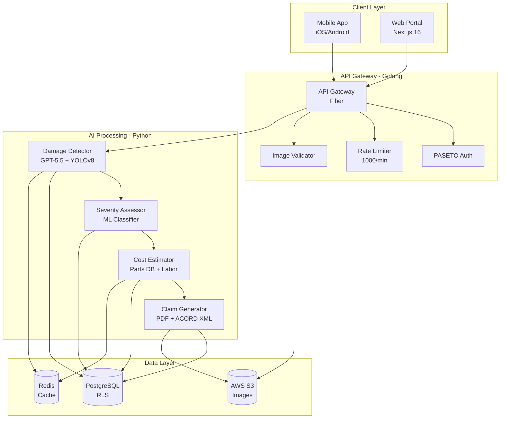

---

## 2. Image Upload & Validation Flow

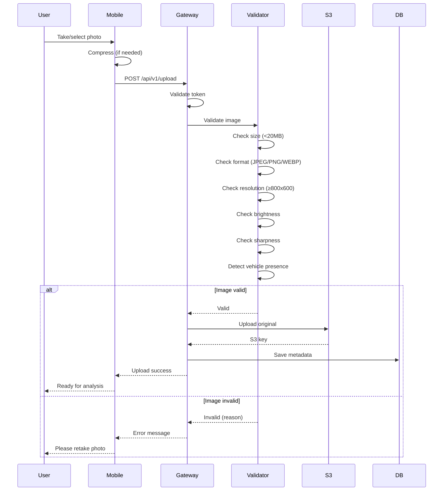

---

## 3. Damage Detection Pipeline

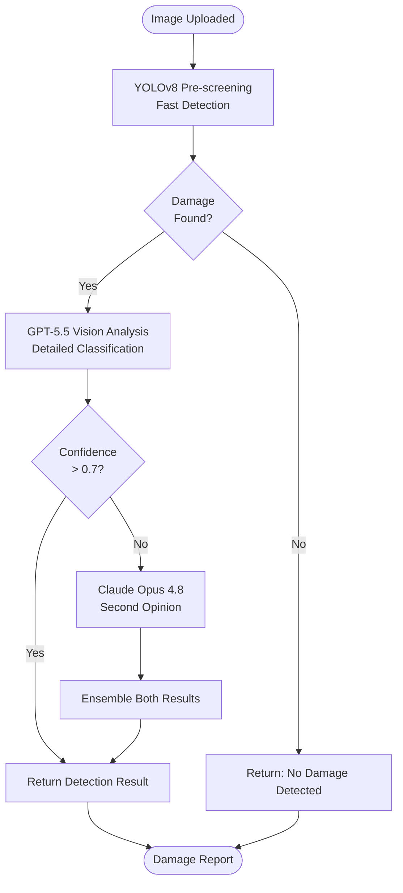

---

## 4. Parallel Processing Architecture

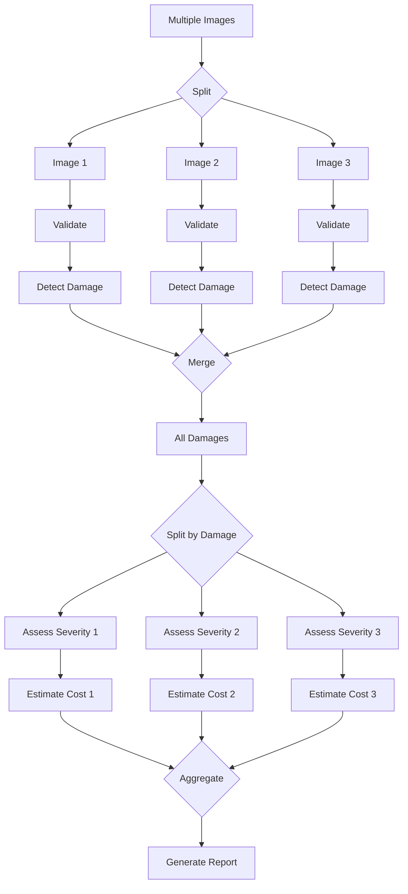

---

## 5. Cost Estimation Flow

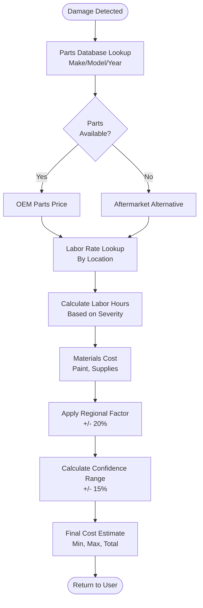

---

## 6. Multi-Tenant Data Isolation

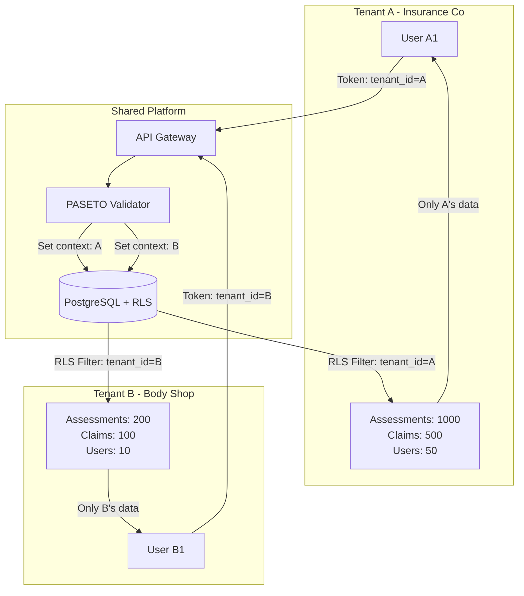

---

## 7. Claim Generation Workflow

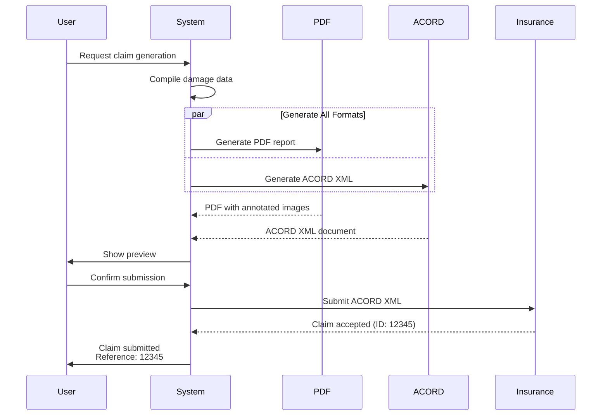

---

## 8. Caching Strategy

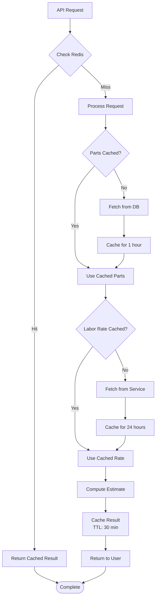

---

## 9. Error Handling & Circuit Breaker

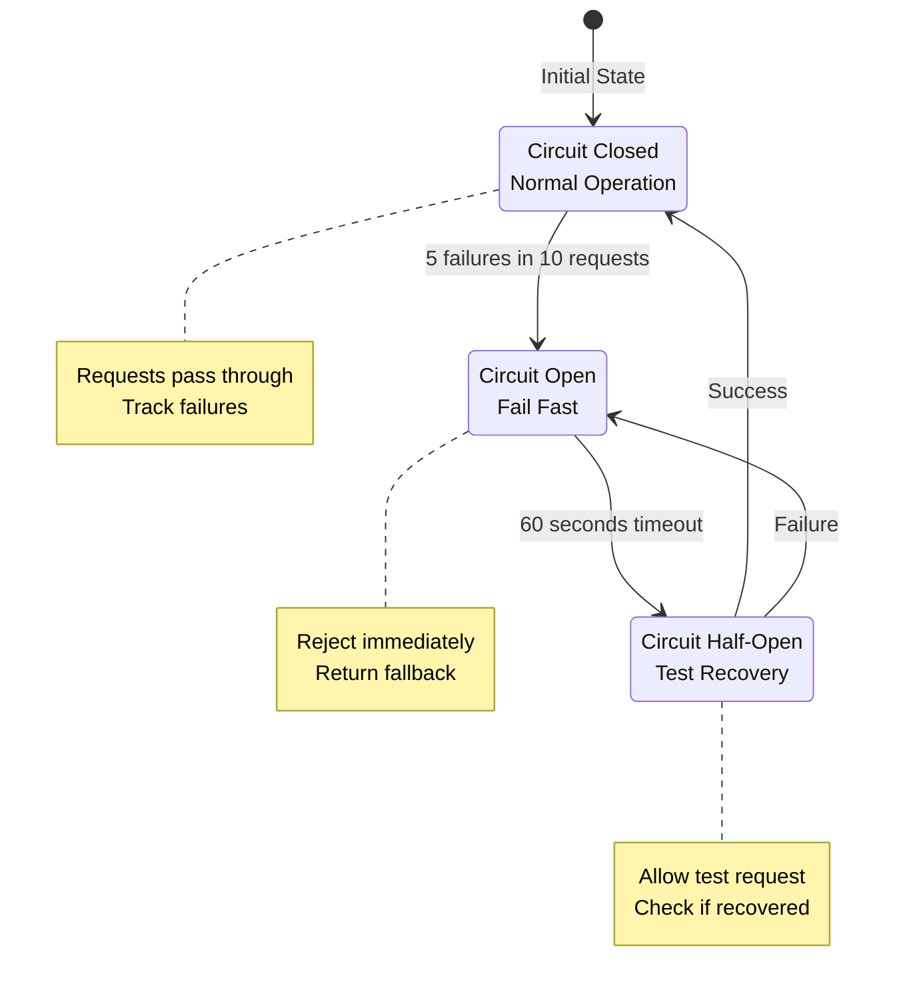

---

## 10. Auto-Scaling Behavior

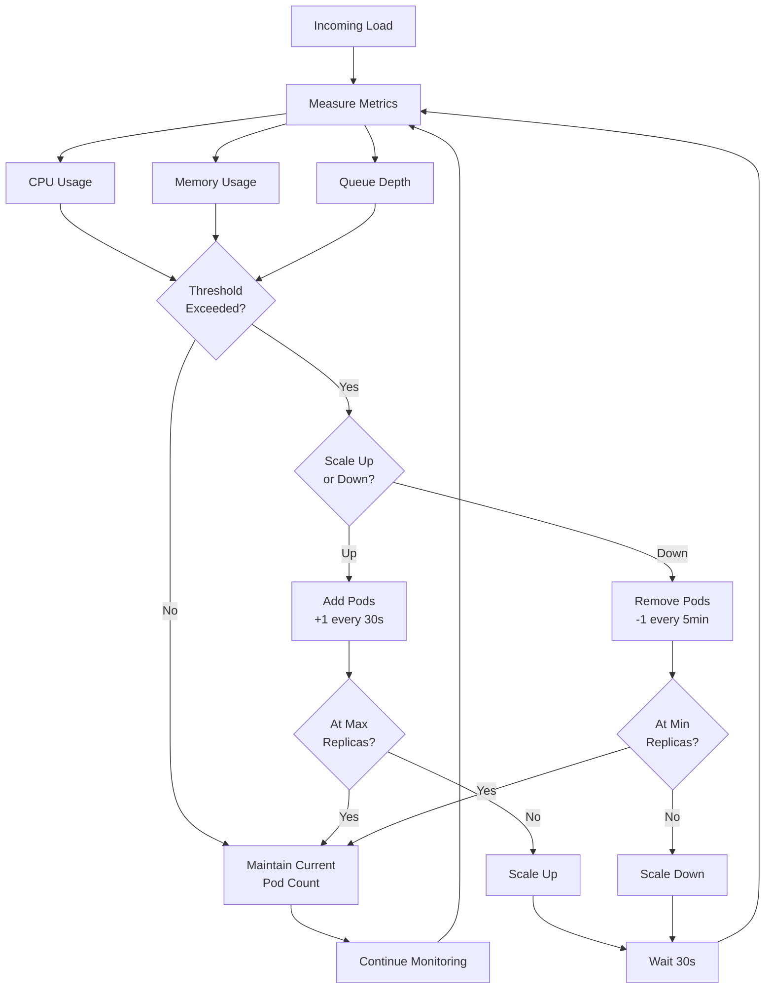

---

## 11. Deployment Pipeline

```mermaid
flowchart LR
    DEV[Developer] --> COMMIT[Git Commit]
    COMMIT --> CI[CI Pipeline]
    
    CI --> TESTS[Run Tests<br/>85% Coverage]
    TESTS --> LINT[Linting<br/>Type Checks]
    LINT --> BUILD[Build Docker Image]
    
    BUILD --> PUSH[Push to Registry]
    PUSH --> STAGING[Deploy to Staging]
    
    STAGING --> SMOKE[Smoke Tests]
    SMOKE --> APPROVE{Manual<br/>Approval?}
    
    APPROVE -->|Yes| BLUE_GREEN[Blue-Green Deploy]
    APPROVE -->|No| ROLLBACK[Rollback]
    
    BLUE_GREEN --> GREEN[Deploy to Green]
    GREEN --> HEALTH[Health Checks]
    
    HEALTH --> SWITCH{All<br/>Healthy?}
    SWITCH -->|Yes| TRAFFIC[Switch Traffic]
    SWITCH -->|No| ROLLBACK
    
    TRAFFIC --> PROD[Production Live]
    PROD --> MONITOR[Monitor Metrics]
```

---

## 12. Data Architecture

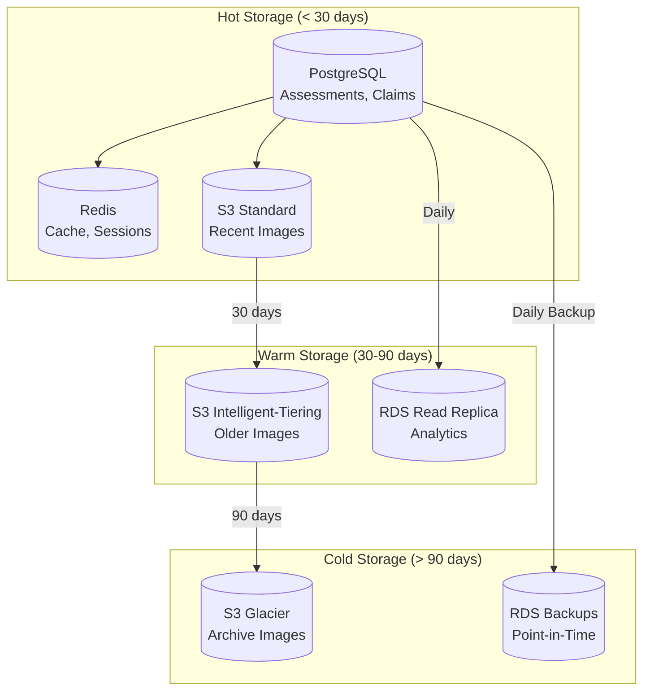

---

**Status:** ✅ Complete - 12 System Diagrams

**Usage:** Render with Mermaid (GitHub, GitLab, VS Code)
