# AI-Powered Automated Compliance Platform - System Diagrams

**Date:** June 23, 2026  
**Version:** 1.0

---

## 1. Complete System Architecture

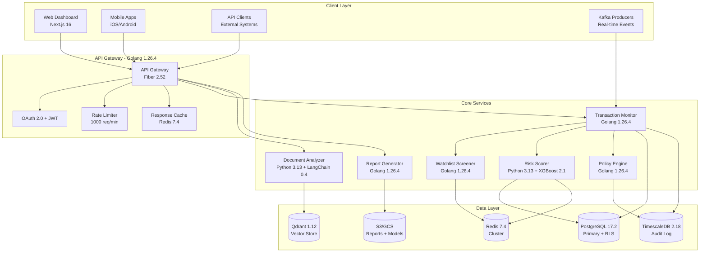

---

## 2. Transaction Screening Flow

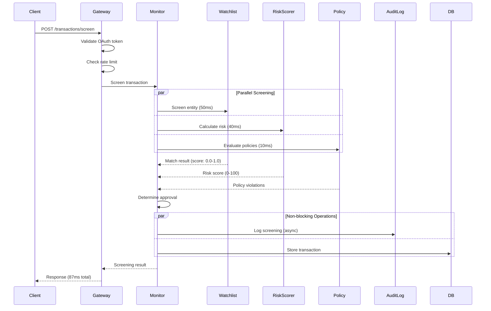

---

## 3. RAG Document Analysis Pipeline

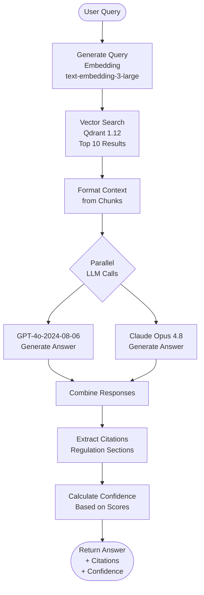

---

## 4. ML Risk Scoring Architecture

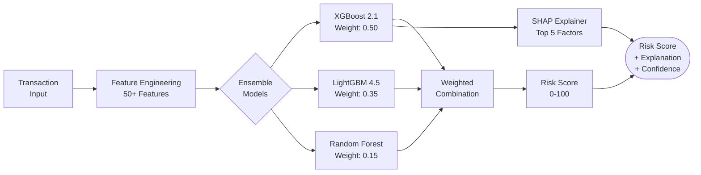

---

## 5. Watchlist Screening Flow

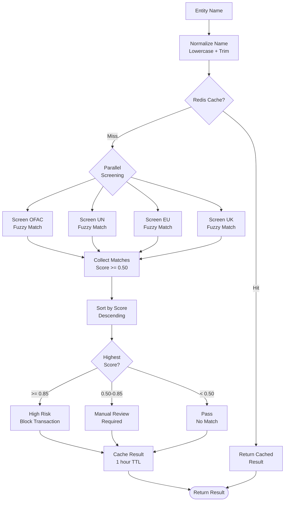

---

## 6. Cryptographic Audit Trail

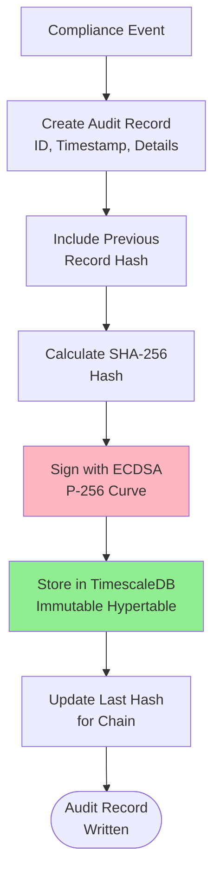

---

## 7. Report Generation Workflow

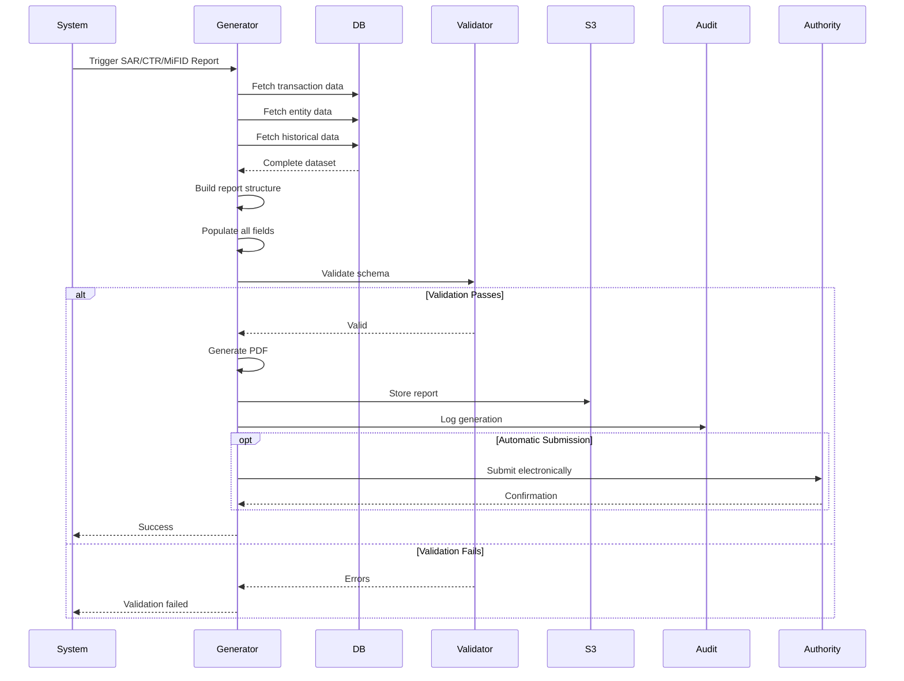

---

## 8. Multi-Jurisdiction Compliance

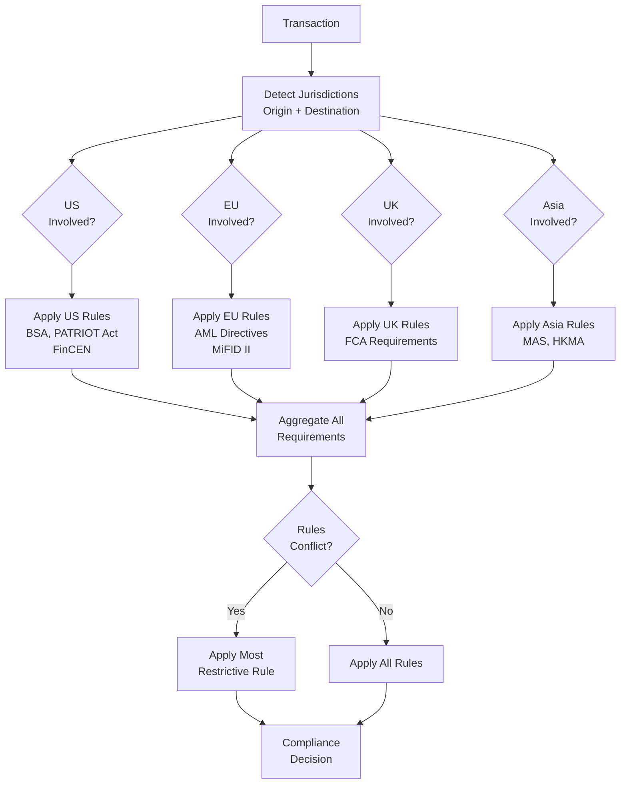

---

## 9. Exception Management Flow

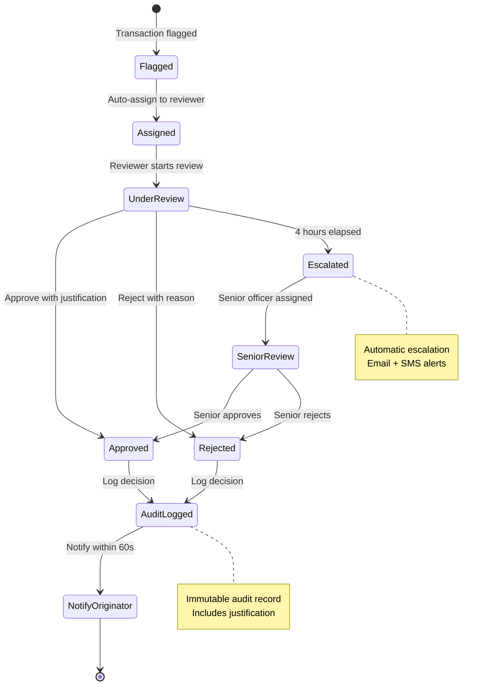

---

## 10. Caching Strategy

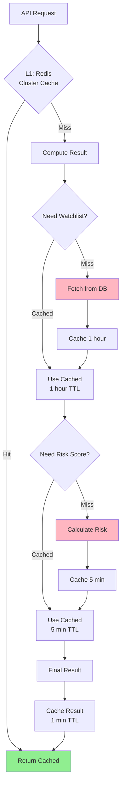

---

## 11. Deployment Architecture

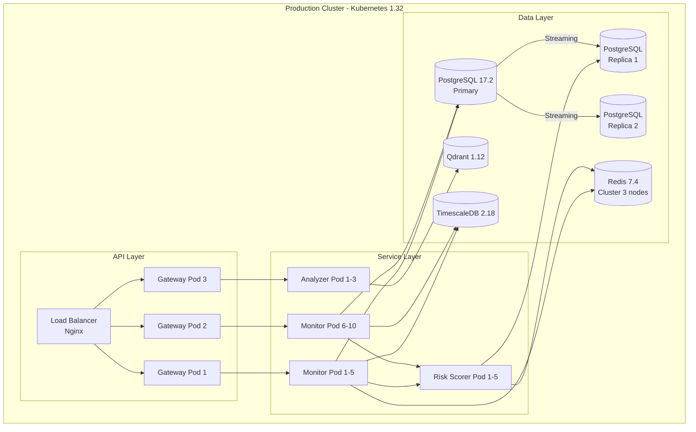

---

## 12. Auto-Scaling Behavior

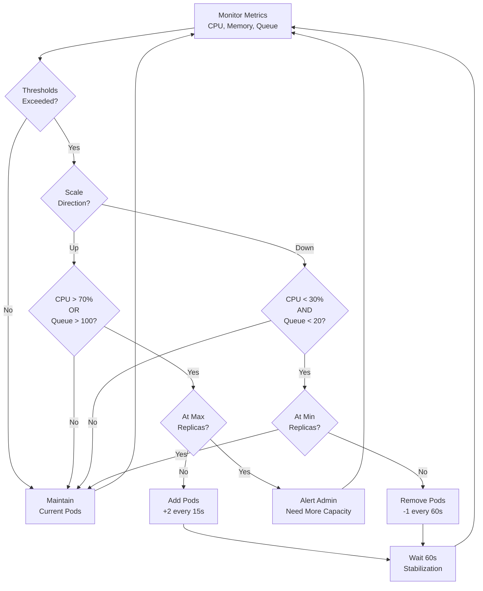

---

## 13. Disaster Recovery Flow

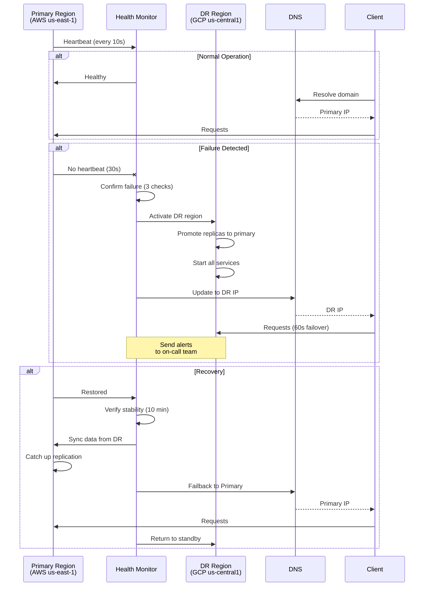

---

## 14. Security Architecture Layers

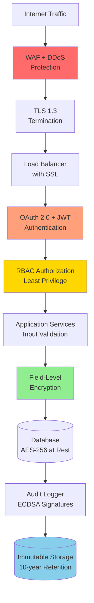

---

## 15. Monitoring & Observability

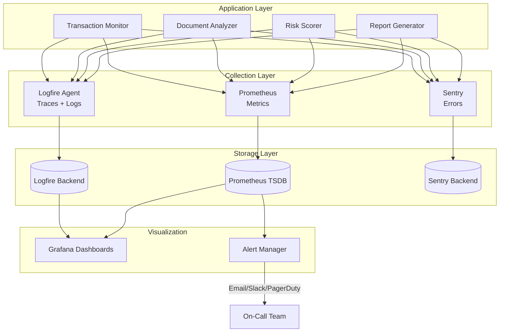

---

**Status:** ✅ Complete - 15 System Diagrams

**Usage:** Render with Mermaid (GitHub, GitLab, VS Code, Notion)

**Technology Versions:** Updated to June 2026 latest
- Golang 1.26.4
- Python 3.13
- PostgreSQL 17.2
- TimescaleDB 2.18
- Redis 7.4
- Kafka 3.8
- Kubernetes 1.32
- Next.js 16
- XGBoost 2.1
- LangChain 0.4
