# AI-Powered Credit Risk Modeling Platform - System Diagrams

**Date:** June 23, 2026  
**Version:** 1.0

---

## 1. Complete System Architecture

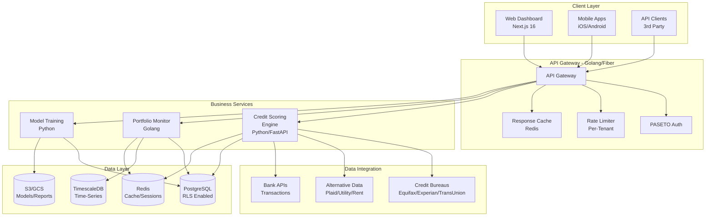

---

## 2. Credit Assessment Request Flow

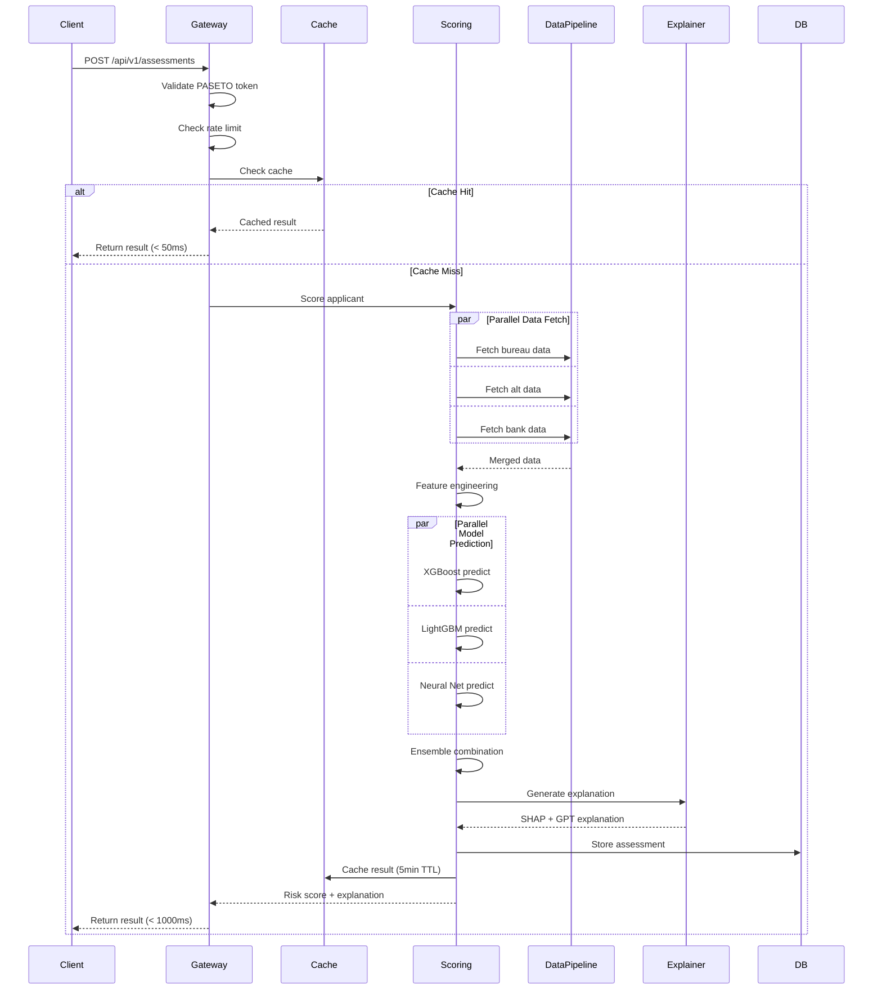

---

## 3. Model Ensemble Architecture

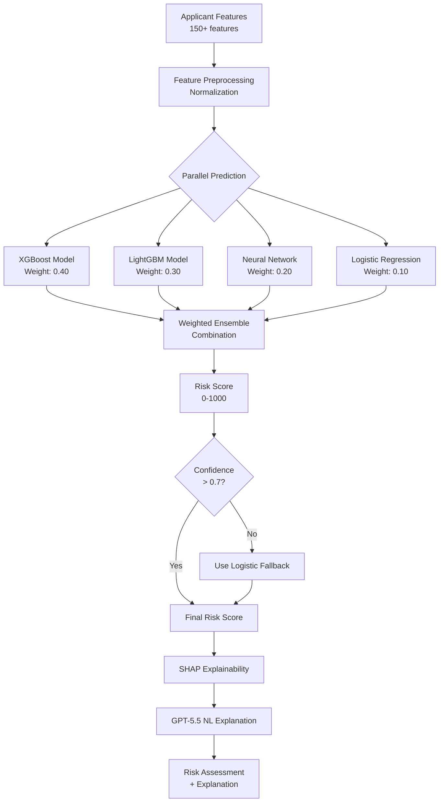

---

## 4. Data Integration Pipeline

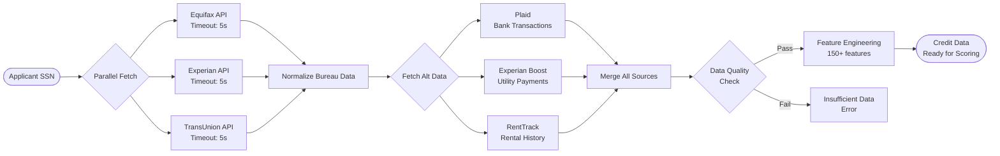

---

## 5. Multi-Tenant Data Isolation

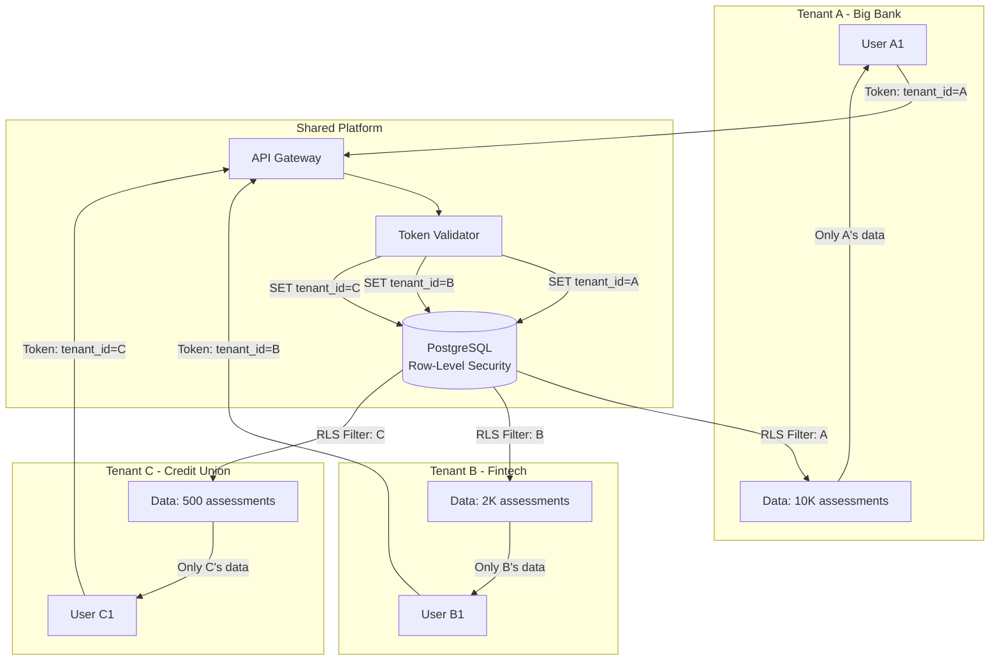

---

## 6. Portfolio Risk Monitoring Flow

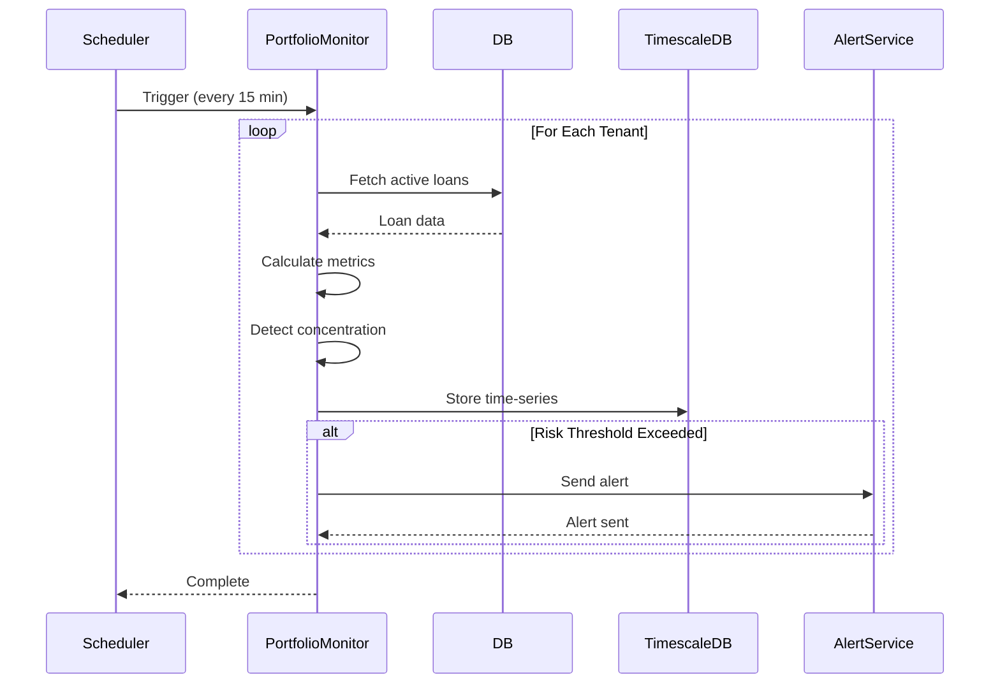

---

## 7. Model Training & Deployment Pipeline

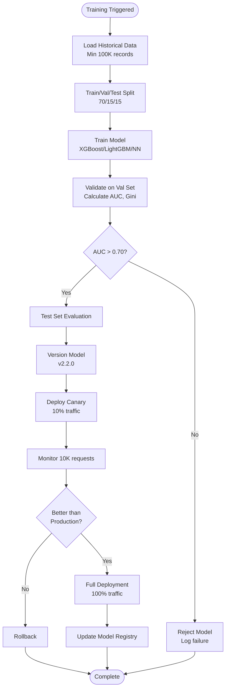

---

## 8. Explainability Generation Pipeline

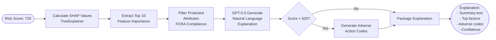

---

## 9. Caching Strategy

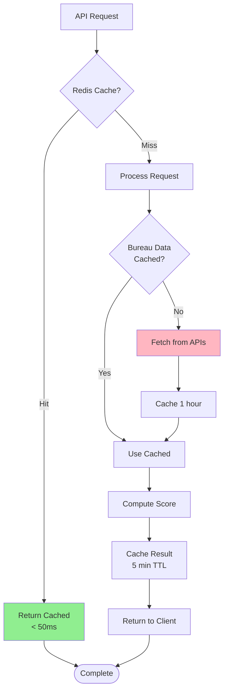

---

## 10. Circuit Breaker Pattern

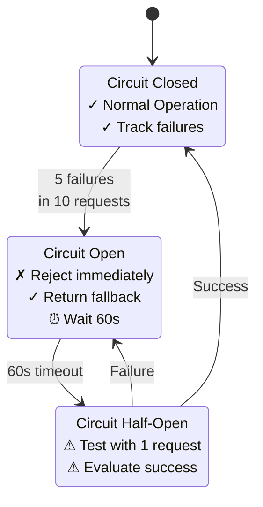

---

## 11. Auto-Scaling Behavior

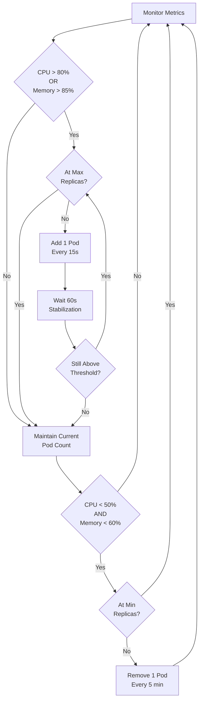

---

## 12. Database Connection Pooling

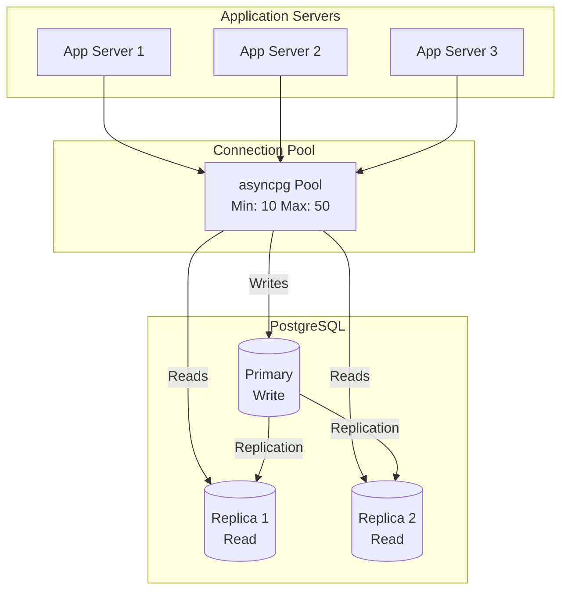

---

## 13. Disaster Recovery Architecture

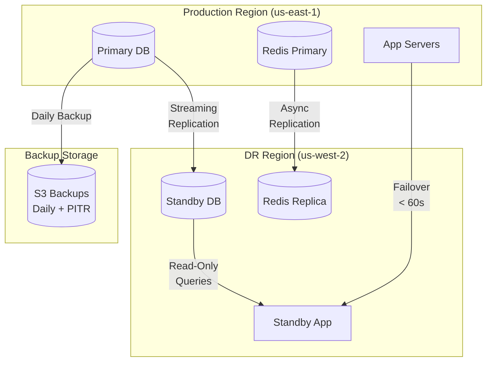

---

## 14. Security Architecture Layers

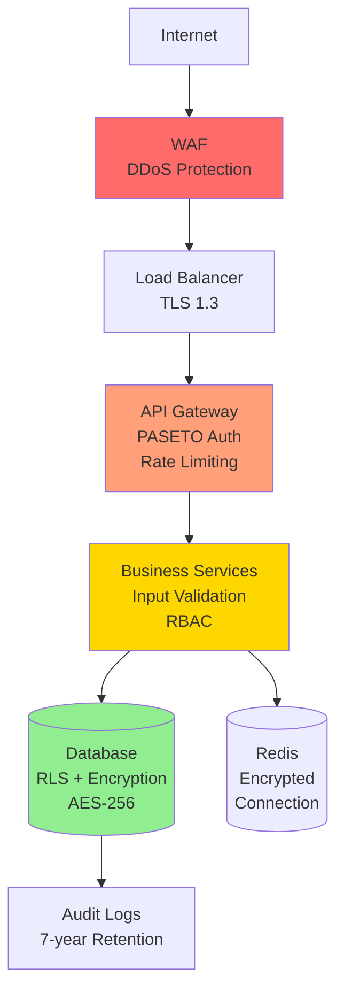

---

## 15. Observability & Monitoring Stack

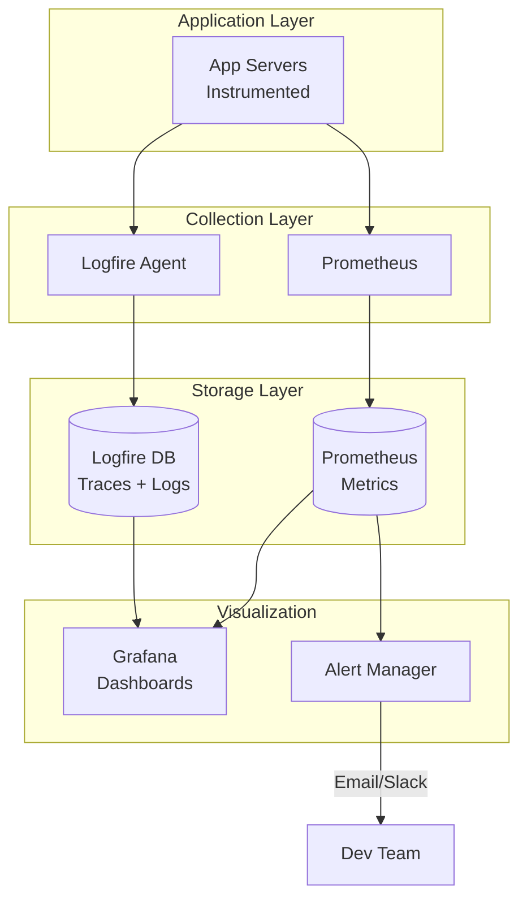

---

**Status:** ✅ Complete - 15 System Diagrams

**Usage:** Render with Mermaid (GitHub, GitLab, VS Code, Notion)
