# AI-Powered Database Migration Agent - System Diagrams

**Date:** June 24, 2026  
**Version:** 1.0

---

## 1. Complete System Architecture

```mermaid
graph TB
    subgraph "Client Layer"
        WEB[Web Dashboard<br/>Next.js 16]
        CLI[CLI Tool<br/>Golang Binary]
        API_CLIENT[API Clients<br/>SDKs]
        CICD[CI/CD Plugins<br/>Jenkins, GitHub Actions]
    end
    
    subgraph "API Gateway - Golang 1.26.4"
        GW[API Gateway<br/>Fiber 2.52]
        AUTH[OAuth 2.0 + JWT]
        GRAPHQL[GraphQL Server<br/>gqlgen]
        RATE[Rate Limiter<br/>1000 req/min]
    end
    
    subgraph "Core Services"
        SCHEMA[Schema Analyzer<br/>Python 3.13]
        CODE[Code Analyzer<br/>Python 3.13 + Tree-sitter]
        PLANNER[AI Planner<br/>Python 3.13 + GPT-4o]
        EXECUTOR[Migration Executor<br/>Golang 1.26.4]
        VALIDATOR[Validation Engine<br/>Golang 1.26.4]
        ROLLBACK[Rollback Manager<br/>Golang 1.26.4]
    end
    
    subgraph "MCP Server Layer"
        SCHEMA_MCP[Schema MCP<br/>Metadata & Lineage]
        QUERY_MCP[Query MCP<br/>Translation & Optimization]
        COMPLIANCE_MCP[Compliance MCP<br/>GDPR/HIPAA/PCI-DSS]
        OBSERV_MCP[Observability MCP<br/>Metrics & Drift Detection]
        KNOWLEDGE_MCP[Knowledge MCP<br/>Semantic Mapping]
        DB_MCP[Database MCP Servers<br/>PostgreSQL, MySQL, Oracle]
        IDENTITY_MCP[Identity & Access MCP<br/>RBAC & Secrets]
        CICD_MCP[CI/CD MCP<br/>Deployment & Rollback]
        CLOUD_MCP[Cloud Resource MCP<br/>AWS, Azure, GCP]
        GIT_MCP[Git MCP<br/>Schema Versioning]
        SLACK_MCP[Slack MCP<br/>Team Notifications]
    end
    
    subgraph "Database Connectivity"
        PG_CONN[PostgreSQL Driver]
        MYSQL_CONN[MySQL Driver]
        ORACLE_CONN[Oracle Driver]
        MSSQL_CONN[SQL Server Driver]
        MONGO_CONN[MongoDB Driver]
    end
    
    subgraph "Data Layer"
        PG[(PostgreSQL 17.2<br/>Metadata)]
        REDIS[(Redis 7.4<br/>Cache)]
        KAFKA[(Kafka 3.8<br/>Events)]
        NEO4J[(Neo4j 5.26<br/>Dependencies)]
        S3[(S3/GCS<br/>Backups)]
    end
    
    WEB --> GW
    CLI --> GW
    API_CLIENT --> GW
    CICD --> GW
    
    GW --> AUTH
    GW --> GRAPHQL
    GW --> RATE
    
    GW --> SCHEMA
    GW --> CODE
    GW --> PLANNER
    
    PLANNER --> EXECUTOR
    EXECUTOR --> VALIDATOR
    EXECUTOR --> ROLLBACK
    
    SCHEMA --> SCHEMA_MCP
    SCHEMA --> QUERY_MCP
    CODE --> GIT_MCP
    PLANNER --> KNOWLEDGE_MCP
    EXECUTOR --> DB_MCP
    EXECUTOR --> CLOUD_MCP
    EXECUTOR --> CICD_MCP
    VALIDATOR --> OBSERV_MCP
    VALIDATOR --> COMPLIANCE_MCP
    ROLLBACK --> IDENTITY_MCP
    EXECUTOR --> SLACK_MCP
    
    DB_MCP --> PG_CONN
    DB_MCP --> MYSQL_CONN
    DB_MCP --> ORACLE_CONN
    DB_MCP --> MSSQL_CONN
    DB_MCP --> MONGO_CONN
    
    SCHEMA --> NEO4J
    EXECUTOR --> PG
    EXECUTOR --> KAFKA
    VALIDATOR --> REDIS
    
    ROLLBACK --> S3
    EXECUTOR --> SLACK_MCP
    EXECUTOR --> OBSERV_MCP
    
    style NEO4J fill:#90EE90
    style EXECUTOR fill:#FFB6C1
    style SCHEMA_MCP fill:#87CEEB
    style QUERY_MCP fill:#87CEEB
    style COMPLIANCE_MCP fill:#FF6B6B
    style KNOWLEDGE_MCP fill:#DDA0DD
    style SLACK_MCP fill:#FFD700
```

---

## 2. Migration Workflow - Complete Flow

```mermaid
sequenceDiagram
    participant User
    participant Gateway
    participant Schema as Schema Analyzer
    participant AI as AI Planner
    participant Executor
    participant Validator
    participant Source as Source DB
    participant Target as Target DB
    
    User->>Gateway: Create migration request
    Gateway->>Gateway: Authenticate user
    
    Gateway->>Schema: Analyze source database
    Schema->>Source: Connect and introspect
    Source-->>Schema: Schema metadata
    Schema-->>Gateway: Complete schema definition
    
    Gateway->>AI: Generate migration plan
    AI->>AI: LLM analysis (GPT-4o)
    AI-->>Gateway: Migration strategy + steps
    
    Gateway-->>User: Present plan for approval
    User->>Gateway: Approve migration
    
    Gateway->>Executor: Execute migration
    
    loop For each table
        Executor->>Source: Extract data (partition)
        Source-->>Executor: Data batch
        Executor->>Executor: Transform data
        Executor->>Target: Load data (bulk insert)
        Target-->>Executor: Confirmation
    end
    
    Executor->>Validator: Validate migration
    Validator->>Source: Get checksums
    Validator->>Target: Get checksums
    Validator-->>Executor: Validation result
    
    Executor-->>Gateway: Migration complete
    Gateway-->>User: Success + metrics
    
    Note over Source,Target: Total time: 45 minutes<br/>Data transferred: 500GB
```

---

## 3. Schema Discovery and Analysis

---

## 4. AI Migration Planning

```mermaid
flowchart LR
    SCHEMA[Source Schema<br/>Definition] --> SUMMARIZE[Summarize Schema<br/>Key Statistics]
    
    REQUIREMENTS[Migration<br/>Requirements] --> SUMMARIZE
    
    SUMMARIZE --> LLM{LLM<br/>Analysis}
    
    LLM --> GPT[GPT-4o Analysis<br/>Strategy Generation]
    LLM --> CLAUDE[Claude Opus 4<br/>Validation]
    
    GPT --> STRATEGY[Migration Strategy<br/>Zero-Downtime/Phased/Cutover]
    
    STRATEGY --> INCOMPAT[Identify<br/>Incompatibilities]
    
    INCOMPAT --> RISK[Risk Assessment<br/>Critical/High/Medium/Low]
    
    RISK --> STEPS[Generate Execution<br/>Steps]
    
    STEPS --> ESTIMATE[Estimate Duration<br/>Resources, Cost]
    
    CLAUDE --> VALIDATE[Validate Strategy<br/>Cross-Check]
    
    VALIDATE --> MERGE[Merge LLM<br/>Insights]
    ESTIMATE --> MERGE
    
    MERGE --> PLAN([Migration Plan<br/>+ Playbook])
    
    style GPT fill:#90EE90
    style CLAUDE fill:#87CEEB
    style PLAN fill:#FFD700
```

---

## 5. Parallel Data Migration

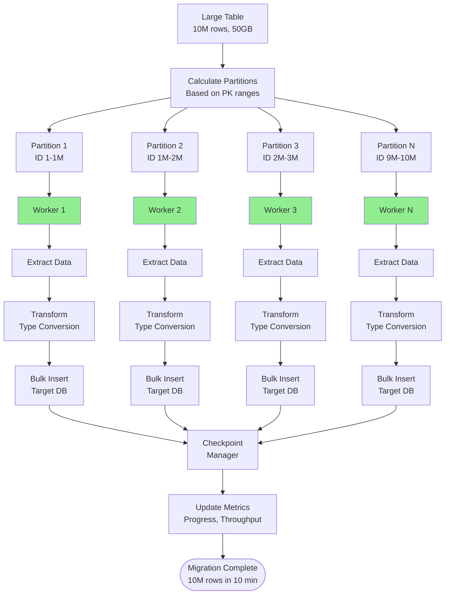

---

## 6. Zero-Downtime Migration Strategy

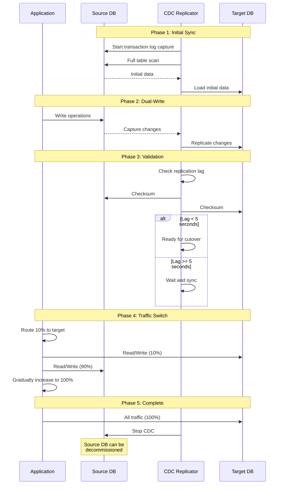

---

## 7. Code Analysis and Query Rewriting

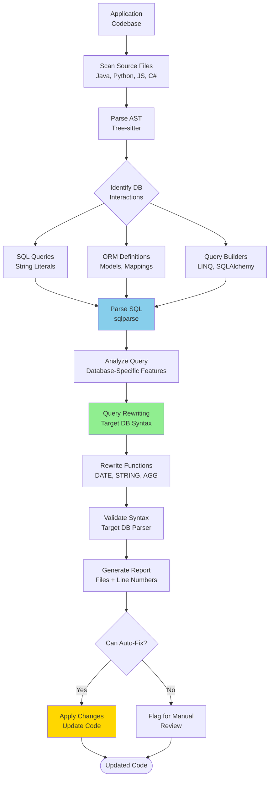

---

## 8. Data Validation Pipeline

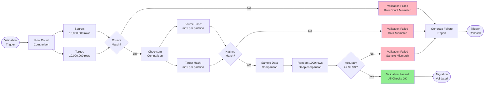

---

## 9. Rollback Mechanism

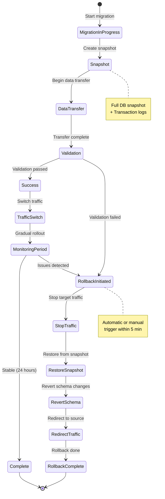

---

## 10. Schema Translation

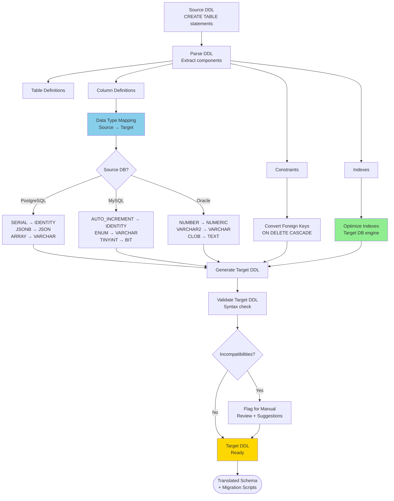

---

## 11. Connection String Management

---

## 12. Real-Time Monitoring Dashboard

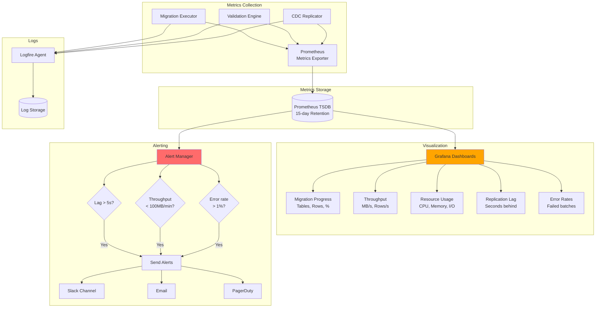

---

## 13. Multi-Tenancy Architecture

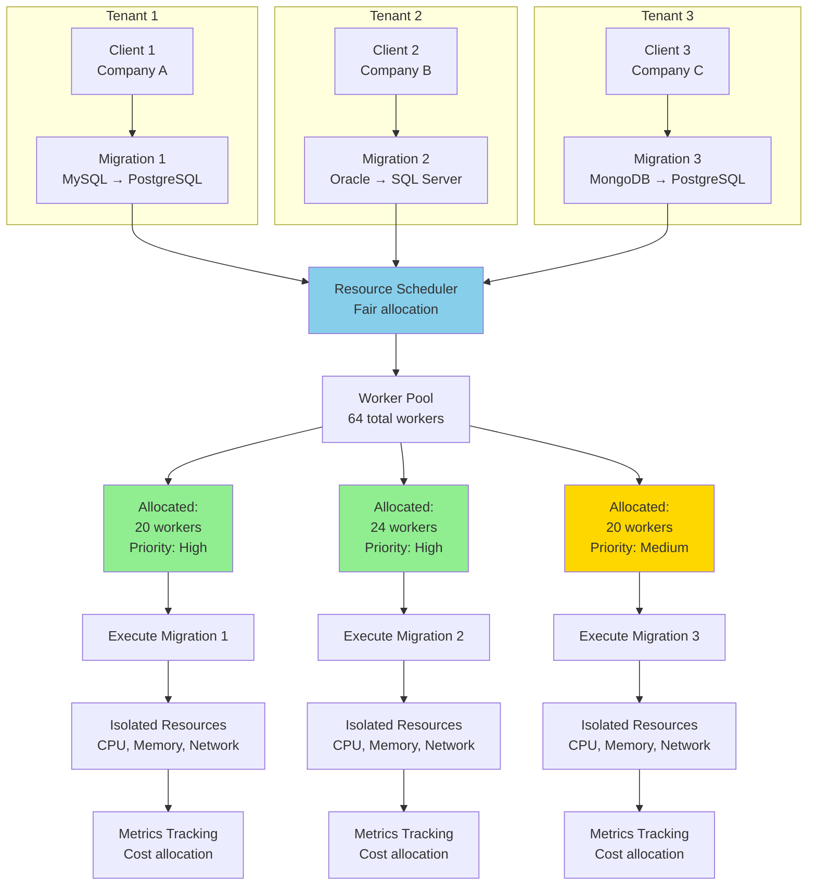

---

## 14. Security Architecture

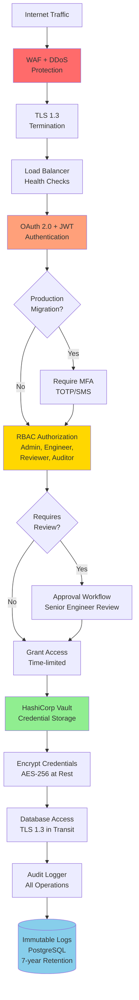

---

## 15. Deployment Architecture

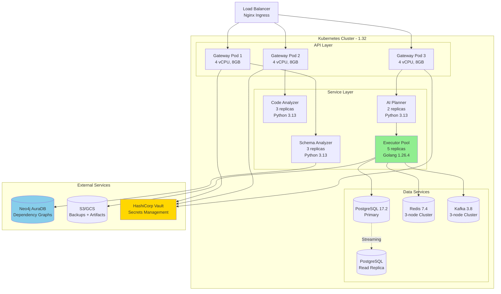

---

**Status:** ✅ Complete - 20 Comprehensive System Diagrams

**Diagram Summary:**
1. Complete System Architecture - Full component layout with all MCP servers
2. Migration Workflow - End-to-end sequence
3. Schema Discovery and Analysis - Parallel extraction pipeline
4. AI Migration Planning - LLM-powered strategy generation
5. Parallel Data Migration - Worker pool architecture
6. Zero-Downtime Migration Strategy - CDC-based replication
7. Code Analysis and Query Rewriting - AST parsing workflow
8. Data Validation Pipeline - Multi-stage verification
9. Rollback Mechanism - State machine for recovery
10. Schema Translation - DDL conversion pipeline
11. Connection String Management - Configuration updates
12. Real-Time Monitoring Dashboard - Observability stack
13. Multi-Tenancy Architecture - Resource isolation
14. Security Architecture - Defense-in-depth layers
15. Deployment Architecture - Kubernetes cluster layout
16. Agent-Validator Pattern Overview - Defense-in-depth validation
17. Schema Translation with Validation Flow - Agent-Validator coordination
18. Multi-Agent Coordinator with Validators - Complete validation pipeline
19. Compliance MCP Workflow - Regulatory enforcement
20. Knowledge MCP Semantic Mapping - ML-powered schema mapping

**Rendering:** All diagrams use Mermaid syntax compatible with GitHub, GitLab, VS Code, Notion, and Confluence

**Technology Versions (June 2026):**
- Golang: 1.26.4
- Python: 3.13
- PostgreSQL: 17.2
- Redis: 7.4
- Kafka: 3.8
- Kubernetes: 1.32
- Neo4j: 5.26
- Next.js: 16

---

**Document Complete**  
**Date:** June 24, 2026
