# AI-Powered Database Migration Agent - System Diagrams

**Date:** June 24, 2026  
**Version:** 1.0

---

## 1. Complete System Architecture

```mermaid
graph TB
    subgraph "Client Layer"
        WEB[Web Dashboard<br/>Next.js 16]
        CLI[CLI Tool<br/>Golang Binary]
        API_CLIENT[API Clients<br/>SDKs]
        CICD[CI/CD Plugins<br/>Jenkins, GitHub Actions]
    end
    
    subgraph "API Gateway - Golang 1.26.4"
        GW[API Gateway<br/>Fiber 2.52]
        AUTH[OAuth 2.0 + JWT]
        GRAPHQL[GraphQL Server<br/>gqlgen]
        RATE[Rate Limiter<br/>1000 req/min]
    end
    
    subgraph "Core Services"
        SCHEMA[Schema Analyzer<br/>Python 3.13]
        CODE[Code Analyzer<br/>Python 3.13 + Tree-sitter]
        PLANNER[AI Planner<br/>Python 3.13 + GPT-4o]
        EXECUTOR[Migration Executor<br/>Golang 1.26.4]
        VALIDATOR[Validation Engine<br/>Golang 1.26.4]
        ROLLBACK[Rollback Manager<br/>Golang 1.26.4]
    end
    
    subgraph "MCP Server Layer"
        SCHEMA_MCP[Schema MCP<br/>Metadata & Lineage]
        QUERY_MCP[Query MCP<br/>Translation & Optimization]
        COMPLIANCE_MCP[Compliance MCP<br/>GDPR/HIPAA/PCI-DSS]
        OBSERV_MCP[Observability MCP<br/>Metrics & Drift Detection]
        KNOWLEDGE_MCP[Knowledge MCP<br/>Semantic Mapping]
        DB_MCP[Database MCP Servers<br/>PostgreSQL, MySQL, Oracle]
        IDENTITY_MCP[Identity & Access MCP<br/>RBAC & Secrets]
        CICD_MCP[CI/CD MCP<br/>Deployment & Rollback]
        CLOUD_MCP[Cloud Resource MCP<br/>AWS, Azure, GCP]
        GIT_MCP[Git MCP<br/>Schema Versioning]
        SLACK_MCP[Slack MCP<br/>Team Notifications]
    end
    
    subgraph "Database Connectivity"
        PG_CONN[PostgreSQL Driver]
        MYSQL_CONN[MySQL Driver]
        ORACLE_CONN[Oracle Driver]
        MSSQL_CONN[SQL Server Driver]
        MONGO_CONN[MongoDB Driver]
    end
    
    subgraph "Data Layer"
        PG[(PostgreSQL 17.2<br/>Metadata)]
        REDIS[(Redis 7.4<br/>Cache)]
        KAFKA[(Kafka 3.8<br/>Events)]
        NEO4J[(Neo4j 5.26<br/>Dependencies)]
        S3[(S3/GCS<br/>Backups)]
    end
    
    WEB --> GW
    CLI --> GW
    API_CLIENT --> GW
    CICD --> GW
    
    GW --> AUTH
    GW --> GRAPHQL
    GW --> RATE
    
    GW --> SCHEMA
    GW --> CODE
    GW --> PLANNER
    
    PLANNER --> EXECUTOR
    EXECUTOR --> VALIDATOR
    EXECUTOR --> ROLLBACK
    
    SCHEMA --> SCHEMA_MCP
    SCHEMA --> QUERY_MCP
    CODE --> GIT_MCP
    PLANNER --> KNOWLEDGE_MCP
    EXECUTOR --> DB_MCP
    EXECUTOR --> CLOUD_MCP
    EXECUTOR --> CICD_MCP
    VALIDATOR --> OBSERV_MCP
    VALIDATOR --> COMPLIANCE_MCP
    ROLLBACK --> IDENTITY_MCP
    EXECUTOR --> SLACK_MCP
    
    DB_MCP --> PG_CONN
    DB_MCP --> MYSQL_CONN
    DB_MCP --> ORACLE_CONN
    DB_MCP --> MSSQL_CONN
    DB_MCP --> MONGO_CONN
    
    SCHEMA --> NEO4J
    EXECUTOR --> PG
    EXECUTOR --> KAFKA
    VALIDATOR --> REDIS
    
    ROLLBACK --> S3
    EXECUTOR --> SLACK_MCP
    EXECUTOR --> OBSERV_MCP
    
    style NEO4J fill:#90EE90
    style EXECUTOR fill:#FFB6C1
    style SCHEMA_MCP fill:#87CEEB
    style QUERY_MCP fill:#87CEEB
    style COMPLIANCE_MCP fill:#FF6B6B
    style KNOWLEDGE_MCP fill:#DDA0DD
    style SLACK_MCP fill:#FFD700
```

---

## 2. Migration Workflow - Complete Flow

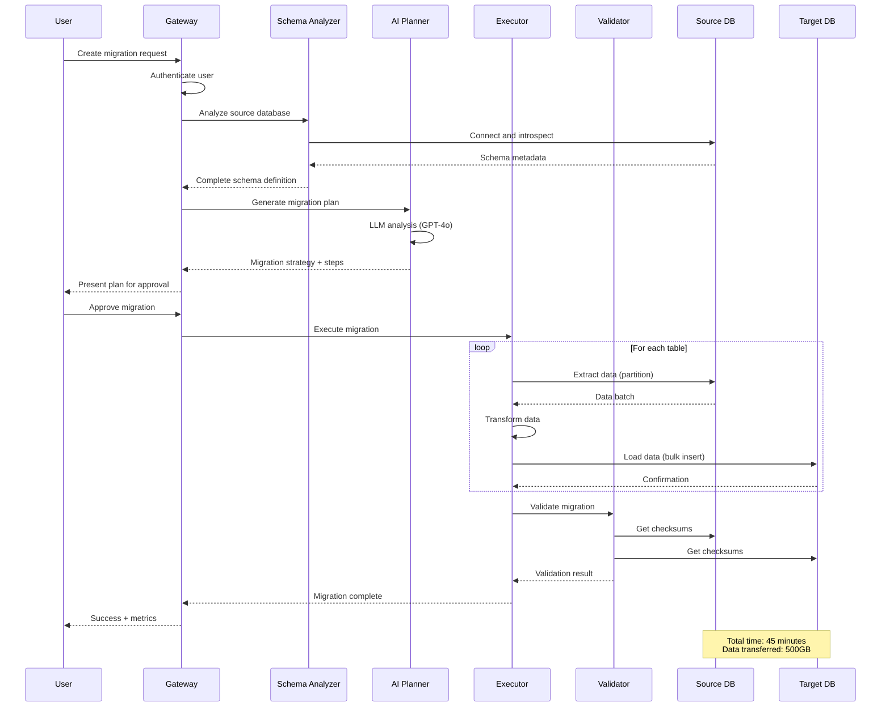

---

## 3. Schema Discovery and Analysis

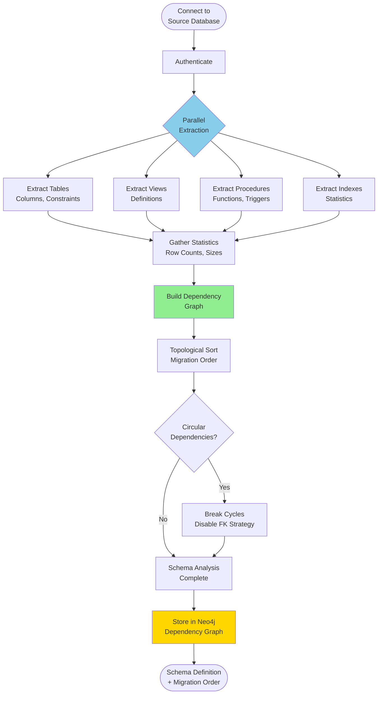

---

## 4. AI Migration Planning


---

## 5. Parallel Data Migration


---

## 6. Zero-Downtime Migration Strategy

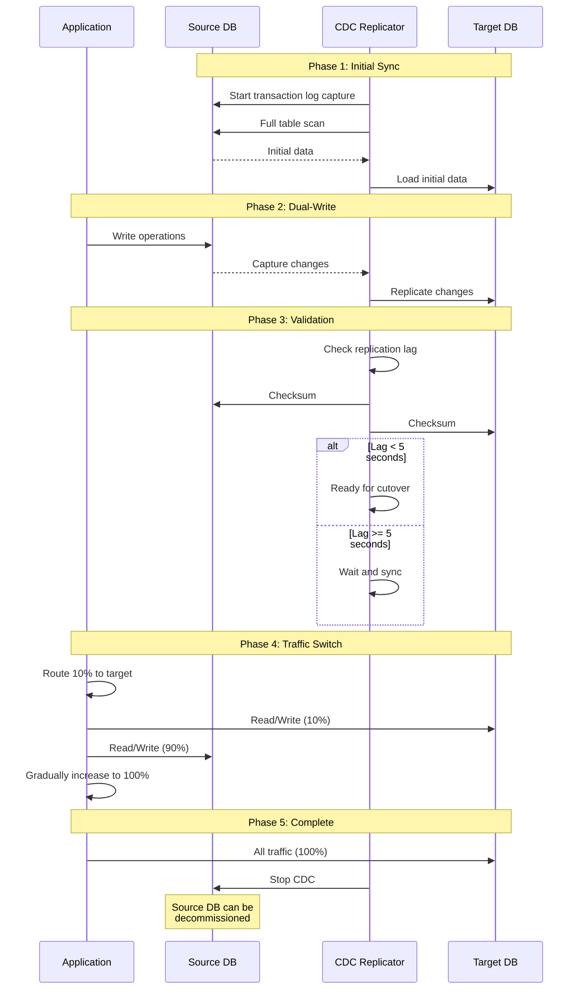

---

## 7. Code Analysis and Query Rewriting


---

## 8. Data Validation Pipeline


---

## 9. Rollback Mechanism

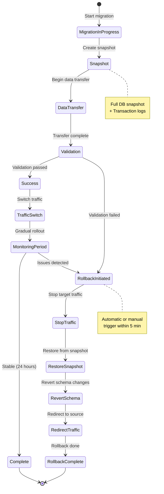

---

## 10. Schema Translation


---

## 11. Connection String Management

```mermaid
flowchart LR
    SCAN[Scan Deployment<br/>Configs] --> K8S[Kubernetes<br/>ConfigMaps/Secrets]
    SCAN --> ENV[Environment<br/>Files .env]
    SCAN --> DOCKER[Docker Compose<br/>docker-compose.yml]
    SCAN --> TERRAFORM[Terraform<br/>variables.tf]
    
    K8S --> EXTRACT[Extract Connection<br/>Strings]
    ENV --> EXTRACT
    DOCKER --> EXTRACT
    TERRAFORM --> EXTRACT
    
    EXTRACT --> PARSE[Parse Connection<br/>Components]
    
    PARSE --> HOST[Host: old-db.company.com]
    PARSE --> PORT[Port: 5432]
    PARSE --> DB[Database: prod_db]
    PARSE --> USER[User: app_user]
    
    HOST --> UPDATE[Update to Target]
    PORT --> UPDATE
    DB --> UPDATE
    USER --> UPDATE
    
    UPDATE --> NEW_HOST[Host: new-db.company.com]
    UPDATE --> NEW_PORT[Port: 5432]
    UPDATE --> NEW_DB[Database: prod_db_v2]
    UPDATE --> NEW_USER[User: app_user]
    
    NEW_HOST --> BUILD[Build New<br/>Connection String]
    NEW_PORT --> BUILD
    NEW_DB --> BUILD
    NEW_USER --> BUILD
    
    BUILD --> BACKUP[Backup Original<br/>Configs]
    
    BACKUP --> DEPLOY{Deploy<br/>Strategy?}
    
    DEPLOY -->|Canary| CANARY[Deploy to<br/>Canary Instance]
    DEPLOY -->|All| ALL[Deploy to<br/>All Instances]
    
    CANARY --> TEST[Test Connectivity]
    ALL --> TEST
    
    TEST --> VERIFY{Connection<br/>OK?}
    
    VERIFY -->|Yes| SUCCESS([Config Updated])
    VERIFY -->|No| ROLLBACK([Auto-Rollback<br/>to Backup])
    
    style BACKUP fill:#87CEEB
    style SUCCESS fill:#90EE90
    style ROLLBACK fill:#FFB6C1
```

---

## 12. Real-Time Monitoring Dashboard

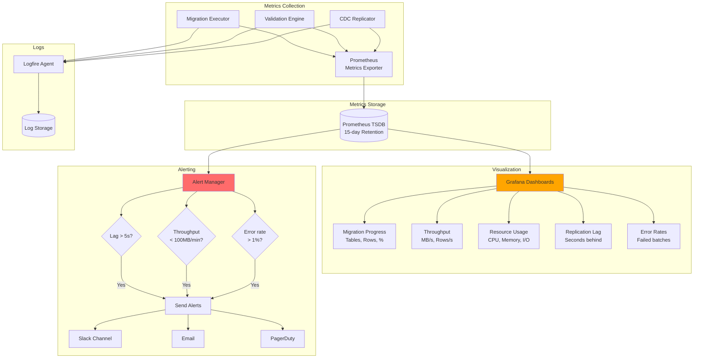

---

## 13. Multi-Tenancy Architecture

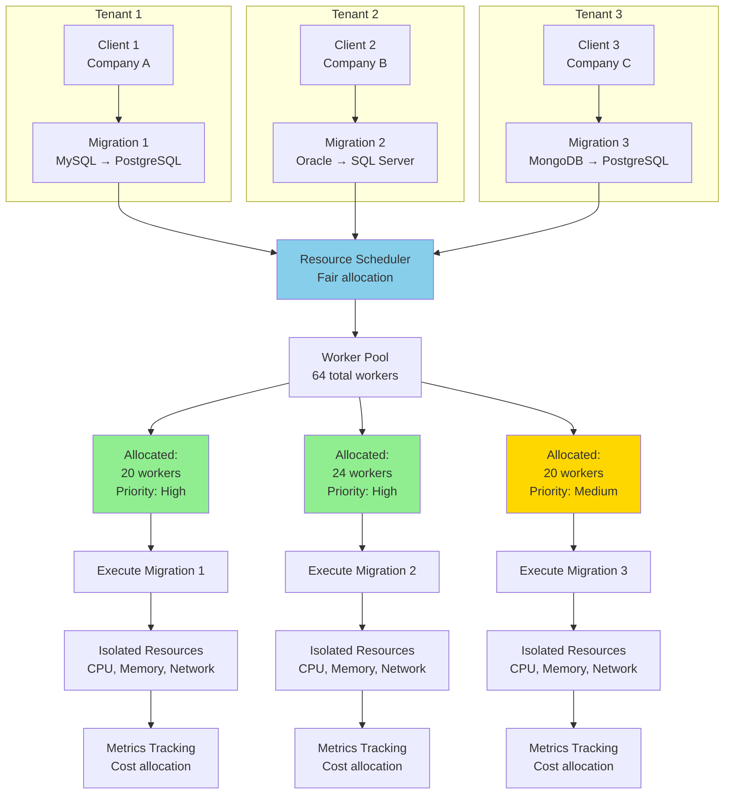

---

## 14. Security Architecture

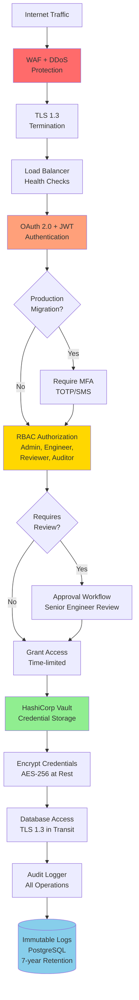

---

## 15. Deployment Architecture

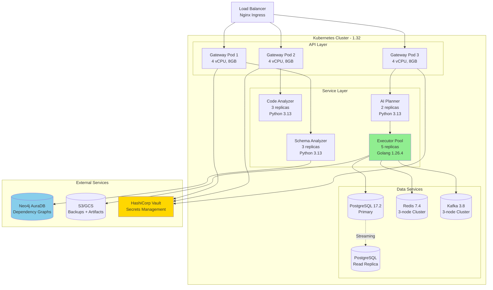

---

**Status:** ✅ Complete - 15 Comprehensive System Diagrams

**Diagram Summary:**
1. Complete System Architecture - Full component layout
2. Migration Workflow - End-to-end sequence
3. Schema Discovery and Analysis - Parallel extraction pipeline
4. AI Migration Planning - LLM-powered strategy generation
5. Parallel Data Migration - Worker pool architecture
6. Zero-Downtime Migration Strategy - CDC-based replication
7. Code Analysis and Query Rewriting - AST parsing workflow
8. Data Validation Pipeline - Multi-stage verification
9. Rollback Mechanism - State machine for recovery
10. Schema Translation - DDL conversion pipeline
11. Connection String Management - Configuration updates
12. Real-Time Monitoring Dashboard - Observability stack
13. Multi-Tenancy Architecture - Resource isolation
14. Security Architecture - Defense-in-depth layers
15. Deployment Architecture - Kubernetes cluster layout

**Rendering:** All diagrams use Mermaid syntax compatible with GitHub, GitLab, VS Code, Notion, and Confluence

**Technology Versions (June 2026):**
- Golang: 1.26.4
- Python: 3.13
- PostgreSQL: 17.2
- Redis: 7.4
- Kafka: 3.8
- Kubernetes: 1.32
- Neo4j: 5.26
- Next.js: 16

---

**Document Complete**  
**Date:** June 24, 2026


---

## 16. Agent-Validator Pattern Overview

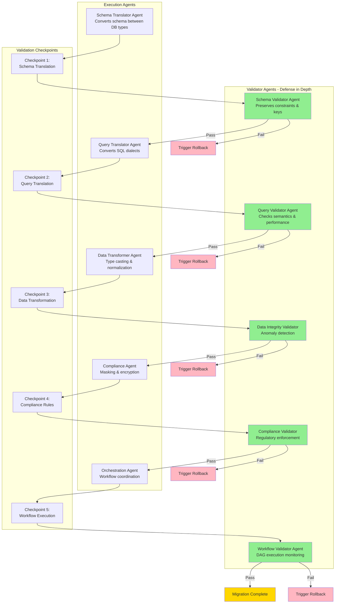

---

## 17. Schema Translation with Validation Flow

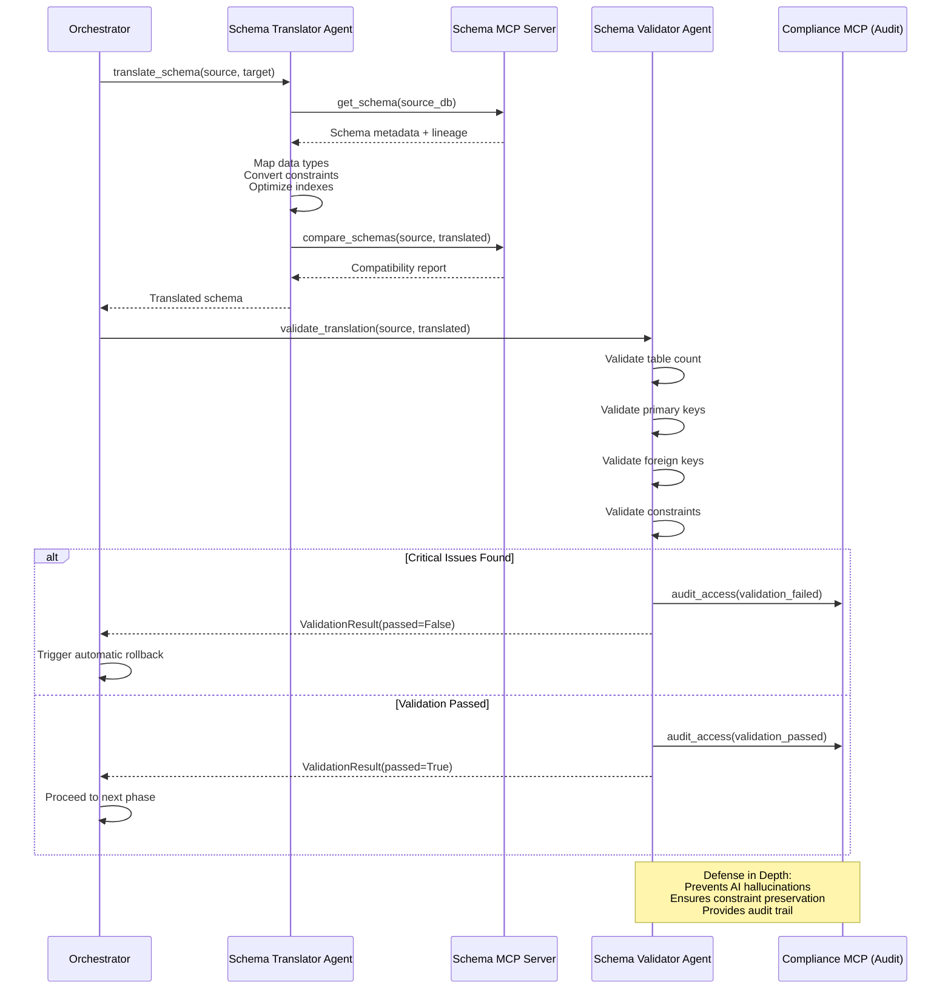

---

## 18. Sandbox Execution Environment

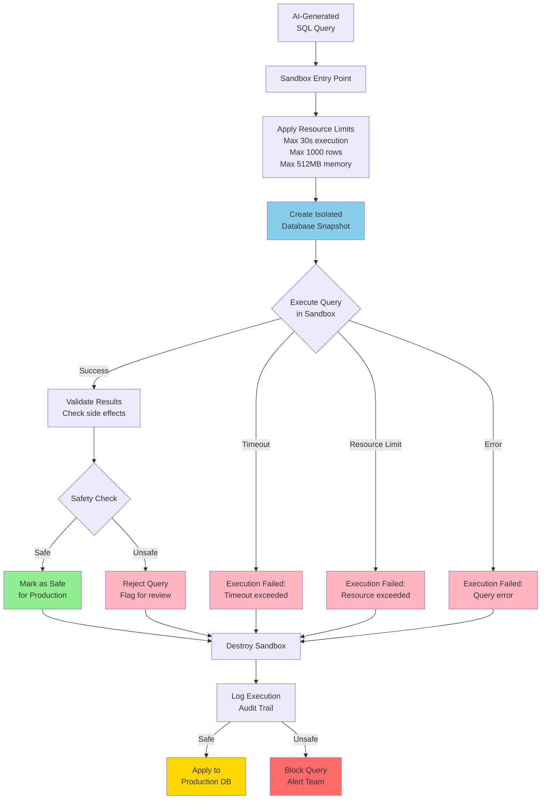

---

## 19. Drift Detection & Auto-Correction

```mermaid
flowchart LR
    SOURCE[(Source DB<br/>PostgreSQL)] --> MONITOR[Drift Monitor<br/>Observability MCP]
    TARGET[(Target DB<br/>MySQL)] --> MONITOR
    
    MONITOR --> CONTINUOUS[Continuous Monitoring<br/>Every 5 seconds]
    
    CONTINUOUS --> DETECT{Drift<br/>Detected?}
    
    DETECT -->|No Drift| CONTINUE[Continue Monitoring]
    DETECT -->|Schema Drift| SCHEMA_DRIFT[Schema Drift:<br/>Column added/removed]
    DETECT -->|Data Drift| DATA_DRIFT[Data Drift:<br/>Row count mismatch]
    DETECT -->|Performance Drift| PERF_DRIFT[Performance Drift:<br/>Query slowdown]
    
    SCHEMA_DRIFT --> VALIDATOR[Workflow Validator Agent<br/>Analyze drift impact]
    DATA_DRIFT --> VALIDATOR
    PERF_DRIFT --> VALIDATOR
    
    VALIDATOR --> SEVERITY{Drift<br/>Severity?}
    
    SEVERITY -->|Critical| AUTO_ROLLBACK[Automatic Rollback<br/>Revert to snapshot]
    SEVERITY -->|High| CORRECTIVE[Corrective Transformation<br/>Sync differences]
    SEVERITY -->|Medium| ALERT[Alert Team<br/>Manual review]
    SEVERITY -->|Low| LOG[Log Event<br/>Continue monitoring]
    
    AUTO_ROLLBACK --> RESTORE[Restore Source State]
    CORRECTIVE --> SYNC[Synchronize Databases]
    
    RESTORE --> NOTIFY[Notify Team<br/>Slack MCP]
    SYNC --> VERIFY[Verify Correction]
    ALERT --> NOTIFY
    LOG --> CONTINUE
    
    VERIFY -->|Fixed| CONTINUE
    VERIFY -->|Not Fixed| AUTO_ROLLBACK
    
    style DETECT fill:#87CEEB
    style AUTO_ROLLBACK fill:#FFB6C1
    style CORRECTIVE fill:#FFD700
    style VERIFY fill:#90EE90
```

---

## 20. Knowledge & Context Layer with RAG

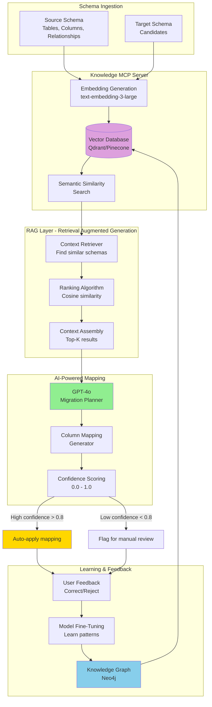

---


## 21. Observability & Governance Stack

```mermaid
graph TB
    subgraph "Migration Agents"
        AGENT1[Schema Agent]
        AGENT2[Query Agent]
        AGENT3[Data Agent]
        AGENT4[Compliance Agent]
    end
    
    subgraph "Structured Logging"
        LOGFIRE[Logfire Agent<br/>Distributed Tracing]
        LOG_AGGREGATOR[Log Aggregator<br/>Centralized storage]
    end
    
    subgraph "Metrics Collection"
        PROMETHEUS[Prometheus<br/>Time-series metrics]
        CUSTOM_METRICS[Custom Metrics<br/>Throughput, Lag, Errors]
    end
    
    subgraph "Tracing"
        TRACE_COLLECTOR[Trace Collector<br/>OpenTelemetry]
        SPAN_STORAGE[(Span Storage<br/>Distributed traces)]
    end
    
    subgraph "Audit Trail"
        AUDIT_MCP[Compliance MCP<br/>Audit Logger]
        AUDIT_DB[(Audit Database<br/>Immutable logs<br/>7-year retention)]
    end
    
    subgraph "AI-Driven Anomaly Detection"
        ANOMALY_DETECTOR[Anomaly Detector<br/>ML-based patterns]
        ALERT_ENGINE[Alert Engine<br/>Slack/Email/PagerDuty]
    end
    
    subgraph "Real-Time Dashboards"
        GRAFANA[Grafana Dashboards<br/>Live metrics]
        CUSTOM_DASH[Custom Dashboards<br/>Migration progress]
    end
    
    AGENT1 --> LOGFIRE
    AGENT2 --> LOGFIRE
    AGENT3 --> LOGFIRE
    AGENT4 --> LOGFIRE
    
    LOGFIRE --> LOG_AGGREGATOR
    
    AGENT1 --> PROMETHEUS
    AGENT2 --> PROMETHEUS
    AGENT3 --> PROMETHEUS
    AGENT4 --> PROMETHEUS
    
    PROMETHEUS --> CUSTOM_METRICS
    
    AGENT1 --> TRACE_COLLECTOR
    AGENT2 --> TRACE_COLLECTOR
    AGENT3 --> TRACE_COLLECTOR
    AGENT4 --> TRACE_COLLECTOR
    
    TRACE_COLLECTOR --> SPAN_STORAGE
    
    AGENT1 --> AUDIT_MCP
    AGENT2 --> AUDIT_MCP
    AGENT3 --> AUDIT_MCP
    AGENT4 --> AUDIT_MCP
    
    AUDIT_MCP --> AUDIT_DB
    
    CUSTOM_METRICS --> ANOMALY_DETECTOR
    SPAN_STORAGE --> ANOMALY_DETECTOR
    
    ANOMALY_DETECTOR -->|Anomaly found| ALERT_ENGINE
    
    CUSTOM_METRICS --> GRAFANA
    PROMETHEUS --> GRAFANA
    
    GRAFANA --> CUSTOM_DASH
    
    style ANOMALY_DETECTOR fill:#FFA500
    style ALERT_ENGINE fill:#FF6B6B
    style AUDIT_DB fill:#87CEEB
    style GRAFANA fill:#90EE90
```

---

## 22. Resilience & Reliability Architecture

```mermaid
flowchart TD
    START[Migration Start] --> CHECKPOINT_INIT[Initialize Checkpoint Manager]
    
    CHECKPOINT_INIT --> SNAPSHOT[Create Database Snapshot<br/>Full backup + transaction logs]
    
    SNAPSHOT --> VERSION_CONTROL[Version Control<br/>Git commit: schema + data hash]
    
    VERSION_CONTROL --> EXECUTE[Execute Migration Phase]
    
    EXECUTE --> CHECKPOINT_SAVE{Checkpoint<br/>Interval?}
    
    CHECKPOINT_SAVE -->|Every 5 min| SAVE_STATE[Save Migration State<br/>Progress, metadata]
    CHECKPOINT_SAVE -->|Continue| EXECUTE
    
    SAVE_STATE --> EXECUTE
    
    EXECUTE --> ERROR{Error<br/>Occurred?}
    
    ERROR -->|No Error| CONTINUE{More<br/>Phases?}
    ERROR -->|Transient Error| RETRY{Retry<br/>Count < 3?}
    ERROR -->|Critical Error| ROLLBACK_INIT[Initiate Rollback]
    
    RETRY -->|Yes| BACKOFF[Exponential Backoff<br/>Wait 2^n seconds]
    RETRY -->|No| ESCALATE[Escalate to<br/>Multi-Agent Redundancy]
    
    BACKOFF --> EXECUTE
    
    ESCALATE --> FAILOVER[Failover to<br/>Backup Agent]
    
    FAILOVER -->|Success| EXECUTE
    FAILOVER -->|Failure| ROLLBACK_INIT
    
    CONTINUE -->|Yes| EXECUTE
    CONTINUE -->|No| FINAL_VALIDATION[Final Validation]
    
    FINAL_VALIDATION --> VALIDATION_PASS{Validation<br/>Passed?}
    
    VALIDATION_PASS -->|Yes| COMMIT[Commit Changes<br/>Finalize migration]
    VALIDATION_PASS -->|No| ROLLBACK_INIT
    
    ROLLBACK_INIT --> RESTORE_SNAPSHOT[Restore Snapshot<br/>Point-in-time recovery]
    
    RESTORE_SNAPSHOT --> REVERT_GIT[Git Revert<br/>Schema version rollback]
    
    REVERT_GIT --> CLEANUP[Cleanup Resources<br/>Release locks]
    
    CLEANUP --> NOTIFY_FAILURE[Notify Team<br/>Rollback complete]
    
    COMMIT --> SUCCESS[Migration Complete<br/>Archive checkpoints]
    
    style CHECKPOINT_SAVE fill:#87CEEB
    style SAVE_STATE fill:#87CEEB
    style RETRY fill:#FFD700
    style FAILOVER fill:#FFA500
    style ROLLBACK_INIT fill:#FFB6C1
    style SUCCESS fill:#90EE90
```

---

## 23. Multi-Agent Coordinator with Validators

```mermaid
sequenceDiagram
    participant User
    participant Orchestrator as Orchestration Agent
    participant Schema as Schema Translator
    participant SchemaVal as Schema Validator
    participant Query as Query Translator
    participant QueryVal as Query Validator
    participant Data as Data Transformer
    participant DataVal as Data Integrity Validator
    participant Compliance as Compliance Agent
    participant CompVal as Compliance Validator
    participant Workflow as Workflow Validator
    
    User->>Orchestrator: Start migration
    
    Orchestrator->>Orchestrator: Initialize MCP servers
    
    Note over Orchestrator: Phase 1: Schema Translation
    Orchestrator->>Schema: translate_schema(source, target)
    Schema-->>Orchestrator: Translated schema
    
    Orchestrator->>SchemaVal: validate_translation()
    SchemaVal->>SchemaVal: Check constraints, keys, relationships
    
    alt Critical Issues
        SchemaVal-->>Orchestrator: FAIL - Critical issues
        Orchestrator->>User: Abort migration
    else Pass
        SchemaVal-->>Orchestrator: PASS - Schema valid
    end
    
    Note over Orchestrator: Phase 2: Query Translation
    Orchestrator->>Query: translate_queries()
    Query-->>Orchestrator: Translated queries
    
    Orchestrator->>QueryVal: validate_translation()
    QueryVal->>QueryVal: Check semantics, performance
    
    alt Performance Degradation
        QueryVal-->>Orchestrator: WARN - Performance issue
        Orchestrator->>User: Review recommended
    else Pass
        QueryVal-->>Orchestrator: PASS - Queries valid
    end
    
    Note over Orchestrator: Phase 3: Data Transformation
    Orchestrator->>Data: transform_batch()
    Data-->>Orchestrator: Transformed data
    
    Orchestrator->>DataVal: validate_transformation()
    DataVal->>DataVal: Type checks, anomaly detection
    
    alt Anomalies Detected
        DataVal-->>Orchestrator: WARN - Anomalies found
        Orchestrator->>Orchestrator: Log anomalies, continue
    else Pass
        DataVal-->>Orchestrator: PASS - Data valid
    end
    
    Note over Orchestrator: Phase 4: Compliance
    Orchestrator->>Compliance: apply_compliance_rules()
    Compliance-->>Orchestrator: Compliant data
    
    Orchestrator->>CompVal: validate_compliance()
    CompVal->>CompVal: Check GDPR, HIPAA, PCI-DSS
    
    alt Compliance Violation
        CompVal-->>Orchestrator: FAIL - Violation detected
        Orchestrator->>User: Abort migration
    else Pass
        CompVal-->>Orchestrator: PASS - Compliant
    end
    
    Note over Orchestrator: Phase 5: Workflow Validation
    Orchestrator->>Workflow: validate_workflow()
    Workflow->>Workflow: Check DAG execution, drift
    
    alt Drift Detected
        Workflow-->>Orchestrator: FAIL - Drift exceeded threshold
        Orchestrator->>Orchestrator: Trigger rollback
        Orchestrator->>User: Migration rolled back
    else Pass
        Workflow-->>Orchestrator: PASS - All validations complete
        Orchestrator->>User: Migration successful
    end
    
    Note over Orchestrator,Workflow: Defense in Depth:<br/>5 validation checkpoints<br/>Automatic rollback on critical issues<br/>Complete audit trail
```

---

## 24. Compliance MCP Workflow

```mermaid
flowchart TD
    DATA_BATCH[Incoming Data Batch<br/>10,000 rows] --> SCAN[Scan for Sensitive Data<br/>PII, PHI, PCI]
    
    SCAN --> CLASSIFY{Data<br/>Classification}
    
    CLASSIFY -->|PII| PII_RULES[Apply GDPR Rules<br/>Masking, Anonymization]
    CLASSIFY -->|PHI| PHI_RULES[Apply HIPAA Rules<br/>Encryption, Access Control]
    CLASSIFY -->|PCI| PCI_RULES[Apply PCI-DSS Rules<br/>Tokenization, Redaction]
    CLASSIFY -->|Non-Sensitive| PASS_THROUGH[Pass Through<br/>No transformation]
    
    PII_RULES --> MASKING[Data Masking<br/>Email: j***@example.com<br/>SSN: ***-**-1234]
    PHI_RULES --> ENCRYPTION[Field-Level Encryption<br/>AES-256]
    PCI_RULES --> TOKENIZATION[Tokenization<br/>Card: tok_xxxxxxxxxxxx]
    
    MASKING --> VALIDATE_PII[Compliance Validator<br/>Verify GDPR compliance]
    ENCRYPTION --> VALIDATE_PHI[Compliance Validator<br/>Verify HIPAA compliance]
    TOKENIZATION --> VALIDATE_PCI[Compliance Validator<br/>Verify PCI-DSS compliance]
    PASS_THROUGH --> AUDIT
    
    VALIDATE_PII --> COMPLIANT1{Compliant?}
    VALIDATE_PHI --> COMPLIANT2{Compliant?}
    VALIDATE_PCI --> COMPLIANT3{Compliant?}
    
    COMPLIANT1 -->|Yes| AUDIT[Audit Log<br/>Compliance MCP]
    COMPLIANT1 -->|No| REJECT1[Reject Batch<br/>Critical violation]
    
    COMPLIANT2 -->|Yes| AUDIT
    COMPLIANT2 -->|No| REJECT2[Reject Batch<br/>Critical violation]
    
    COMPLIANT3 -->|Yes| AUDIT
    COMPLIANT3 -->|No| REJECT3[Reject Batch<br/>Critical violation]
    
    AUDIT --> IMMUTABLE_LOG[(Immutable Audit Log<br/>PostgreSQL<br/>7-year retention)]
    
    IMMUTABLE_LOG --> REPORT[Generate Compliance Report<br/>Quarterly audit]
    
    REJECT1 --> ALERT[Alert Compliance Team<br/>Slack/Email]
    REJECT2 --> ALERT
    REJECT3 --> ALERT
    
    REPORT --> ARCHIVE[Archive Report<br/>S3/GCS]
    
    style VALIDATE_PII fill:#90EE90
    style VALIDATE_PHI fill:#90EE90
    style VALIDATE_PCI fill:#90EE90
    style REJECT1 fill:#FF6B6B
    style REJECT2 fill:#FF6B6B
    style REJECT3 fill:#FF6B6B
    style IMMUTABLE_LOG fill:#87CEEB
    style ARCHIVE fill:#FFD700
```

---


## 25. Security & IAM Architecture

```mermaid
graph TB
    subgraph "Authentication Layer"
        USER[User/Service] --> AUTH[OAuth 2.0 + JWT]
        AUTH --> MFA{MFA<br/>Required?}
        MFA -->|Yes| TOTP[TOTP/SMS<br/>Verification]
        MFA -->|No| AUTHZ
        TOTP --> AUTHZ[Authorization<br/>Check]
    end
    
    subgraph "Role-Based Access Control"
        AUTHZ --> RBAC{User<br/>Role?}
        RBAC -->|Admin| ADMIN_PERMS[Full Access<br/>All operations]
        RBAC -->|Engineer| ENG_PERMS[Limited Access<br/>Execute migrations]
        RBAC -->|Reviewer| REV_PERMS[Read-Only<br/>Review & approve]
        RBAC -->|Auditor| AUD_PERMS[Audit Logs<br/>Compliance reports]
    end
    
    subgraph "Secrets Vault Integration"
        ADMIN_PERMS --> VAULT[HashiCorp Vault<br/>Secrets Manager]
        ENG_PERMS --> VAULT
        REV_PERMS --> VAULT_RO[Vault Read-Only]
        AUD_PERMS --> AUDIT_ONLY[Audit Logs Only]
        
        VAULT --> DB_CREDS[Database Credentials<br/>Encrypted at rest]
        VAULT --> API_KEYS[API Keys<br/>Rotation policy: 90 days]
        VAULT --> CERT_STORE[TLS Certificates<br/>Auto-renewal]
    end
    
    subgraph "Encryption Layer"
        DB_CREDS --> ENCRYPT_REST[Encryption at Rest<br/>AES-256]
        API_KEYS --> ENCRYPT_REST
        CERT_STORE --> ENCRYPT_TRANSIT[Encryption in Transit<br/>TLS 1.3]
    end
    
    subgraph "Database Access"
        ENCRYPT_REST --> DB_CONNECT[Secure DB Connection]
        ENCRYPT_TRANSIT --> DB_CONNECT
        
        DB_CONNECT --> SOURCE_DB[(Source Database<br/>TLS 1.3)]
        DB_CONNECT --> TARGET_DB[(Target Database<br/>TLS 1.3)]
    end
    
    subgraph "Audit & Compliance"
        DB_CONNECT --> AUDIT_LOG[Audit Logger<br/>All operations logged]
        AUDIT_LOG --> IMMUTABLE[(Immutable Logs<br/>PostgreSQL<br/>7-year retention)]
        IMMUTABLE --> SIEM[SIEM Integration<br/>Security monitoring]
    end
    
    style AUTH fill:#FFA07A
    style VAULT fill:#90EE90
    style ENCRYPT_REST fill:#87CEEB
    style ENCRYPT_TRANSIT fill:#87CEEB
    style IMMUTABLE fill:#FFD700
```

---

## 26. Runtime & Deployment Architecture

```mermaid
graph TB
    subgraph "Source Control"
        GIT[Git Repository<br/>GitHub/GitLab]
        GIT --> BRANCH[Feature Branch<br/>schema-migration-v2]
    end
    
    subgraph "CI/CD Pipeline"
        BRANCH --> TRIGGER[Pipeline Trigger<br/>GitHub Actions]
        TRIGGER --> BUILD[Build Stage<br/>Docker image]
        BUILD --> TEST[Test Stage<br/>Unit + Integration]
        TEST --> SCAN[Security Scan<br/>Trivy + Snyk]
        SCAN --> PUSH[Push to Registry<br/>Docker Hub/ECR]
    end
    
    subgraph "Containerized Execution"
        PUSH --> DOCKER_IMAGE[Docker Image<br/>migration-agent:v2.0]
        DOCKER_IMAGE --> K8S[Kubernetes 1.32<br/>Orchestration]
    end
    
    subgraph "Cloud-Native Scaling"
        K8S --> HPA[Horizontal Pod Autoscaler<br/>CPU > 70% → scale]
        K8S --> VPA[Vertical Pod Autoscaler<br/>Memory optimization]
        
        HPA --> PODS[Migration Agent Pods<br/>3-10 replicas]
        VPA --> PODS
        
        PODS --> SERVERLESS{Workload<br/>Type?}
        
        SERVERLESS -->|Batch| BATCH_JOBS[Kubernetes Jobs<br/>One-time migrations]
        SERVERLESS -->|Continuous| DEPLOYMENTS[Kubernetes Deployments<br/>Always-on agents]
        SERVERLESS -->|Event-Driven| KNATIVE[Knative Functions<br/>Serverless triggers]
    end
    
    subgraph "Resource Management"
        BATCH_JOBS --> RESOURCE_QUOTA[Resource Quotas<br/>CPU: 4 cores<br/>Memory: 8GB]
        DEPLOYMENTS --> RESOURCE_QUOTA
        KNATIVE --> RESOURCE_QUOTA
        
        RESOURCE_QUOTA --> NODE_AFFINITY[Node Affinity<br/>High-memory nodes]
    end
    
    subgraph "Monitoring & Rollback"
        NODE_AFFINITY --> PROMETHEUS[Prometheus<br/>Metrics collection]
        PROMETHEUS --> GRAFANA[Grafana<br/>Dashboards]
        
        GRAFANA --> ALERT{Alert<br/>Triggered?}
        
        ALERT -->|Yes| AUTO_ROLLBACK[Automatic Rollback<br/>Previous version]
        ALERT -->|No| HEALTHY[Deployment Healthy]
        
        AUTO_ROLLBACK --> ROLLBACK_COMPLETE[Rollback Complete<br/>Notify team]
    end
    
    subgraph "GitOps Workflow"
        HEALTHY --> ARGOCD[ArgoCD<br/>GitOps controller]
        ARGOCD --> SYNC[Sync State<br/>Git → Cluster]
        SYNC --> VERSION_CONTROL[Version Control<br/>Schema migrations tracked]
    end
    
    style DOCKER_IMAGE fill:#87CEEB
    style PODS fill:#90EE90
    style HPA fill:#FFD700
    style AUTO_ROLLBACK fill:#FFB6C1
    style ARGOCD fill:#DDA0DD
```

---


---

**Status:** ✅ Complete - 26 Comprehensive System Diagrams

**Diagram Summary:**
1. Complete System Architecture - Full component layout with all MCP servers
2. Migration Workflow - End-to-end sequence
3. Schema Discovery and Analysis - Parallel extraction pipeline
4. AI Migration Planning - LLM-powered strategy generation
5. Parallel Data Migration - Worker pool architecture
6. Zero-Downtime Migration Strategy - CDC-based replication
7. Code Analysis and Query Rewriting - AST parsing workflow
8. Data Validation Pipeline - Multi-stage verification
9. Rollback Mechanism - State machine for recovery
10. Schema Translation - DDL conversion pipeline
11. Connection String Management - Configuration updates
12. Real-Time Monitoring Dashboard - Observability stack
13. Multi-Tenancy Architecture - Resource isolation
14. Security Architecture - Defense-in-depth layers
15. Deployment Architecture - Kubernetes cluster layout
16. **Agent-Validator Pattern Overview** - Defense-in-depth validation with 5 checkpoint pairs
17. **Schema Translation with Validation Flow** - Agent-Validator coordination sequence
18. **Sandbox Execution Environment** - Isolated runtime for AI-generated queries with safety checks
19. **Drift Detection & Auto-Correction** - Continuous monitoring with automatic rollback/correction
20. **Knowledge & Context Layer with RAG** - Vector DB + semantic similarity for schema mapping
21. **Observability & Governance Stack** - Structured logging, metrics, tracing, audit trails, AI anomaly detection
22. **Resilience & Reliability Architecture** - Checkpointing, retries, rollback, version control, multi-agent redundancy
23. **Multi-Agent Coordinator with Validators** - Complete validation pipeline with all 5 agent-validator pairs
24. **Compliance MCP Workflow** - GDPR/HIPAA/PCI-DSS enforcement with data masking, encryption, tokenization
25. **Security & IAM Architecture** - RBAC, MFA, secrets vault, encryption at rest/in-transit
26. **Runtime & Deployment Architecture** - CI/CD, containerized execution, cloud-native scaling, GitOps

**New Architectural Enhancements (Diagrams 16-26):**
- ✅ Agent-Validator Pattern for defense-in-depth validation
- ✅ Sandbox Execution Environment preventing AI hallucinations
- ✅ Drift Detection & Auto-Correction with validator-triggered rollback
- ✅ Knowledge & Context Layer with vector embeddings and RAG
- ✅ Observability & Governance with AI-driven anomaly detection
- ✅ Resilience & Reliability with checkpointing and multi-agent redundancy
- ✅ Compliance MCP Workflow for regulatory enforcement
- ✅ Security & IAM with RBAC, MFA, and secrets vault
- ✅ Runtime & Deployment with CI/CD, Kubernetes, and GitOps

**Rendering:** All diagrams use Mermaid syntax compatible with GitHub, GitLab, VS Code, Notion, and Confluence

**Technology Versions (June 2026):**
- Golang: 1.26.4
- Python: 3.13
- PostgreSQL: 17.2
- Redis: 7.4
- Kafka: 3.8
- Kubernetes: 1.32
- Neo4j: 5.26
- Next.js: 16
- Docker: 27+
- ArgoCD: Latest

---

**Document Complete**  
**Version:** 2.0  
**Date:** June 25, 2026
