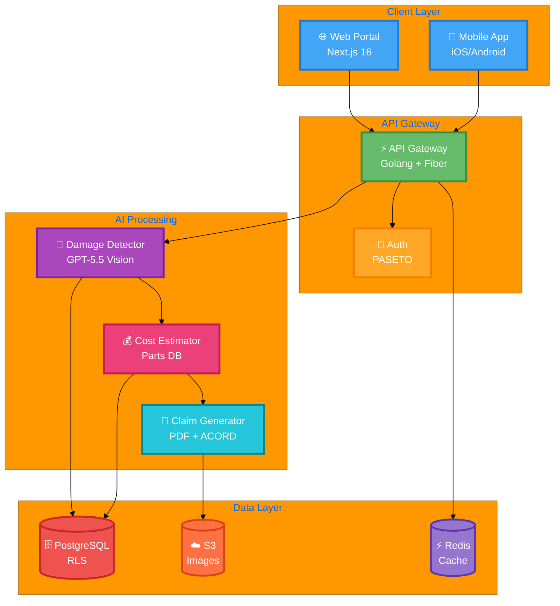
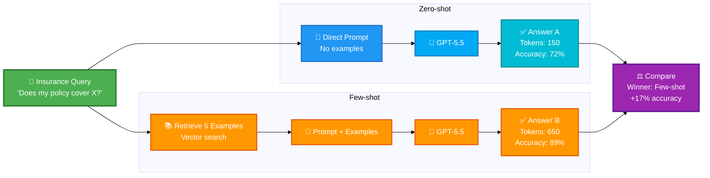
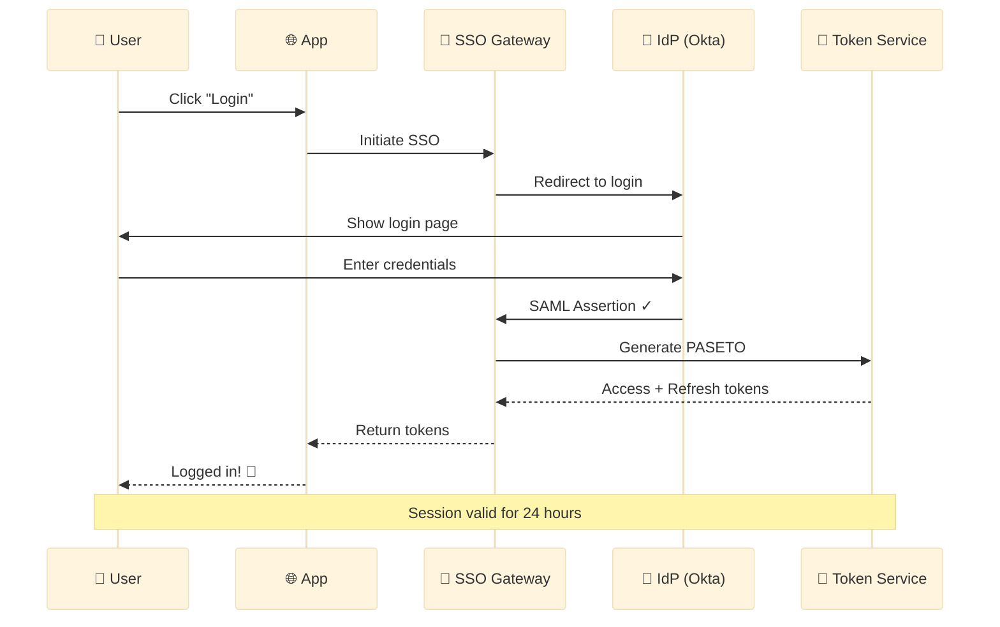
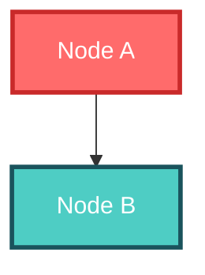
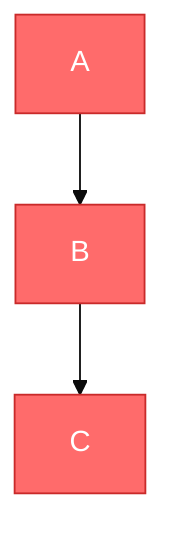
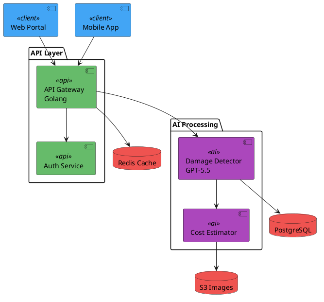
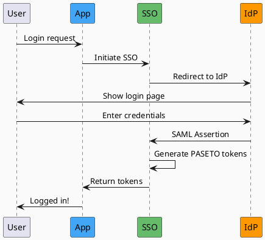

# System Diagram Creation Guide - Colorful Diagrams

**Date:** June 18, 2026  
**Purpose:** Comprehensive guide for creating professional, colorful system diagrams

---

## 🎨 Overview

This guide covers multiple methods to create colorful, professional system diagrams for technical documentation, presentations, and architecture designs.

---

## 📊 Quick Comparison Table

| Method | Best For | Effort | Result Quality | Cost |
|--------|----------|--------|----------------|------|
| **Mermaid** | Quick docs, GitHub, markdown | Low | Good | Free |
| **Python diagrams** | Automated generation, CI/CD | Medium | Professional | Free |
| **D2 Lang** | Modern aesthetics | Medium | Beautiful | Free |
| **PlantUML** | Complex UML diagrams | Medium | Classic | Free |
| **Draw.io** | Custom, pixel-perfect | High | Excellent | Free |
| **Excalidraw** | Hand-drawn style | Medium | Unique | Free |
| **Figma** | Professional design, branding | High | Outstanding | Free tier |
| **Lucidchart** | Enterprise collaboration | Medium | Professional | Paid |

---

## 🎨 Option 1: Mermaid (Most Popular for Docs)

### **Description**
Text-based diagramming that renders directly in GitHub, GitLab, VS Code, and documentation sites.

### **Setup**
- **Online Editor**: https://mermaid.live/
- **VS Code Extension**: "Mermaid Preview"
- **GitHub/GitLab**: Auto-renders in `.md` files

### **Example 1: AI Vehicle Damage Detection System**



### **Example 2: Zero-shot vs Few-shot Comparison**



### **Example 3: SSO Authentication Sequence**



### **Mermaid Color Customization**

**Method 1: Inline Styling**


**Method 2: Theme Variables**


**Available Themes:**
- `default` - Standard blue theme
- `dark` - Dark mode
- `forest` - Green theme
- `neutral` - Gray theme
- `base` - Customizable base

---

## 🐍 Option 2: Python Diagrams Library

### **Description**
Generate diagrams as code using Python. Perfect for automated documentation and CI/CD pipelines.

### **Installation**
```bash
pip install diagrams
```

### **Example: Multi-Cloud Architecture**

```python
from diagrams import Diagram, Cluster, Edge
from diagrams.onprem.client import Users
from diagrams.onprem.compute import Server
from diagrams.onprem.database import PostgreSQL, Redis
from diagrams.aws.storage import S3
from diagrams.programming.language import Python, Go

with Diagram("AI Vehicle Damage Platform", show=False, direction="TB"):
    users = Users("Users")
    
    with Cluster("API Layer"):
        gateway = Go("API Gateway\nGolang")
    
    with Cluster("AI Processing"):
        ai_detect = Python("Damage Detector\nGPT-5.5")
        ai_cost = Python("Cost Estimator")
        ai_claim = Python("Claim Generator")
    
    with Cluster("Data Layer"):
        db = PostgreSQL("PostgreSQL")
        cache = Redis("Redis")
        storage = S3("S3 Images")
    
    users >> gateway
    gateway >> ai_detect >> ai_cost >> ai_claim
    ai_detect >> db
    ai_cost >> db
    ai_claim >> storage
    gateway >> cache
```

**Output:** `AI_Vehicle_Damage_Platform.png`

### **Supported Providers**
- AWS, Azure, GCP, Alibaba Cloud
- Kubernetes, Docker, OpenStack
- Programming languages (Python, Go, Java, etc.)
- Databases (PostgreSQL, MySQL, MongoDB, etc.)
- Custom icons

---

## 🎨 Option 3: D2 Lang (Modern Diagramming)

### **Description**
Modern declarative language for diagrams with beautiful aesthetics.

### **Installation**
```bash
# macOS
brew install d2

# Linux
curl -fsSL https://d2lang.com/install.sh | sh

# Windows
# Download from https://github.com/terrastruct/d2/releases
```

### **Example: System Architecture**

```d2
direction: right

users: Users {
  shape: person
  style: {
    fill: "#4CAF50"
    stroke: "#2E7D32"
    stroke-width: 3
  }
}

api: API Gateway\nGolang {
  shape: rectangle
  style: {
    fill: "#2196F3"
    stroke: "#1565C0"
    stroke-width: 3
  }
}

ai: AI Processing {
  detect: Damage Detector\nGPT-5.5 {
    style: {
      fill: "#9C27B0"
      stroke: "#6A1B9A"
    }
  }
  cost: Cost Estimator {
    style: {
      fill: "#FF9800"
      stroke: "#E65100"
    }
  }
}

data: Data Layer {
  db: PostgreSQL {
    shape: cylinder
    style: {
      fill: "#F44336"
      stroke: "#C62828"
    }
  }
  s3: S3 Images {
    shape: cylinder
    style: {
      fill: "#FF5722"
      stroke: "#D84315"
    }
  }
}

users -> api -> ai.detect -> ai.cost
ai.detect -> data.db
ai.cost -> data.s3
```

**Render:**
```bash
d2 diagram.d2 output.png
d2 diagram.d2 output.svg
```

---

## 📐 Option 4: PlantUML (Classic & Powerful)

### **Description**
Industry-standard for UML diagrams, sequence diagrams, and architecture.

### **Online Editor**
https://www.plantuml.com/plantuml/

### **Example: Component Diagram**



### **Sequence Diagram**



---

## 🎯 Option 5: Draw.io (Most Flexible)

### **Description**
Free, powerful diagramming tool with pixel-perfect control.

### **URL**
https://app.diagrams.net/

### **Features**
- Drag-and-drop interface
- Huge icon library (AWS, Azure, GCP, etc.)
- Custom color palettes
- Templates for all diagram types
- Export to PNG, SVG, PDF

### **Step-by-Step: Create Colorful Diagram**

1. **Open Draw.io**: https://app.diagrams.net/
2. **Choose "Blank Diagram"**
3. **Add Shapes**:
   - Drag **rounded rectangle** from left toolbar
   - Format → Fill → Choose color (#42A5F5 for blue)
   - Format → Line → Choose stroke color (#1976D2)
4. **Add Icons**:
   - Click "+" → Search "server", "database", "cloud"
   - Or import custom icons
5. **Create Groups**:
   - Use dashed rectangles for grouping
   - Format → Line → Style → Dashed
6. **Add Arrows**:
   - Connect shapes with arrow tool
   - Add labels on arrows
7. **Export**:
   - File → Export as → PNG
   - Choose 2x or 3x resolution for high quality

---

## 🖍️ Option 6: Excalidraw (Hand-drawn Style)

### **Description**
Create hand-drawn style diagrams with a unique aesthetic.

### **URL**
https://excalidraw.com/

### **Features**
- Hand-drawn aesthetic (like whiteboard sketches)
- Real-time collaboration
- Custom colors and shapes
- Export as PNG, SVG
- No signup required

### **Perfect For**
- Brainstorming diagrams
- Casual documentation
- Presentation slides with personality

---

## 🎨 Recommended Color Palettes

### **Material Design Colors**
```
Blue (Primary):   #2196F3 | Dark: #1565C0
Green (Success):  #4CAF50 | Dark: #2E7D32
Orange (Warning): #FF9800 | Dark: #E65100
Red (Error):      #F44336 | Dark: #C62828
Purple (AI):      #9C27B0 | Dark: #6A1B9A
Teal (Data):      #009688 | Dark: #00695C
```

### **Professional Palette**
```
Navy Blue:    #1E3A8A
Sky Blue:     #3B82F6
Emerald:      #10B981
Amber:        #F59E0B
Rose:         #F43F5E
Slate Gray:   #64748B
```

### **Tech Stack Colors**
```
Frontend:     #42A5F5 (Light Blue)
Backend:      #66BB6A (Green)
Database:     #EF5350 (Red)
Cache:        #AB47BC (Purple)
AI/ML:        #9C27B0 (Deep Purple)
Storage:      #FF7043 (Deep Orange)
```

---

## 🚀 Quick Start Workflow

### **For Documentation (Markdown/GitHub)**
1. Use **Mermaid** diagrams in `.md` files
2. GitHub/GitLab auto-renders
3. Version control friendly

### **For Presentations**
1. Use **Draw.io** or **Excalidraw**
2. Export as high-res PNG (2x)
3. Insert into PowerPoint/Google Slides

### **For Automated Documentation**
1. Use **Python diagrams** library
2. Generate in CI/CD pipeline
3. Auto-update with code changes

### **For Infographics**
1. Use **Figma** or **Draw.io**
2. Pixel-perfect control
3. Export as SVG for scaling

---

## 📊 Icon Resources (Free)

1. **Flaticon**: https://www.flaticon.com/
2. **Font Awesome**: https://fontawesome.com/
3. **Heroicons**: https://heroicons.com/
4. **Material Design Icons**: https://fonts.google.com/icons
5. **Noun Project**: https://thenounproject.com/
6. **AWS Architecture Icons**: https://aws.amazon.com/architecture/icons/
7. **Azure Icons**: https://docs.microsoft.com/en-us/azure/architecture/icons/
8. **GCP Icons**: https://cloud.google.com/icons

---

## 💡 Pro Tips

1. **Consistency**: Use 3-5 colors max from same palette
2. **Spacing**: Maintain consistent padding and margins
3. **Alignment**: Use grid for perfect alignment
4. **Font**: Stick to 1-2 fonts (bold for titles, regular for body)
5. **Icons**: Keep same style (outline vs filled)
6. **Export**: Always export at 2x or 3x resolution
7. **White Space**: Don't overcrowd - leave breathing room
8. **Accessibility**: Ensure sufficient color contrast

---

## 🎯 Decision Matrix

### **Choose Mermaid if:**
- Writing technical documentation
- Need version control
- Want auto-rendering in GitHub
- Quick turnaround

### **Choose Python Diagrams if:**
- Generating diagrams programmatically
- Need CI/CD integration
- Multiple similar diagrams
- Infrastructure-as-code approach

### **Choose Draw.io if:**
- Need pixel-perfect control
- Custom branding required
- Complex, detailed diagrams
- One-time creation

### **Choose Excalidraw if:**
- Want hand-drawn aesthetic
- Brainstorming sessions
- Casual documentation
- Real-time collaboration

---

## 📝 Example Commands

### **Mermaid (Live Editor)**
```
1. Go to https://mermaid.live/
2. Paste code
3. Download PNG/SVG
```

### **Python Diagrams**
```bash
python3 -m pip install diagrams
python3 my_diagram.py
# Output: diagram.png
```

### **D2 Lang**
```bash
d2 input.d2 output.png
d2 --theme=200 input.d2 output.svg
```

### **PlantUML**
```bash
plantuml diagram.puml
# Output: diagram.png
```

---

**Document Status:** ✅ Complete Reference Guide

**Version:** 1.0  
**Date:** June 18, 2026

**Usage:** Reference this guide when creating system diagrams for any project.
