# Finance Multi-AI-Agent Platform - System Diagrams

**Date:** June 18, 2026  
**Version:** 1.0

---

## 1. Complete System Architecture

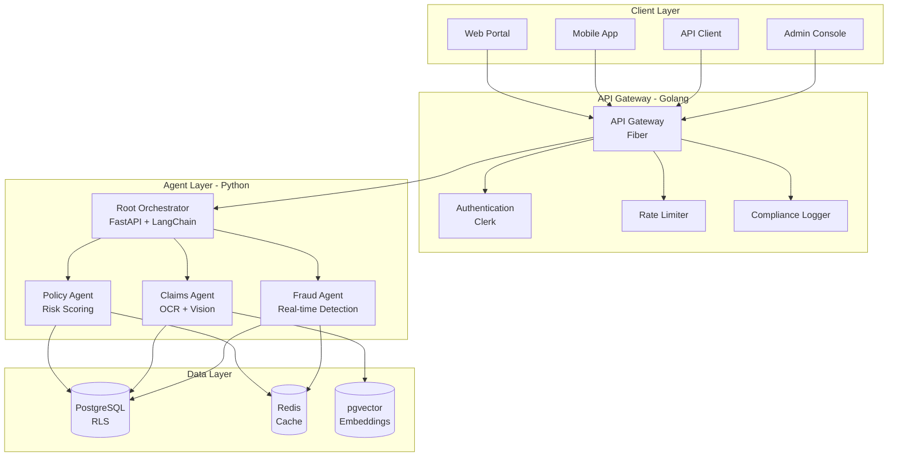

---

## 2. Sequential Workflow Pattern

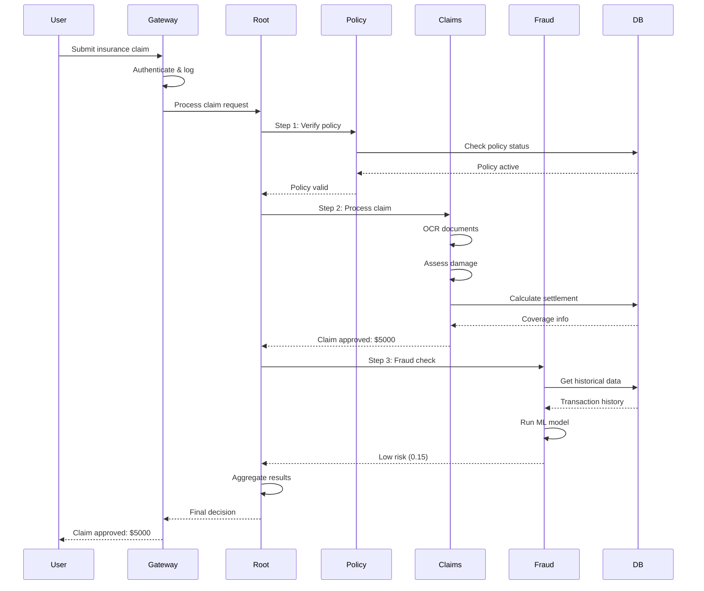

---

## 3. Parallel Workflow Pattern

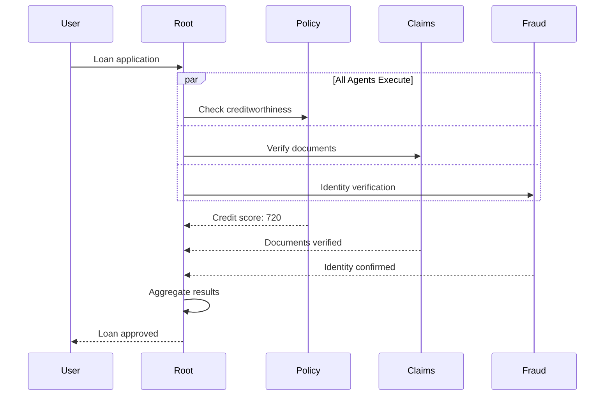

---

## 4. Peer-to-Peer Collaboration

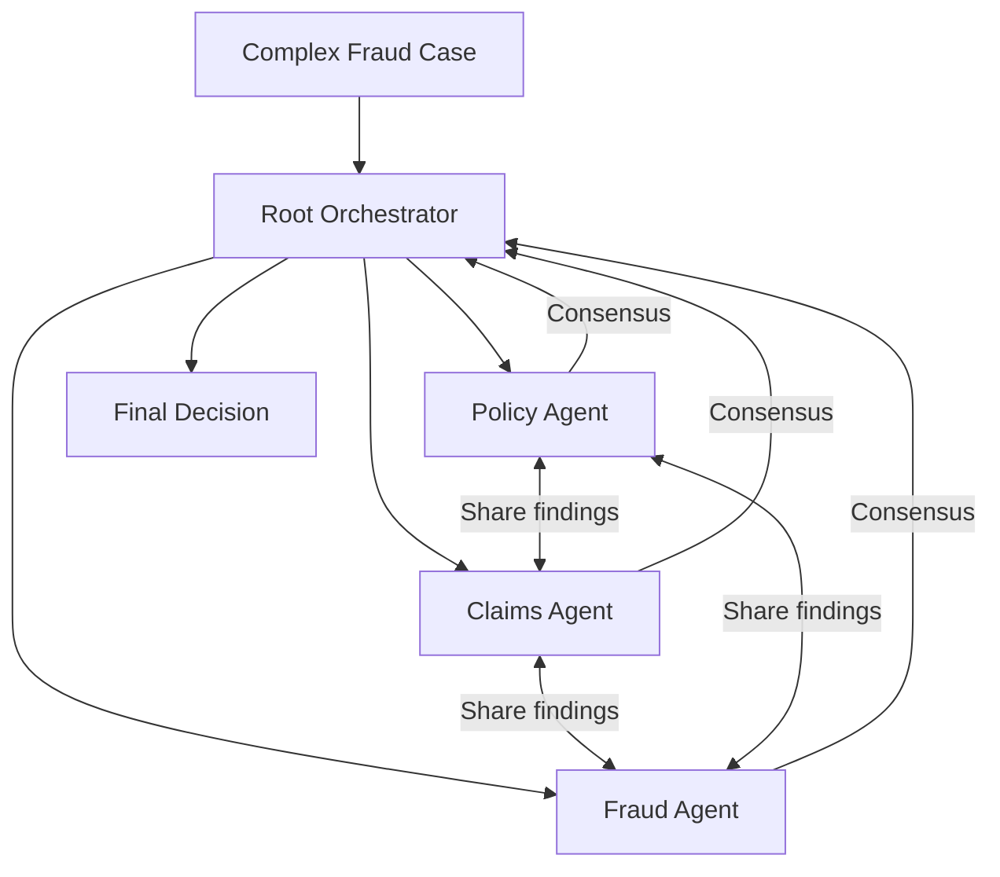

---

## 5. Policy Agent Flow

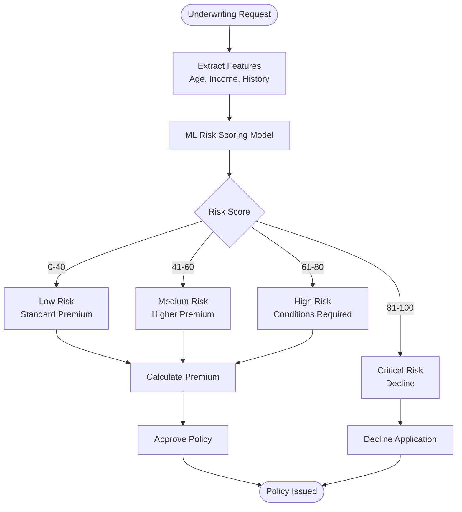

---

## 6. Claims Agent Flow

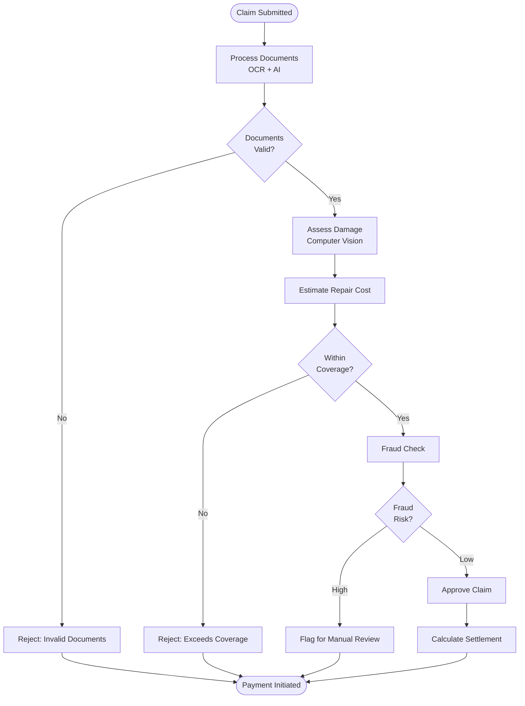

---

## 7. Fraud Agent Real-Time Detection

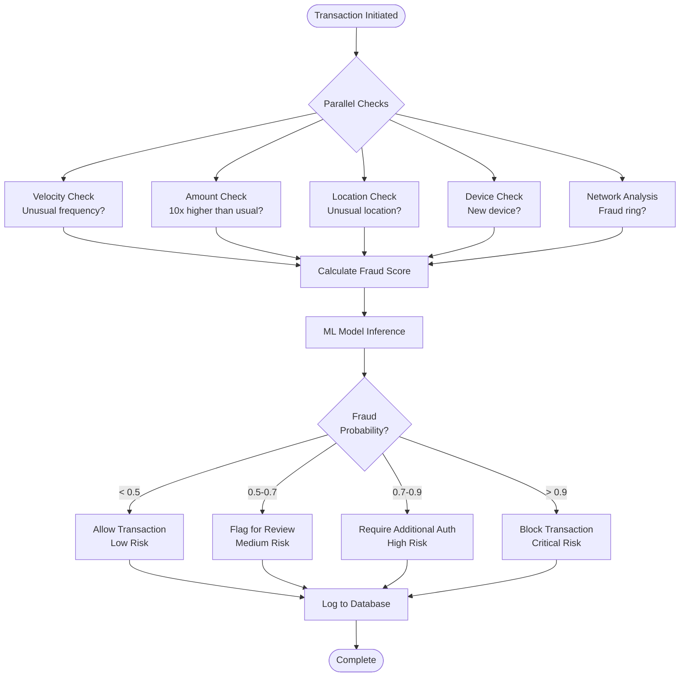

---

## 8. Multi-Tenant Data Isolation

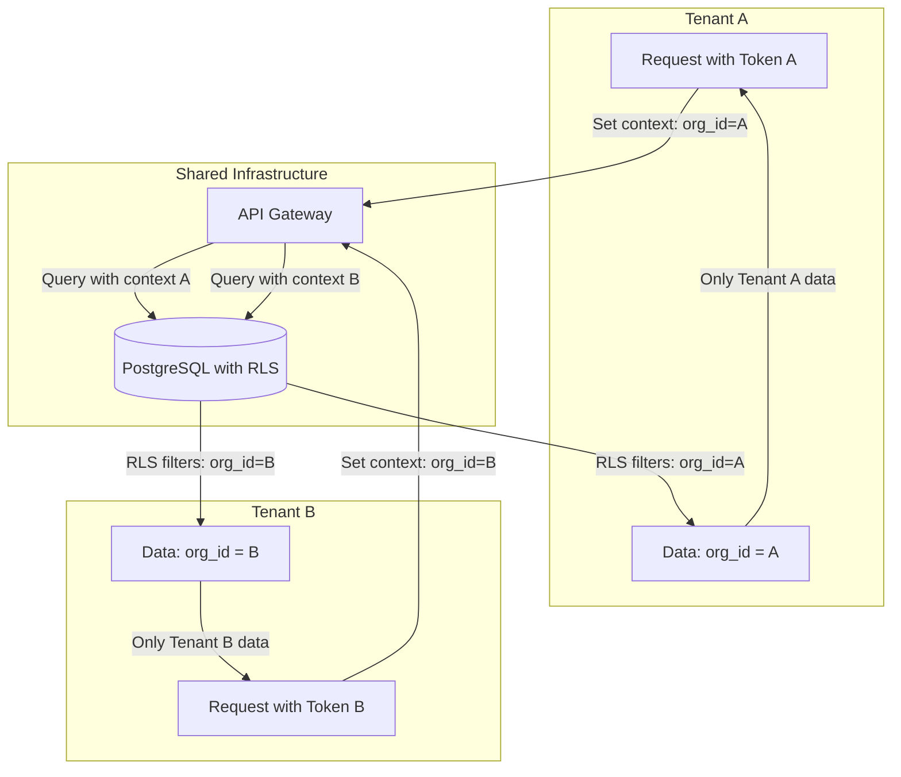

---

## 9. Compliance Architecture

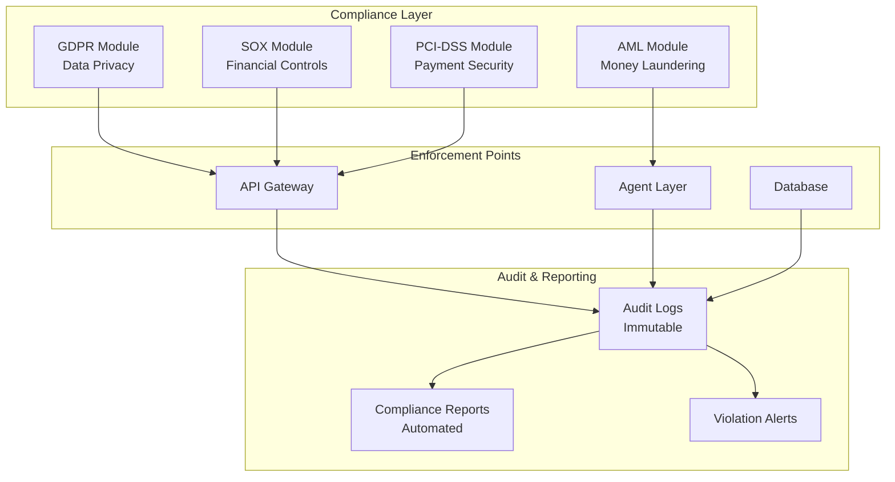

---

## 10. Fraud Detection Network Analysis

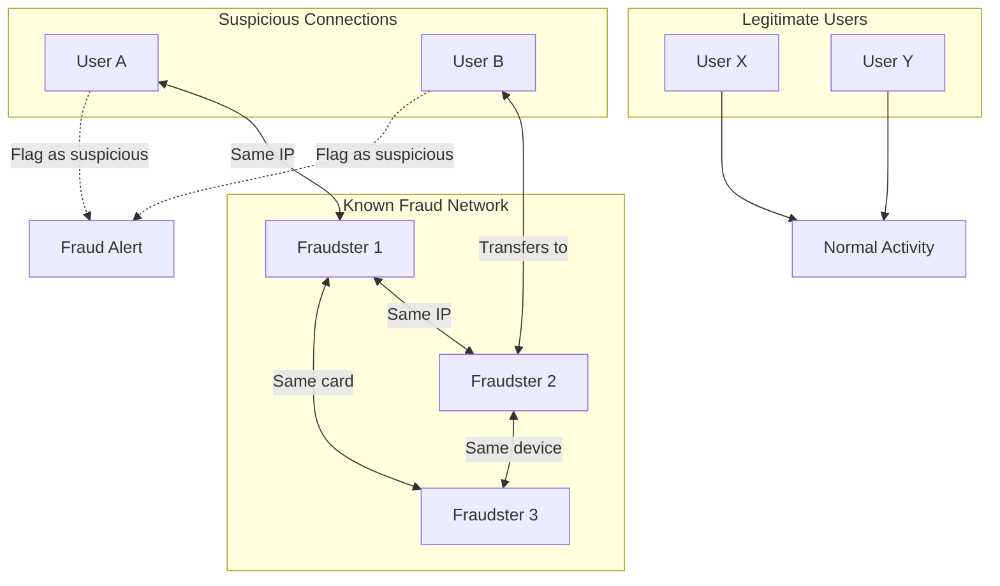

---

## 11. Data Architecture

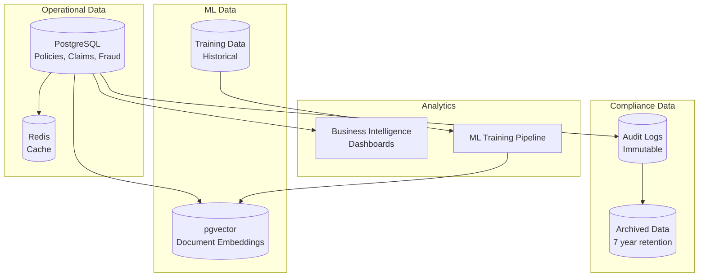

---

## 12. Deployment Architecture

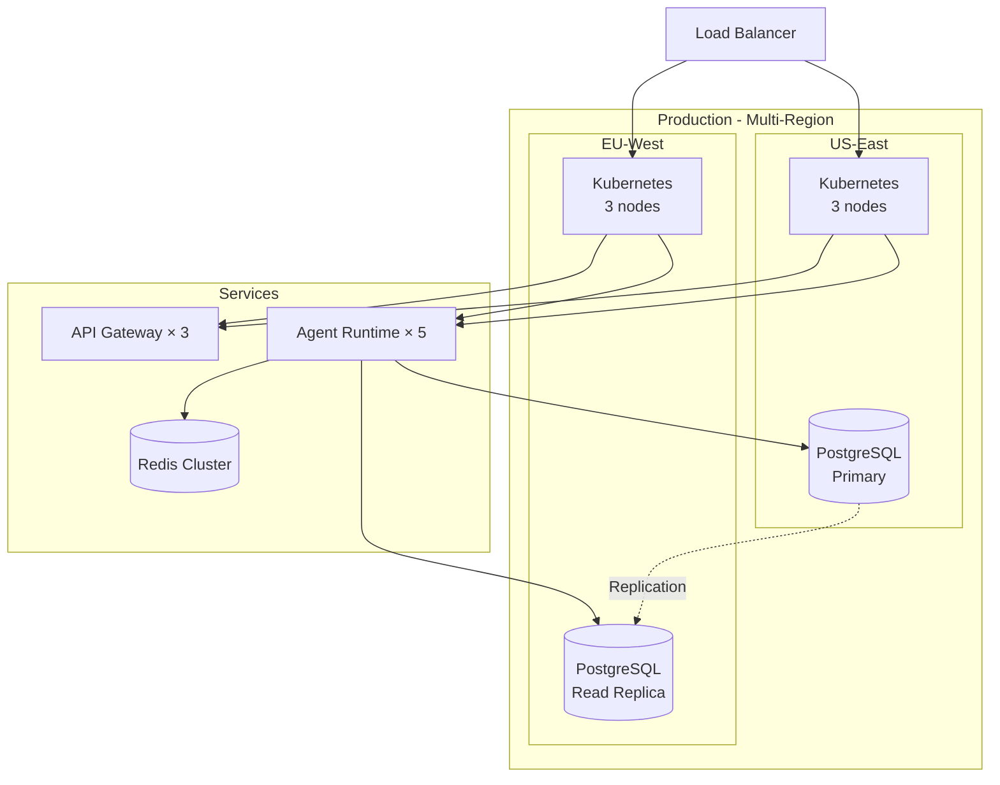

---

**Status:** ✅ Complete - 12 System Diagrams

**Usage:** Render with Mermaid (GitHub, GitLab, VS Code)
