# Financial Knowledge Graph & Semantic Reasoning Platform - System Diagrams

**Date:** June 24, 2026  
**Version:** 1.0

---

## 1. Complete System Architecture

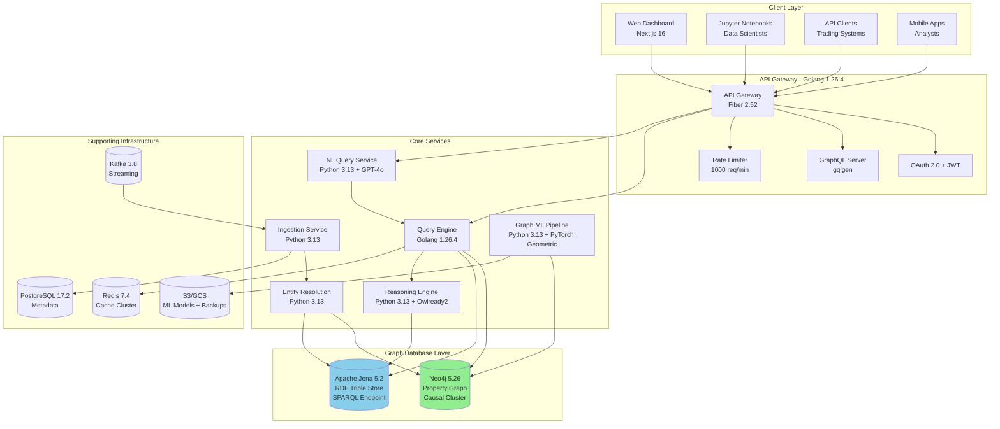

---

## 2. Graph Query Execution Flow

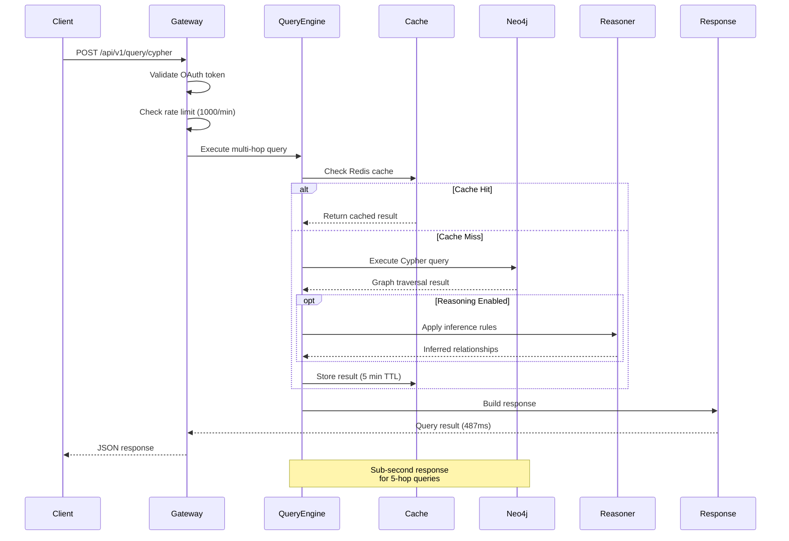

---

## 3. Entity Resolution Pipeline

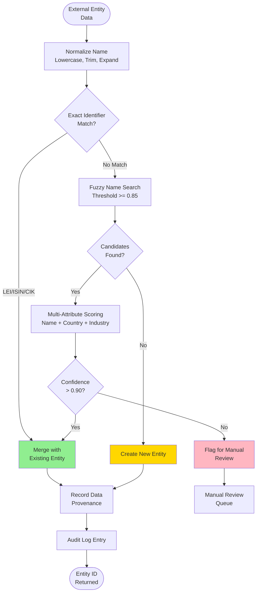

---

## 4. Multi-Hop Relationship Traversal

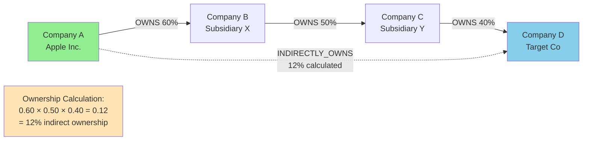

---

## 5. Semantic Reasoning Workflow

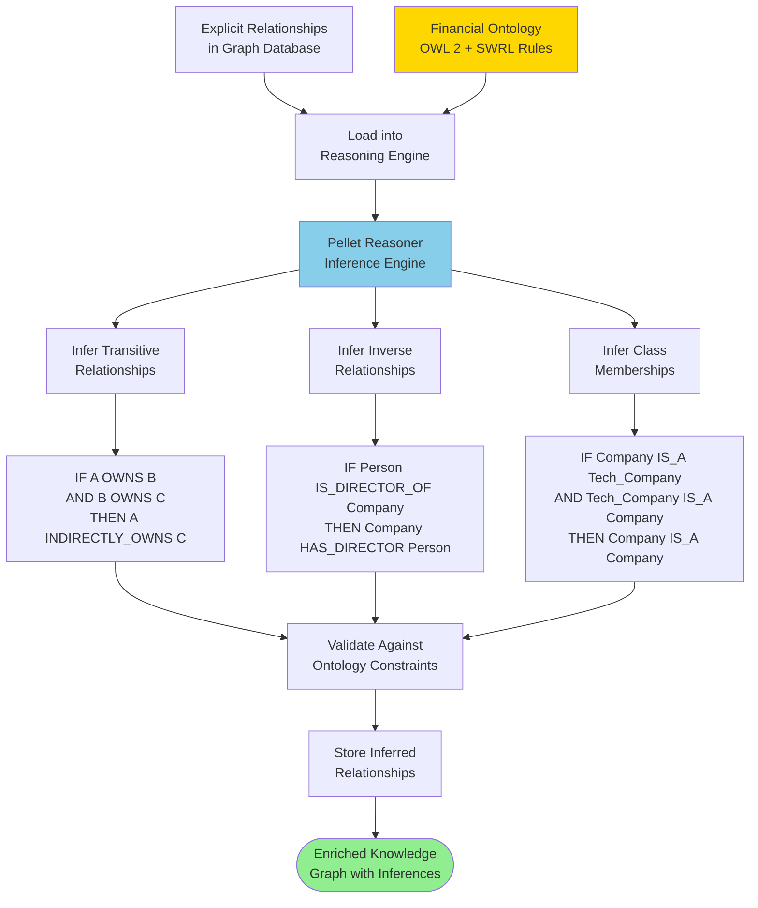

---

## 6. GNN Training and Inference Pipeline

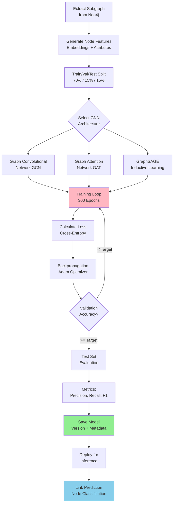

---

## 7. Real-Time Data Ingestion

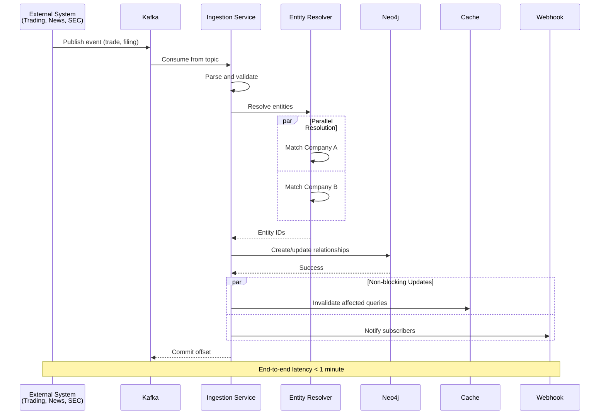

---

## 8. Temporal Graph Queries

```mermaid
flowchart TD
    QUERY[Historical Query:<br/>"Show board members<br/>on Jan 1, 2025"] --> PARSE[Parse Target<br/>Timestamp]
    
    PARSE --> FILTER[Filter Relationships:<br/>valid_from <= 2025-01-01<br/>AND valid_to >= 2025-01-01]
    
    FILTER --> CYPHER[Build Cypher Query<br/>with Temporal Constraints]
    
    CYPHER --> NEO4J[Execute on Neo4j<br/>Temporal Graph]
    
    NEO4J --> SNAPSHOT[Reconstruct Graph<br/>State at Timestamp]
    
    SNAPSHOT --> RESULT[Return Historical<br/>Graph State]
    
    RESULT --> TIMELINE{User Requests<br/>Time Series?}
    
    TIMELINE -->|Yes| AGGREGATE[Aggregate Changes<br/>Over Time Windows]
    TIMELINE -->|No| DISPLAY[Display Single<br/>Snapshot]
    
    AGGREGATE --> CHARTS[Generate Time-Series<br/>Charts]
    
    CHARTS --> DISPLAY
    
    DISPLAY --> OUTPUT([Historical Analysis<br/>Result])
    
    style SNAPSHOT fill:#87CEEB
    style CHARTS fill:#FFD700
```

---

## 9. Natural Language Query Translation

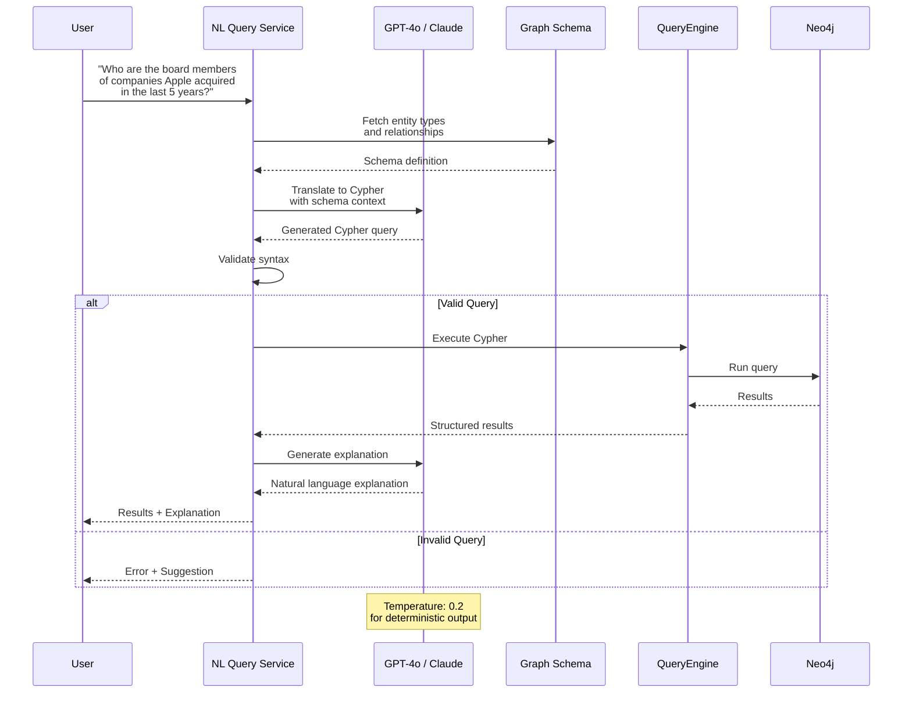

---

## 10. Graph Visualization Architecture

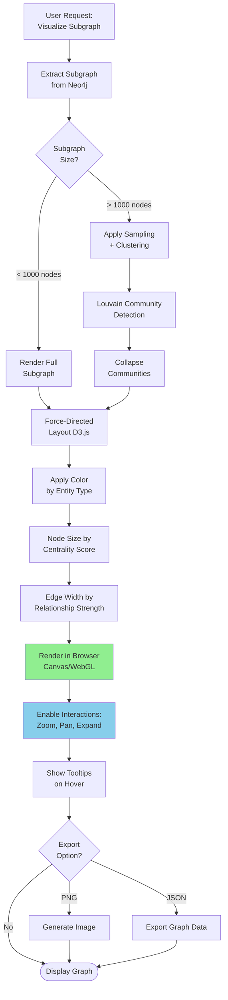

---

## 11. Neo4j Cluster Deployment

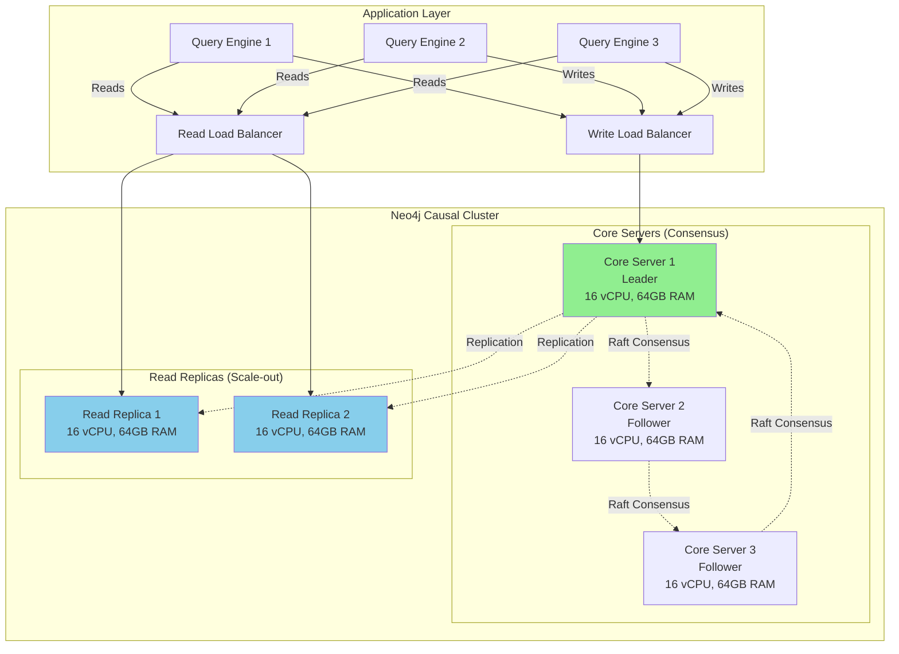

---

## 12. Caching Strategy

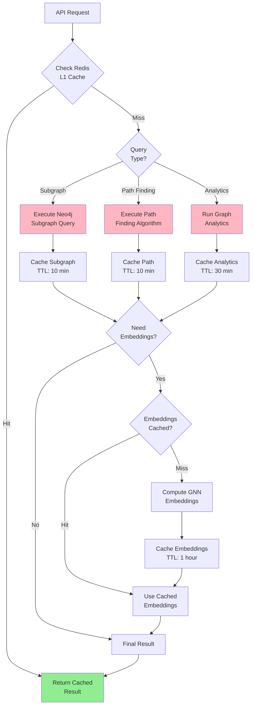

---

## 13. Auto-Scaling Behavior

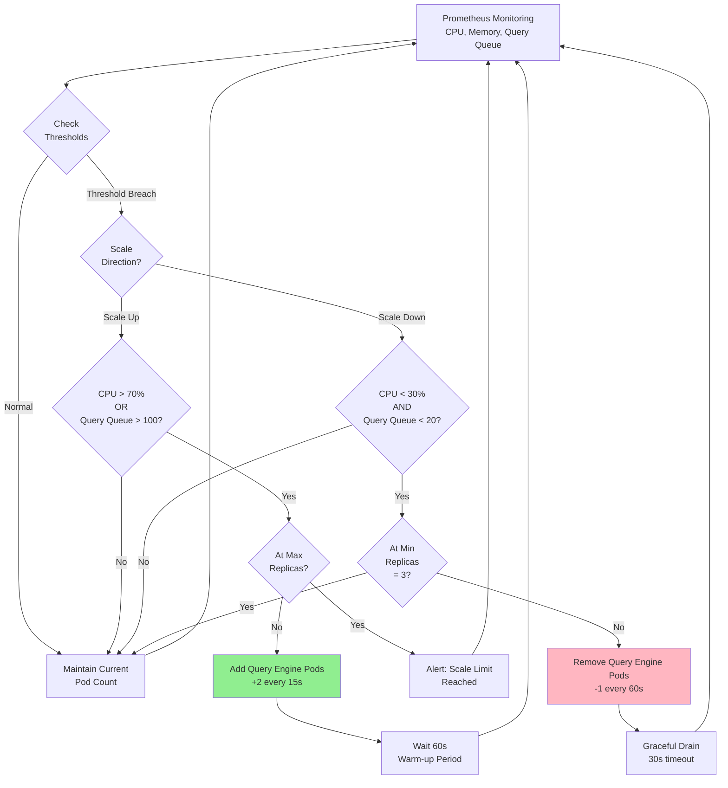

---

## 14. Security Layers

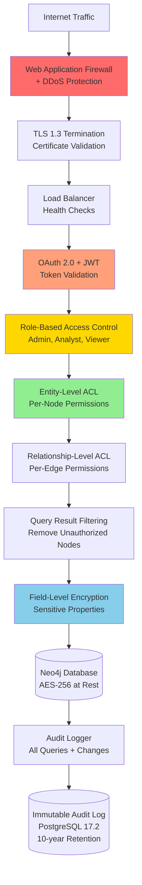

---

## 15. Monitoring & Observability

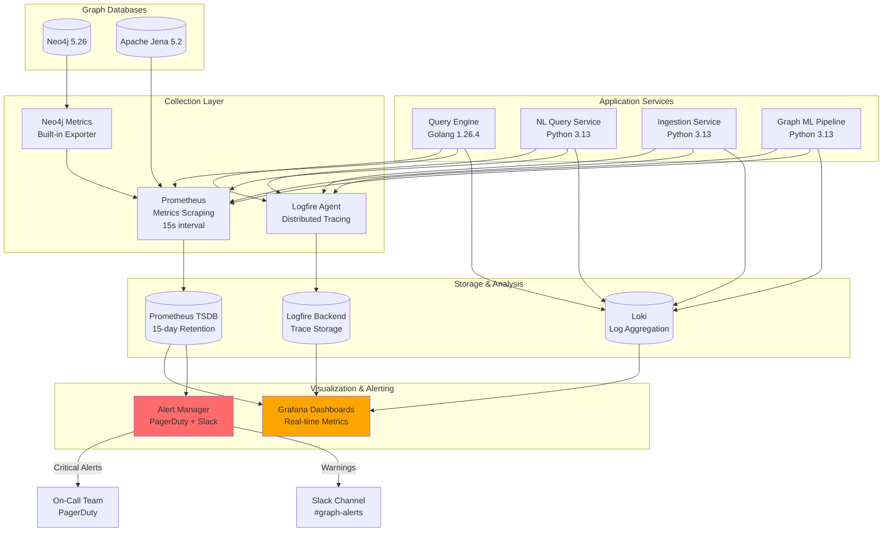

---

**Status:** ✅ Complete - 15 Comprehensive System Diagrams

**Diagram Summary:**
1. Complete System Architecture - High-level component overview
2. Graph Query Execution Flow - Sequence diagram for query processing
3. Entity Resolution Pipeline - Deduplication and merging workflow
4. Multi-Hop Relationship Traversal - Ownership calculation example
5. Semantic Reasoning Workflow - OWL inference process
6. GNN Training and Inference Pipeline - Machine learning workflow
7. Real-Time Data Ingestion - Kafka streaming architecture
8. Temporal Graph Queries - Historical state reconstruction
9. Natural Language Query Translation - LLM-powered query conversion
10. Graph Visualization Architecture - Interactive rendering pipeline
11. Neo4j Cluster Deployment - Causal cluster configuration
12. Caching Strategy - Multi-layer Redis caching
13. Auto-Scaling Behavior - Kubernetes HPA logic
14. Security Layers - Defense-in-depth architecture
15. Monitoring & Observability - Comprehensive observability stack

**Rendering:** All diagrams use Mermaid syntax compatible with GitHub, GitLab, VS Code, Notion, and Confluence

**Technology Versions (June 2026):**
- Golang: 1.26.4
- Python: 3.13
- Neo4j: 5.26
- Apache Jena: 5.2
- PyTorch Geometric: 2.6
- Redis: 7.4
- Kafka: 3.8
- Kubernetes: 1.32
- Next.js: 16
- PostgreSQL: 17.2

---

**Document Complete**  
**Date:** June 24, 2026
