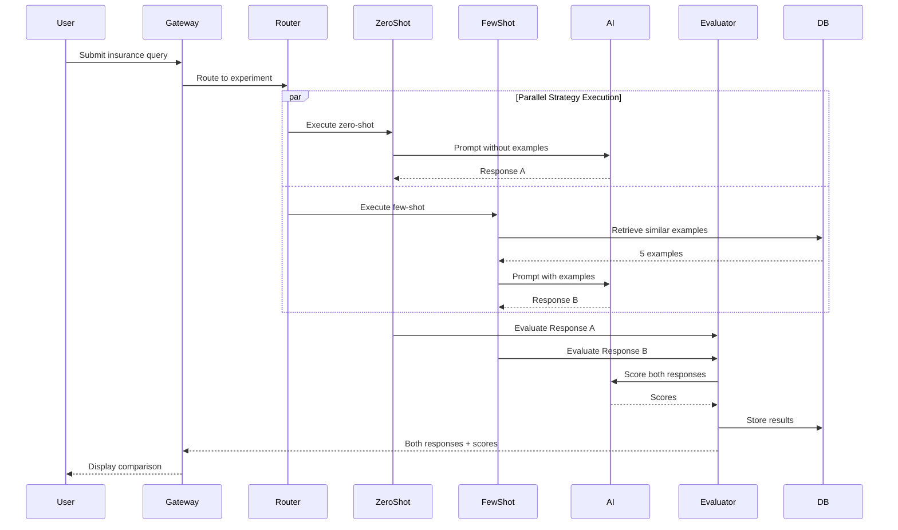
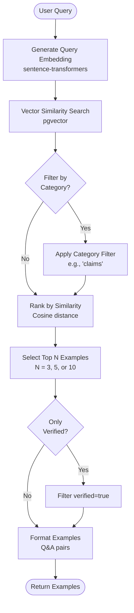
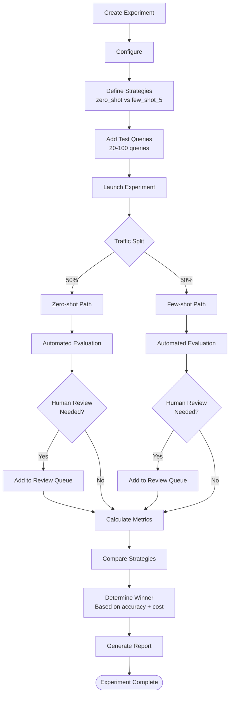
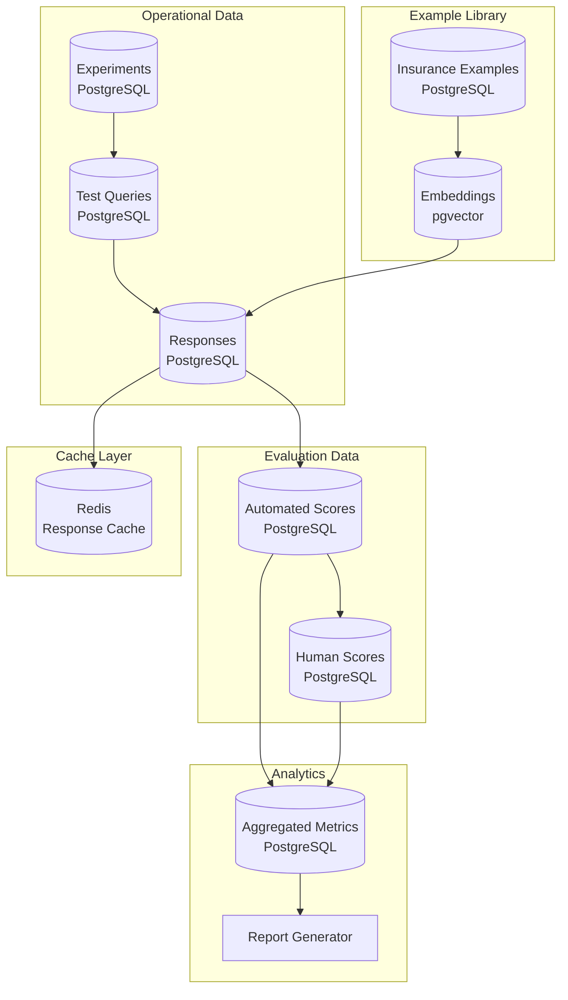
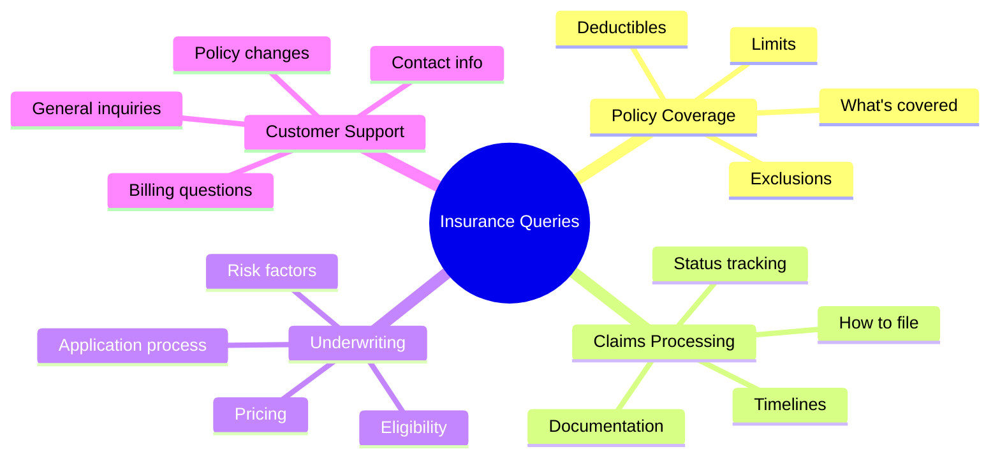
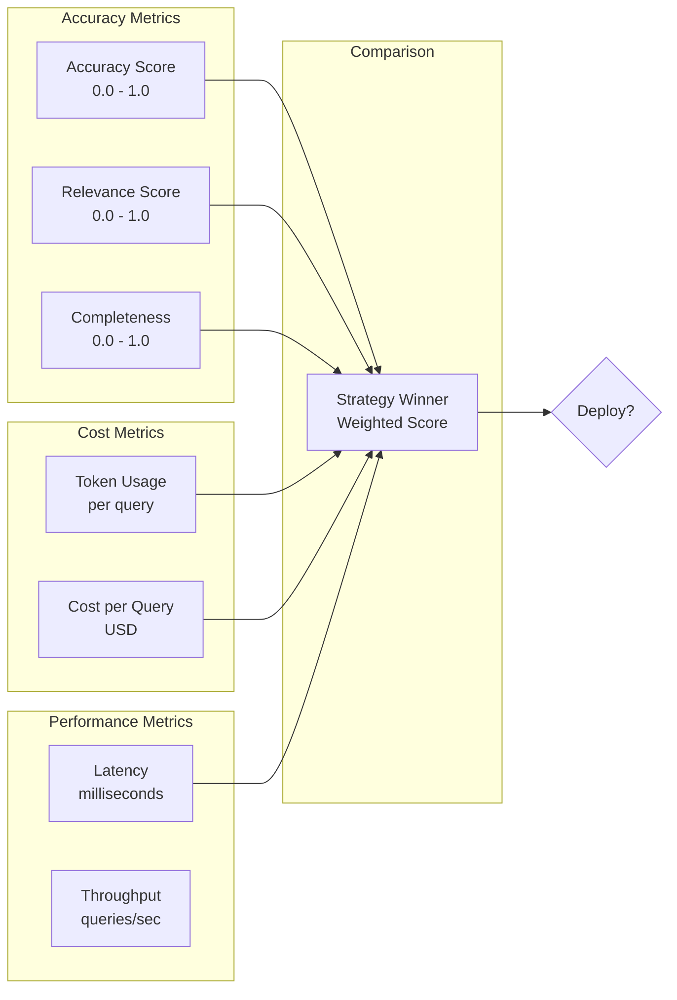
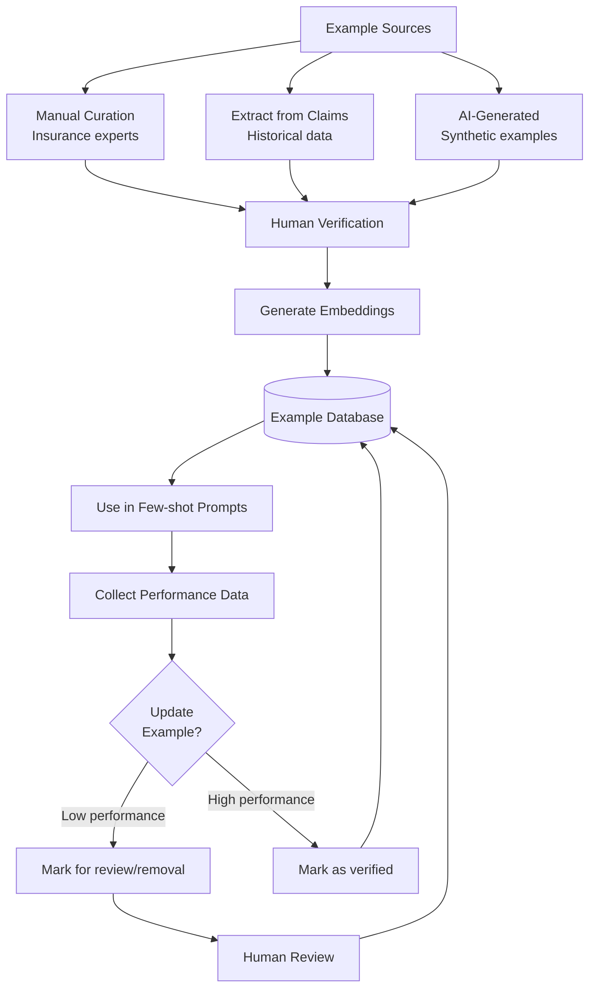

# Zero-shot vs Few-shot Prompting Platform - Architecture & System Diagrams

**Date:** June 18, 2026  
**Version:** 1.0

---

## 1. Complete System Architecture

```
┌──────────────────────────────────────────────────────────────┐
│              USER INTERFACE LAYER                            │
│  Experiment Dashboard | Query Tester | Analytics Dashboard  │
│  Next.js 16 + React 19.2.7 + Chart.js                       │
└────────────────────────┬─────────────────────────────────────┘
                         │
                    HTTPS/REST
                         │
┌────────────────────────▼─────────────────────────────────────┐
│       API GATEWAY (Golang + Fiber)                           │
│  ┌────────────────────────────────────────────────────┐     │
│  │  Request Router                                    │     │
│  │  • Experiment routing                              │     │
│  │  • A/B test traffic split                         │     │
│  │  • Response collection                             │     │
│  └────────────────────┬───────────────────────────────┘     │
└────────────────────────┼─────────────────────────────────────┘
                         │
                       gRPC
                         │
┌────────────────────────▼─────────────────────────────────────┐
│      PROMPT ENGINE (Python + FastAPI)                        │
│  ┌────────────────────────────────────────────────────┐     │
│  │         Strategy Router                            │     │
│  │  ┌──────────────┐  ┌──────────────┐              │     │
│  │  │  Zero-shot   │  │  Few-shot    │              │     │
│  │  │  Handler     │  │  Handler     │              │     │
│  │  └──────────────┘  └──────────────┘              │     │
│  └──────────────────┬─────────────────────────────────┘     │
│                     │                                        │
│  ┌──────────────────▼─────────────────────────────────┐     │
│  │      Example Retrieval System                      │     │
│  │  • Vector similarity (pgvector)                    │     │
│  │  • Category filtering                              │     │
│  │  • Dynamic few-shot builder                        │     │
│  └──────────────────┬─────────────────────────────────┘     │
│                     │                                        │
│  ┌──────────────────▼─────────────────────────────────┐     │
│  │      AI Model Interface                            │     │
│  │  • GPT-5.5 API (OpenAI)                           │     │
│  │  • Claude Opus 4.8 (Anthropic)                    │     │
│  └──────────────────┬─────────────────────────────────┘     │
│                     │                                        │
│  ┌──────────────────▼─────────────────────────────────┐     │
│  │      Evaluation Engine                             │     │
│  │  • Automated scoring (AI-as-judge)                 │     │
│  │  • Metric calculation                              │     │
│  │  • Human evaluation queue                          │     │
│  └────────────────────────────────────────────────────┘     │
└──────────────────────┬───────────────────────────────────────┘
                       │
┌──────────────────────▼───────────────────────────────────────┐
│              DATA LAYER                                      │
│  ┌──────────────┐  ┌────────────┐  ┌────────────┐          │
│  │ PostgreSQL   │  │  pgvector  │  │   Redis    │          │
│  │ Experiments  │  │  Examples  │  │   Cache    │          │
│  └──────────────┘  └────────────┘  └────────────┘          │
└──────────────────────────────────────────────────────────────┘
```

---

## 2. Prompt Strategy Comparison Flow



---

## 3. Zero-shot Prompting Architecture

```
┌──────────────────────────────────────────┐
│      Zero-shot Strategy                  │
├──────────────────────────────────────────┤
│                                          │
│  ┌────────────────────────────────┐     │
│  │  System Prompt Builder         │     │
│  │  • Category-specific context   │     │
│  │  • Role definition             │     │
│  │  • Output format instructions  │     │
│  └────────────┬───────────────────┘     │
│               │                          │
│  ┌────────────▼───────────────────┐     │
│  │  User Query                    │     │
│  │  "Does my insurance cover X?"  │     │
│  └────────────┬───────────────────┘     │
│               │                          │
│  ┌────────────▼───────────────────┐     │
│  │  AI Model (GPT-5.5)            │     │
│  │  Temperature: 0.3              │     │
│  │  Max tokens: 500               │     │
│  └────────────┬───────────────────┘     │
│               │                          │
│  ┌────────────▼───────────────────┐     │
│  │  Response                      │     │
│  │  • Answer text                 │     │
│  │  • Token count: ~150           │     │
│  │  • Latency: ~800ms             │     │
│  └────────────────────────────────┘     │
└──────────────────────────────────────────┘
```

---

## 4. Few-shot Prompting Architecture

```
┌──────────────────────────────────────────┐
│      Few-shot Strategy                   │
├──────────────────────────────────────────┤
│                                          │
│  ┌────────────────────────────────┐     │
│  │  Query Embedding               │     │
│  │  sentence-transformers         │     │
│  └────────────┬───────────────────┘     │
│               │                          │
│  ┌────────────▼───────────────────┐     │
│  │  Vector Search (pgvector)      │     │
│  │  • Find 5 similar examples     │     │
│  │  • Category filter: 'policy'   │     │
│  │  • Min similarity: 0.7         │     │
│  └────────────┬───────────────────┘     │
│               │                          │
│  ┌────────────▼───────────────────┐     │
│  │  Prompt Construction           │     │
│  │  • System prompt               │     │
│  │  • 5 example Q&A pairs         │     │
│  │  • User query                  │     │
│  └────────────┬───────────────────┘     │
│               │                          │
│  ┌────────────▼───────────────────┐     │
│  │  AI Model (GPT-5.5)            │     │
│  │  Temperature: 0.3              │     │
│  │  Max tokens: 500               │     │
│  └────────────┬───────────────────┘     │
│               │                          │
│  ┌────────────▼───────────────────┐     │
│  │  Response                      │     │
│  │  • Answer text                 │     │
│  │  • Token count: ~650           │     │
│  │  • Latency: ~1400ms            │     │
│  └────────────────────────────────┘     │
└──────────────────────────────────────────┘
```

---

## 5. Example Retrieval Flow



---

## 6. A/B Testing Experiment Flow



---

## 7. Evaluation Pipeline

```
┌──────────────────────────────────────────┐
│      Evaluation Pipeline                 │
├──────────────────────────────────────────┤
│                                          │
│  ┌────────────────────────────────┐     │
│  │  Response Collection           │     │
│  │  • Query text                  │     │
│  │  • Response text               │     │
│  │  • Strategy used               │     │
│  │  • Token count                 │     │
│  │  • Latency                     │     │
│  └────────────┬───────────────────┘     │
│               │                          │
│  ┌────────────▼───────────────────┐     │
│  │  Automated Evaluation          │     │
│  │  AI-as-Judge (GPT-5.5)         │     │
│  │  ┌──────────────────────┐      │     │
│  │  │ Accuracy: 0.85       │      │     │
│  │  │ Relevance: 0.92      │      │     │
│  │  │ Completeness: 0.88   │      │     │
│  │  │ Tone: 0.90           │      │     │
│  │  └──────────────────────┘      │     │
│  └────────────┬───────────────────┘     │
│               │                          │
│  ┌────────────▼───────────────────┐     │
│  │  Confidence Check              │     │
│  │  If automated score < 0.7:     │     │
│  │  → Flag for human review       │     │
│  └────────────┬───────────────────┘     │
│               │                          │
│  ┌────────────▼───────────────────┐     │
│  │  Human Evaluation (Optional)   │     │
│  │  • Expert insurance adjusters  │     │
│  │  • Side-by-side comparison     │     │
│  │  • Final scores override       │     │
│  └────────────┬───────────────────┘     │
│               │                          │
│  ┌────────────▼───────────────────┐     │
│  │  Aggregate Metrics             │     │
│  │  • Strategy performance        │     │
│  │  • Cost analysis               │     │
│  │  • Latency benchmarks          │     │
│  └────────────────────────────────┘     │
└──────────────────────────────────────────┘
```

---

## 8. Data Architecture



---

## 9. Insurance Query Categories



---

## 10. Performance Metrics Dashboard



---

## 11. Example Library Growth



---

## 12. Deployment Architecture

```
┌─────────────────────────────────────────┐
│         Production Cluster              │
├─────────────────────────────────────────┤
│                                         │
│  Namespace: prompt-engineering          │
│                                         │
│  ┌────────────────────────────────┐    │
│  │  API Gateway                   │    │
│  │  • 3-5 pods (CPU autoscale)    │    │
│  │  • 2 CPU, 4GB RAM per pod      │    │
│  └────────────────────────────────┘    │
│                                         │
│  ┌────────────────────────────────┐    │
│  │  Prompt Engine                 │    │
│  │  • 5-10 pods (queue autoscale) │    │
│  │  • 4 CPU, 8GB RAM per pod      │    │
│  └────────────────────────────────┘    │
│                                         │
│  ┌────────────────────────────────┐    │
│  │  Evaluation Service            │    │
│  │  • 2-5 pods (queue autoscale)  │    │
│  │  • 2 CPU, 4GB RAM per pod      │    │
│  └────────────────────────────────┘    │
└─────────────────────────────────────────┘

┌─────────────────────────────────────────┐
│         Data Services                   │
├─────────────────────────────────────────┤
│                                         │
│  PostgreSQL + pgvector:                 │
│  • Primary (r6g.xlarge)                 │
│  • Read Replica (r6g.large)             │
│                                         │
│  Redis:                                 │
│  • 2-node cluster (cache.r6g.large)    │
│                                         │
│  External APIs:                         │
│  • OpenAI GPT-5.5                       │
│  • Anthropic Claude Opus 4.8           │
└─────────────────────────────────────────┘
```

---

**Status:** ✅ Complete - Architecture & 12 System Diagrams

**Version:** 1.0  
**Date:** June 18, 2026

**Usage:** Render with Mermaid (GitHub, GitLab, VS Code)
