# IoT-AI Oil & Gas Platform - Architecture & System Diagrams

**Date:** June 18, 2026  
**Version:** 1.0

---

## 1. Complete System Architecture

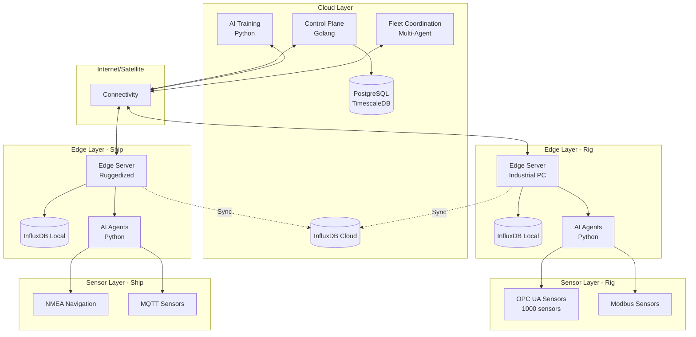

---

## 2. Hybrid Edge-Cloud Data Flow

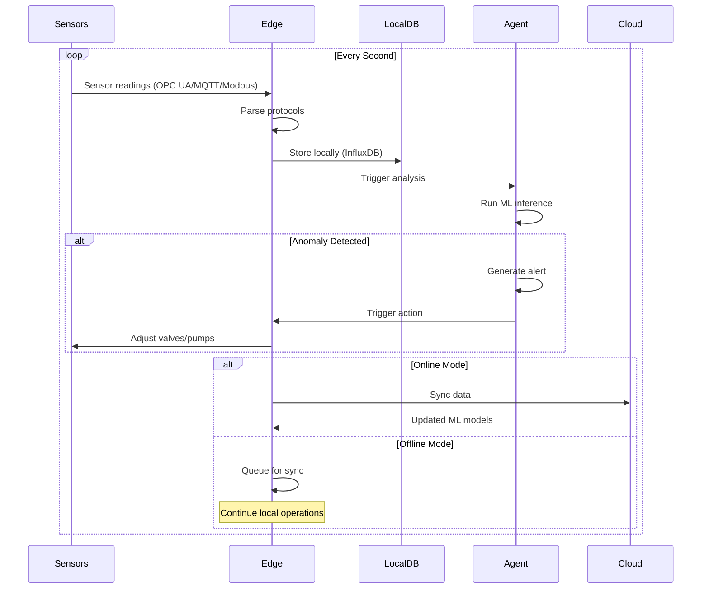

---

## 3. Predictive Maintenance Pipeline

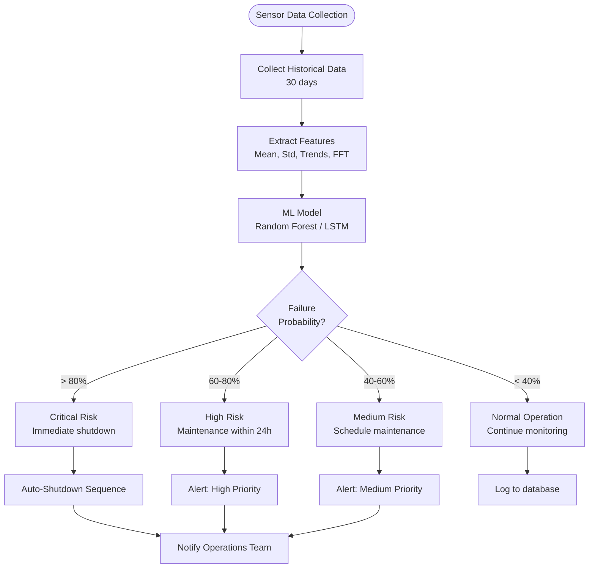

---

## 4. Safety Monitoring Architecture

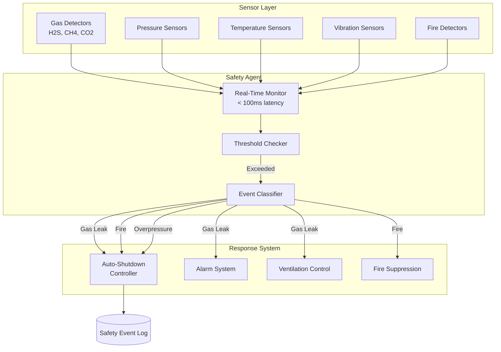

---

## 5. Multi-Protocol Gateway

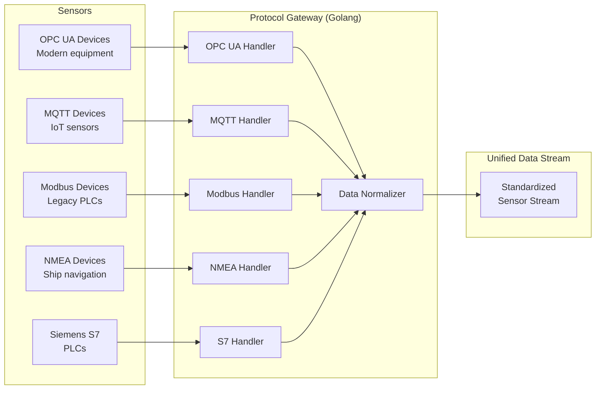

---

## 6. Fleet Coordination (Ships)

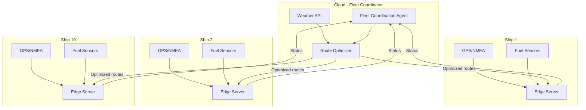

---

## 7. Edge Offline Operation

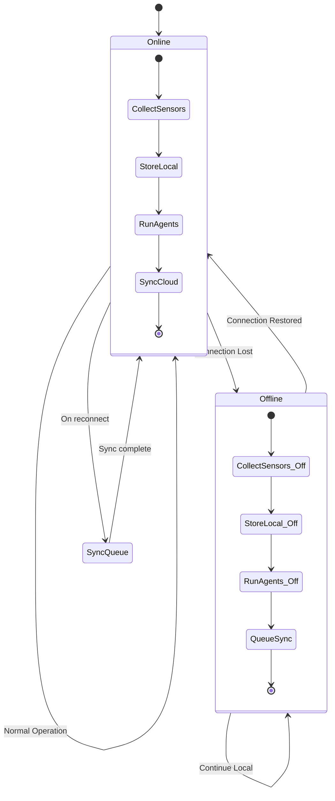

---

## 8. Compliance Monitoring

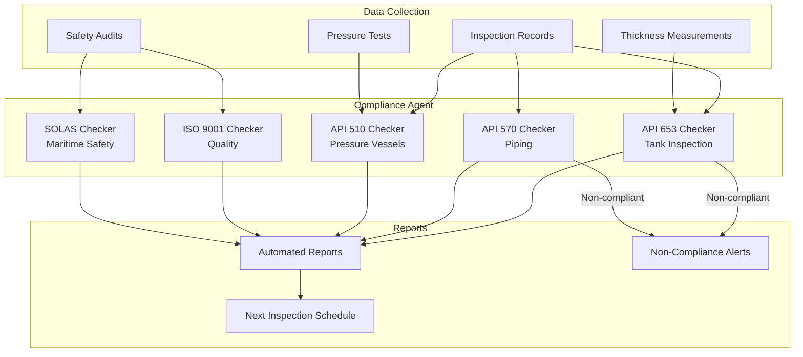

---

## 9. Data Architecture (Time-Series + Relational)

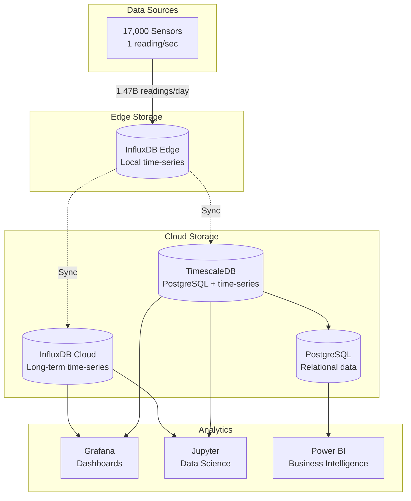

---

## 10. Security Architecture (ISA/IEC 62443)

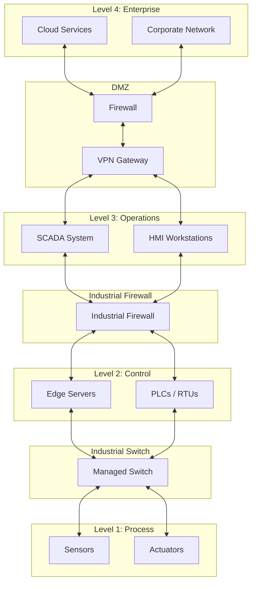

---

## 11. Deployment Topology

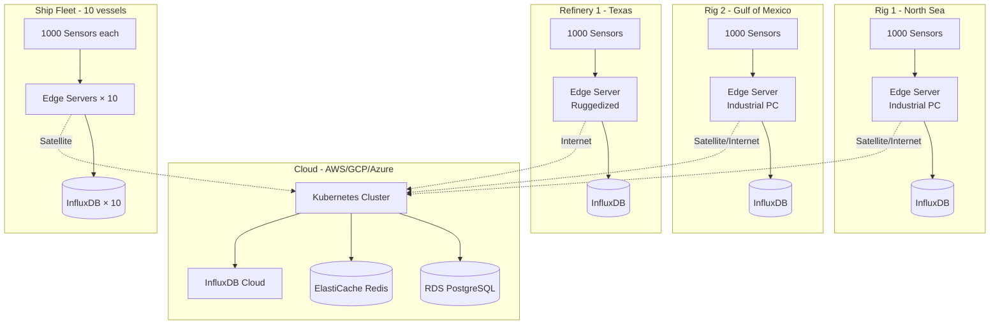

---

## 12. CI/CD Pipeline

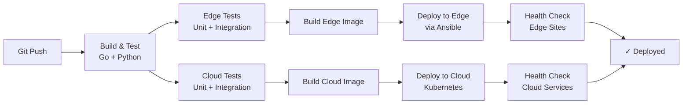

---

**Status:** ✅ Complete - 12 Architecture Diagrams

**Version:** 1.0  
**Date:** June 18, 2026
