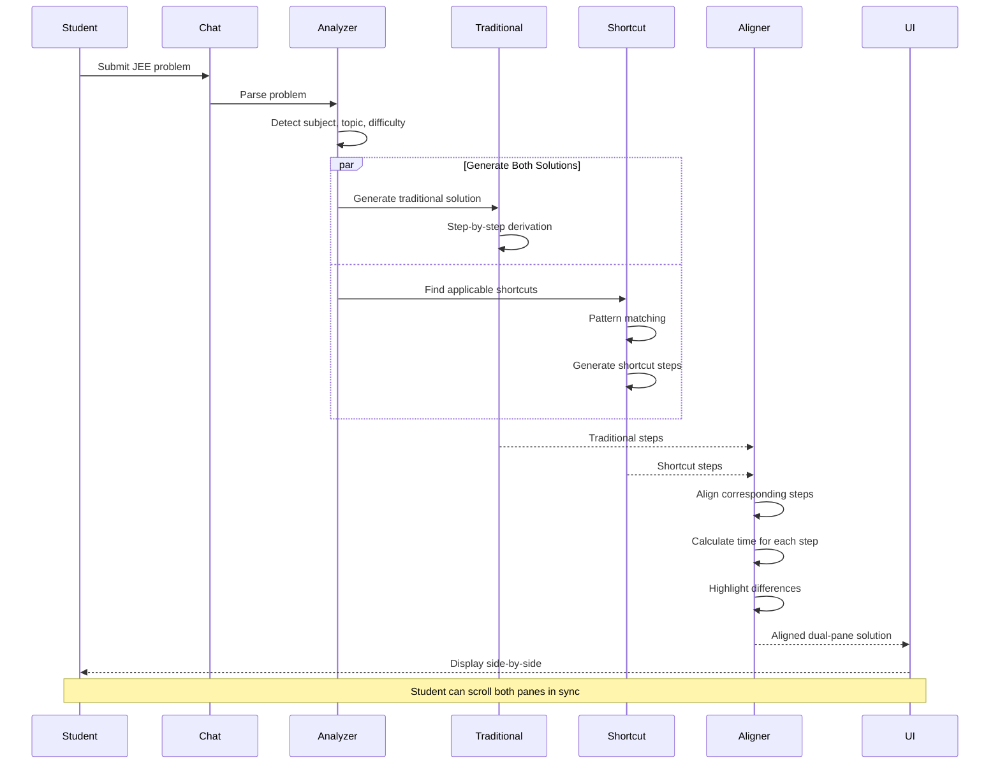
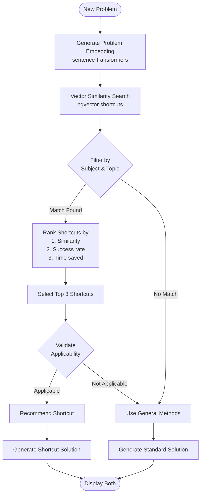
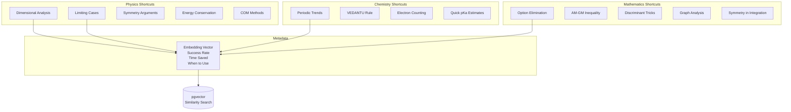
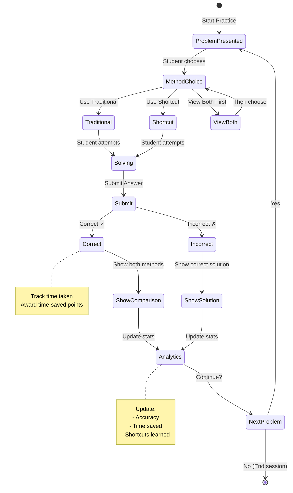
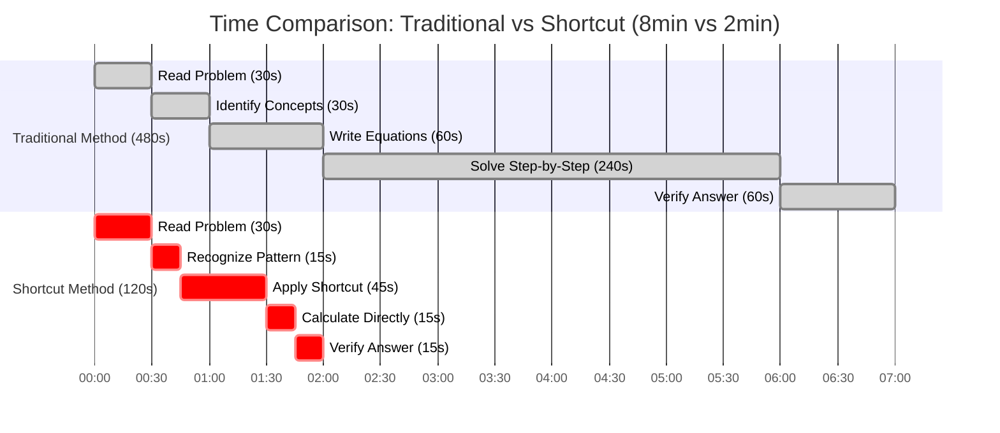
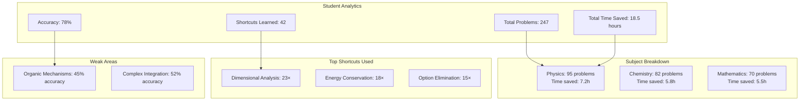

# JEE Shortcut Solutions Platform - Architecture & System Diagrams

**Date:** June 18, 2026  
**Version:** 1.0

---

## 1. Complete System Architecture

```
┌──────────────────────────────────────────────────────────────┐
│           STUDENT INTERFACE                                  │
│  Chat Input | Dual-Pane Viewer | Practice Mode | Analytics  │
│  Next.js 16 + React 19.2.7 + KaTeX/MathJax                 │
└────────────────────────┬─────────────────────────────────────┘
                         │
                    HTTPS/REST
                         │
┌────────────────────────▼─────────────────────────────────────┐
│       API GATEWAY (Golang + Fiber)                           │
│  ┌────────────────────────────────────────────────────┐     │
│  │  Request Router                                    │     │
│  │  • Problem submission                              │     │
│  │  • Solution requests                               │     │
│  │  • Practice sessions                               │     │
│  └────────────────────┬───────────────────────────────┘     │
└────────────────────────┼─────────────────────────────────────┘
                         │
                       gRPC
                         │
┌────────────────────────▼─────────────────────────────────────┐
│      AI SOLUTION ENGINE (Python + FastAPI)                   │
│  ┌────────────────────────────────────────────────────┐     │
│  │         Problem Analyzer                           │     │
│  │  • Subject detection (Physics/Chem/Math)          │     │
│  │  • Topic identification                            │     │
│  │  • Difficulty assessment                           │     │
│  │  • Pattern recognition                             │     │
│  └──────────────────┬─────────────────────────────────┘     │
│                     │                                        │
│  ┌──────────────────▼─────────────────────────────────┐     │
│  │      Traditional Solution Generator                │     │
│  │  • GPT-5.5 for step-by-step                       │     │
│  │  • Claude Opus 4.8 for physics reasoning         │     │
│  │  • SymPy for symbolic math                        │     │
│  └──────────────────┬─────────────────────────────────┘     │
│                     │                                        │
│  ┌──────────────────▼─────────────────────────────────┐     │
│  │      Shortcut Solution Generator                   │     │
│  │  • Pattern matching                                │     │
│  │  • Shortcut database lookup (pgvector)            │     │
│  │  • Time estimation                                 │     │
│  └──────────────────┬─────────────────────────────────┘     │
│                     │                                        │
│  ┌──────────────────▼─────────────────────────────────┐     │
│  │      Step Alignment Engine                         │     │
│  │  • Synchronize traditional & shortcut steps       │     │
│  │  • Highlight differences                           │     │
│  │  • Generate side-by-side view                      │     │
│  └──────────────────┬─────────────────────────────────┘     │
│                     │                                        │
│  ┌──────────────────▼─────────────────────────────────┐     │
│  │      LaTeX Renderer                                │     │
│  │  • Mathematical notation                           │     │
│  │  • Chemical structures                             │     │
│  │  • Diagrams & figures                              │     │
│  └────────────────────────────────────────────────────┘     │
└──────────────────────┬───────────────────────────────────────┘
                       │
┌──────────────────────▼───────────────────────────────────────┐
│              DATA LAYER                                      │
│  ┌──────────────┐  ┌────────────┐  ┌────────────┐          │
│  │ PostgreSQL   │  │  pgvector  │  │   Redis    │          │
│  │ Problems     │  │  Shortcuts │  │   Cache    │          │
│  └──────────────┘  └────────────┘  └────────────┘          │
└──────────────────────────────────────────────────────────────┘
```

---

## 2. Dual-Pane Solution Flow



---

## 3. Problem Analysis Pipeline

```
┌──────────────────────────────────────────┐
│      Problem Input                       │
│  "A particle of mass m is attached..."  │
└────────────────┬─────────────────────────┘
                 │
    ┌────────────▼────────────┐
    │  Subject Detection      │
    │  GPT-5.5 classifier     │
    │  ✓ Physics              │
    └────────────┬────────────┘
                 │
    ┌────────────▼────────────┐
    │  Topic Identification   │
    │  • Mechanics            │
    │  • Simple Harmonic      │
    │    Motion               │
    └────────────┬────────────┘
                 │
    ┌────────────▼────────────┐
    │  Pattern Recognition    │
    │  • Spring-mass system   │
    │  • Energy conservation  │
    └────────────┬────────────┘
                 │
    ┌────────────▼────────────┐
    │  Difficulty Assessment  │
    │  Based on:              │
    │  • Concepts required    │
    │  • Calculation steps    │
    │  • Past year data       │
    │  → Medium (6/10)        │
    └────────────┬────────────┘
                 │
    ┌────────────▼────────────┐
    │  Shortcut Matching      │
    │  Vector search →        │
    │  Energy method shortcut │
    └─────────────────────────┘
```

---

## 4. Shortcut Recommendation Engine



---

## 5. Dual-Pane UI Layout

```
┌─────────────────────────────────────────────────────────┐
│  JEE Shortcut Solutions                    [Settings]   │
├─────────────────────────────────────────────────────────┤
│                                                         │
│  Problem: A particle of mass 2kg is attached to...     │
│  Subject: Physics | Topic: SHM | Difficulty: Medium    │
│                                                         │
├────────────────────┬────────────────────────────────────┤
│                    │                                    │
│  📚 Traditional    │  ⚡ Shortcut Method               │
│  (480 seconds)     │  (120 seconds)                     │
│                    │                                    │
│  ─────────────────────────────────────────────────     │
│                    │                                    │
│  Step 1:           │  Step 1:                          │
│  Write down the    │  Use energy conservation          │
│  equation of       │  directly:                        │
│  motion:           │                                    │
│  F = -kx           │  ½mv² + ½kx² = constant          │
│                    │                                    │
│  Step 2:           │  Step 2:                          │
│  F = ma            │  Differentiate to get ω:          │
│  -kx = m(d²x/dt²)  │  ω = √(k/m)                       │
│                    │                                    │
│  Step 3:           │  Step 3:                          │
│  This is SHM with  │  Period T = 2π/ω                  │
│  ω² = k/m          │  T = 2π√(m/k)                     │
│                    │                                    │
│  Step 4:           │  Done! ✓                          │
│  ω = √(k/m)        │  💡 Why this works:               │
│                    │  Energy method skips              │
│  Step 5:           │  differential equations           │
│  Period T = 2π/ω   │                                    │
│  T = 2π√(m/k)      │  ⏱️ Saved: 6 minutes              │
│                    │                                    │
├────────────────────┴────────────────────────────────────┤
│  [◀ Previous Problem]  [Practice This]  [Next ▶]       │
└─────────────────────────────────────────────────────────┘
```

---

## 6. Shortcut Database Structure



---

## 7. Practice Mode Flow



---

## 8. Time Comparison Visualization



---

## 9. Subject-Specific Architectures

### **Physics Problem Solving**

```
Problem Input
     │
     ├─→ Mechanics? ─→ [Energy/Momentum shortcuts]
     │
     ├─→ Electromagnetism? ─→ [Symmetry/Gauss Law shortcuts]
     │
     ├─→ Waves? ─→ [Boundary condition shortcuts]
     │
     └─→ Modern Physics? ─→ [Formula-based shortcuts]
```

### **Chemistry Problem Solving**

```
Problem Input
     │
     ├─→ Organic? ─→ [Mechanism/Product shortcuts]
     │
     ├─→ Inorganic? ─→ [Periodic trend shortcuts]
     │
     ├─→ Physical? ─→ [Graph analysis shortcuts]
     │
     └─→ Numerical? ─→ [Approximation shortcuts]
```

### **Mathematics Problem Solving**

```
Problem Input
     │
     ├─→ Calculus? ─→ [Limit/Graph shortcuts]
     │
     ├─→ Algebra? ─→ [Discriminant/AM-GM shortcuts]
     │
     ├─→ Trigonometry? ─→ [Identity/Angle shortcuts]
     │
     └─→ Coordinate Geometry? ─→ [Symmetry shortcuts]
```

---

## 10. Analytics Dashboard



---

## 11. Caching Strategy

```
┌─────────────────────────────────────┐
│      Request: Solve Problem X       │
└────────────────┬────────────────────┘
                 │
    ┌────────────▼────────────┐
    │  Check Redis Cache      │
    │  Key: problem_hash      │
    └────────────┬────────────┘
                 │
         ┌───────┴───────┐
         │               │
      Hit │            Miss│
         │               │
    ┌────▼────┐   ┌──────▼──────┐
    │ Return  │   │  Generate   │
    │ Cached  │   │  Solution   │
    │Solution │   └──────┬──────┘
    └─────────┘          │
                    ┌────▼────┐
                    │  Cache  │
                    │ (24hr)  │
                    └────┬────┘
                         │
                    ┌────▼────┐
                    │ Return  │
                    │Solution │
                    └─────────┘
```

**Cache Layers:**
1. **L1 - Browser Cache**: Recently viewed solutions (10 problems)
2. **L2 - Redis**: Generated solutions (24 hour TTL)
3. **L3 - Database**: All historical solutions (permanent)

---

## 12. Deployment Architecture

```
┌─────────────────────────────────────────┐
│         Production Cluster              │
├─────────────────────────────────────────┤
│                                         │
│  Namespace: jee-shortcuts               │
│                                         │
│  ┌────────────────────────────────┐    │
│  │  Web Frontend                  │    │
│  │  • 3-5 pods (CDN + SSR)        │    │
│  │  • Next.js 16                  │    │
│  └────────────────────────────────┘    │
│                                         │
│  ┌────────────────────────────────┐    │
│  │  API Gateway                   │    │
│  │  • 3-5 pods (CPU autoscale)    │    │
│  │  • 2 CPU, 4GB RAM              │    │
│  └────────────────────────────────┘    │
│                                         │
│  ┌────────────────────────────────┐    │
│  │  AI Solution Engine            │    │
│  │  • 5-10 pods (queue autoscale) │    │
│  │  • 4 CPU, 8GB RAM              │    │
│  └────────────────────────────────┘    │
└─────────────────────────────────────────┘

┌─────────────────────────────────────────┐
│         Data Services                   │
├─────────────────────────────────────────┤
│                                         │
│  PostgreSQL + pgvector:                 │
│  • Primary (r6g.xlarge)                 │
│  • 10,000+ problems                     │
│  • 500+ shortcuts                       │
│                                         │
│  Redis:                                 │
│  • 2-node cluster (cache.r6g.large)    │
│  • 24-hour solution cache               │
│                                         │
│  CDN:                                   │
│  • Static assets (images, PDFs)         │
│  • LaTeX-rendered formulas              │
└─────────────────────────────────────────┘
```

---

**Status:** ✅ Complete - Architecture & 12 System Diagrams

**Version:** 1.0  
**Date:** June 18, 2026

**Usage:** Render with Mermaid (GitHub, GitLab, VS Code)
