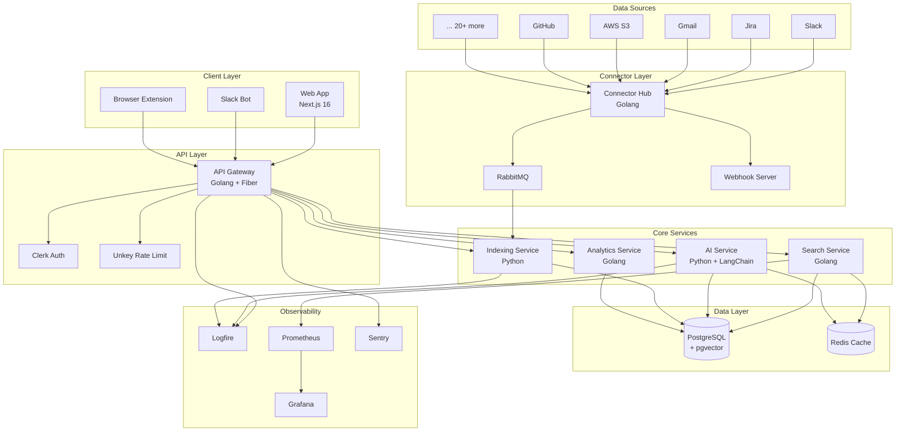
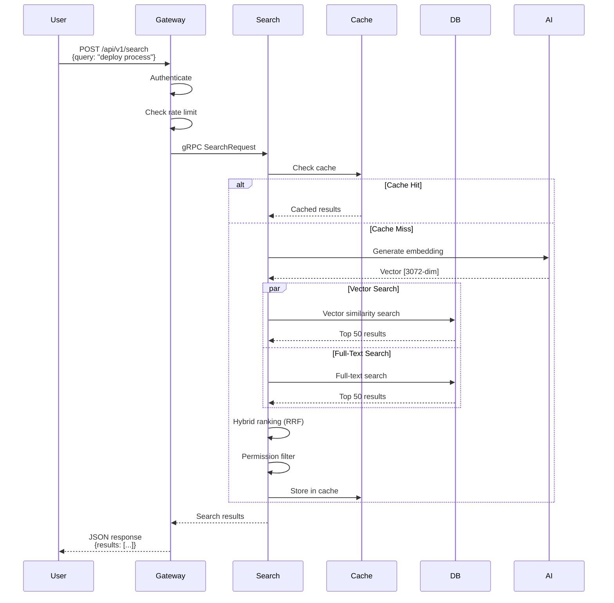
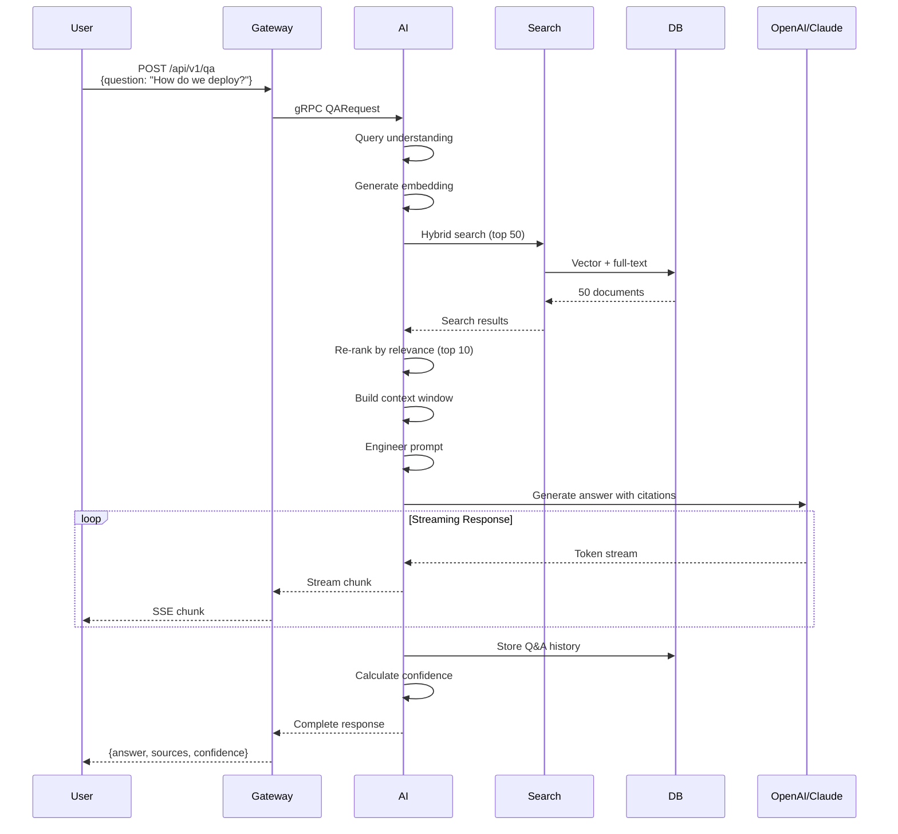
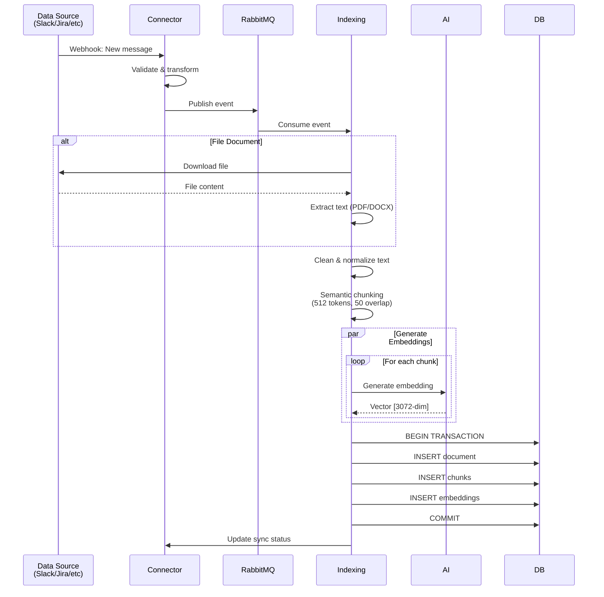
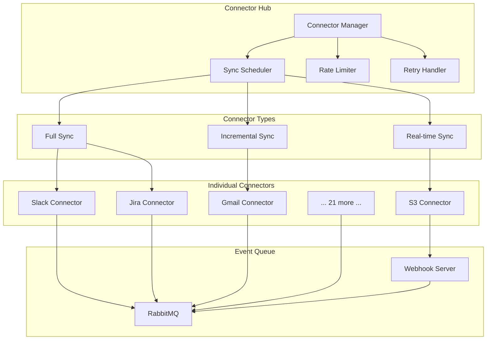
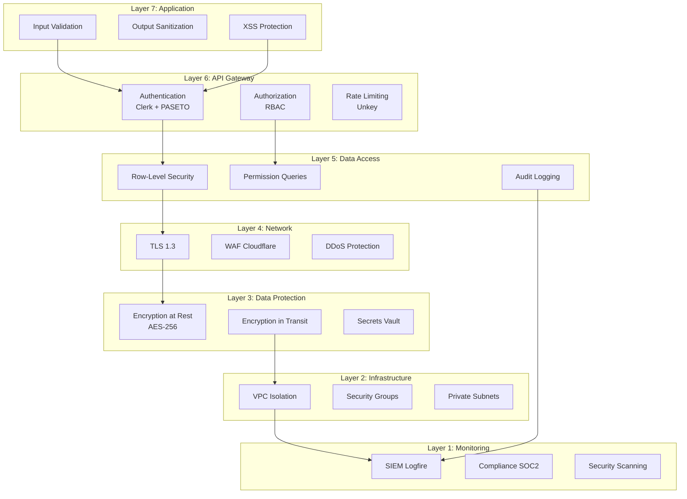
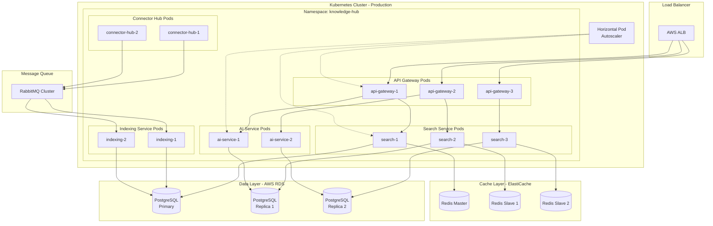
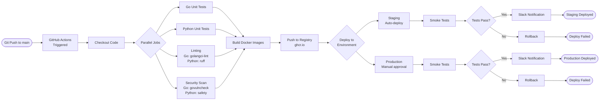
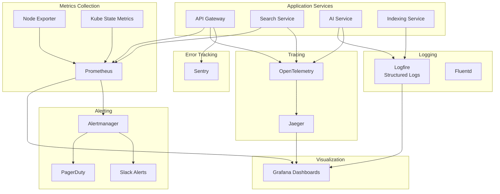

# Universal Knowledge Hub - System Diagrams

**Document Date:** June 18, 2026  
**Version:** 1.0  
**Purpose:** Visual architecture and data flow diagrams

---

## 1. Complete System Architecture



---

## 2. Search Flow Diagram



---

## 3. AI Q&A (RAG) Flow Diagram



---

## 4. Document Indexing Flow Diagram



---

## 5. Connector Sync Architecture



---

## 6. Security Architecture Layers



---

## 7. Data Flow: User Query to Answer

```mermaid
flowchart TD
    START([User asks:<br/>"How do we deploy?"]) --> AUTH{Authenticated?}
    
    AUTH -->|No| ERR1[401 Unauthorized]
    AUTH -->|Yes| RATE{Rate limit OK?}
    
    RATE -->|No| ERR2[429 Too Many Requests]
    RATE -->|Yes| EMBED[Generate Query Embedding<br/>OpenAI API]
    
    EMBED --> VSEARCH[Vector Search<br/>pgvector]
    EMBED --> FTSEARCH[Full-Text Search<br/>PostgreSQL]
    
    VSEARCH --> MERGE[Hybrid Ranking<br/>RRF Algorithm]
    FTSEARCH --> MERGE
    
    MERGE --> PERM{User has<br/>permission?}
    
    PERM -->|No| FILTER[Filter out restricted docs]
    PERM -->|Yes| KEEP[Keep authorized docs]
    
    FILTER --> TOP50[Top 50 Results]
    KEEP --> TOP50
    
    TOP50 --> RERANK[Re-rank by Relevance<br/>Semantic similarity]
    
    RERANK --> TOP10[Select Top 10]
    
    TOP10 --> CONTEXT[Build Context Window<br/>Format for LLM]
    
    CONTEXT --> PROMPT[Engineer Prompt<br/>Add instructions]
    
    PROMPT --> LLM[Call GPT-5.5/Claude<br/>Generate answer]
    
    LLM --> EXTRACT[Extract Citations<br/>Calculate confidence]
    
    EXTRACT --> STORE[Store in Q&A History]
    
    STORE --> RESPONSE[Return Answer + Sources]
    
    RESPONSE --> END([User receives answer<br/>with citations])
```

---

## 8. Deployment Architecture (Kubernetes)



---

## 9. CI/CD Pipeline



---

## 10. Monitoring & Observability Stack



---

**Document Status:** ✅ Complete - 10 comprehensive system diagrams

**Usage:** These diagrams can be rendered using Mermaid-compatible tools (GitHub, GitLab, VS Code, draw.io, etc.)
