# Multi-Tenant Multi-AI-Agent Multi-Cloud Platform - System Diagrams

**Date:** June 18, 2026  
**Version:** 1.0  

---

## 1. Complete System Architecture

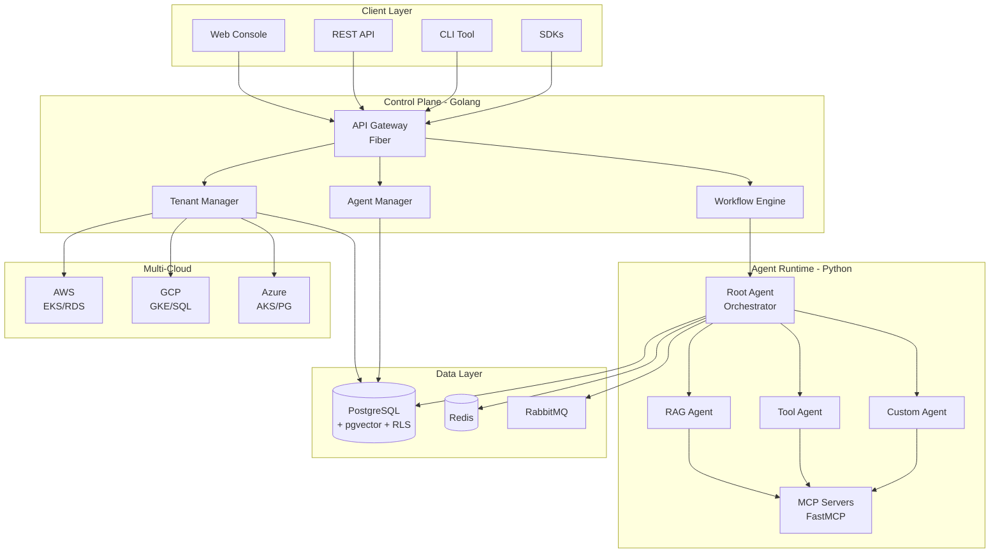

---

## 2. Agent Execution Flow

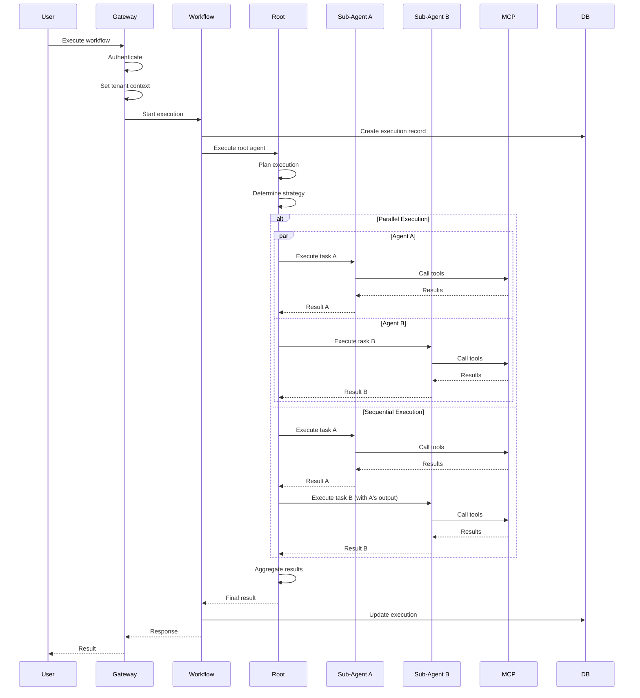

---

## 3. Multi-Tenant Isolation

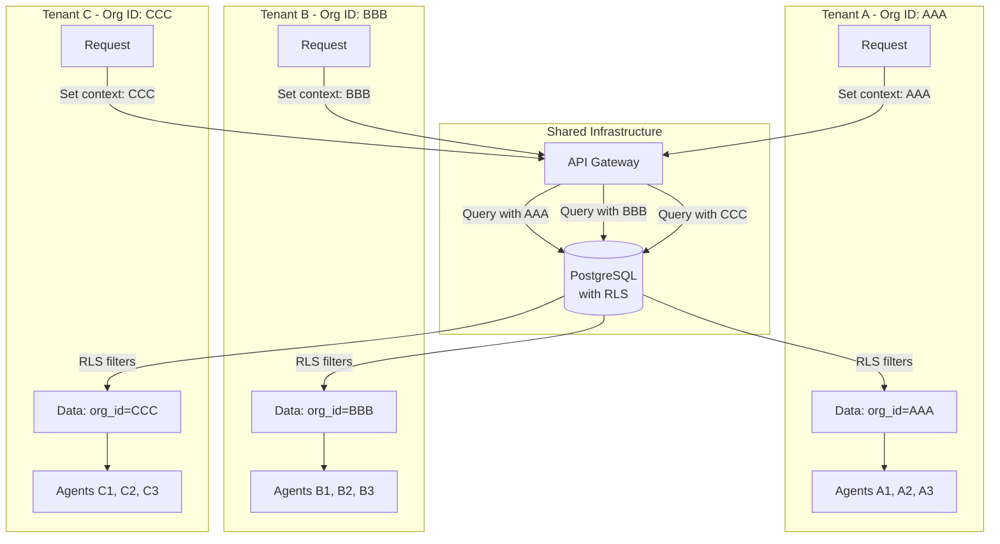

---

## 4. Multi-Cloud Deployment

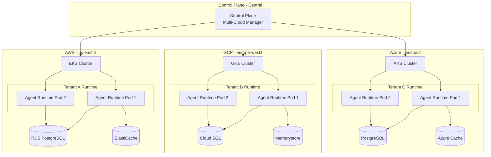

---

## 5. Template 1: Business Process Automation

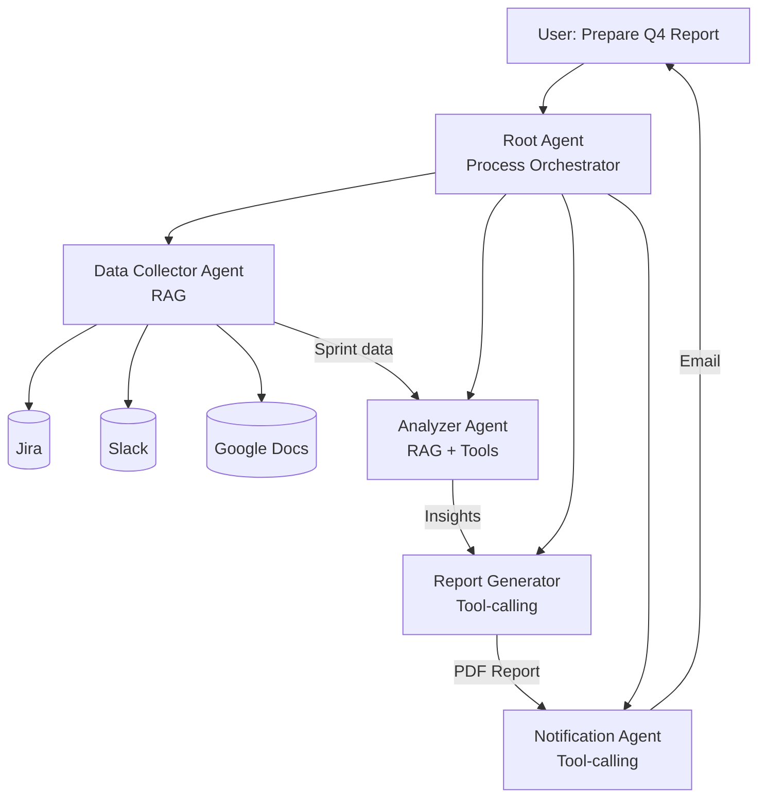

---

## 6. Template 2: Customer Support

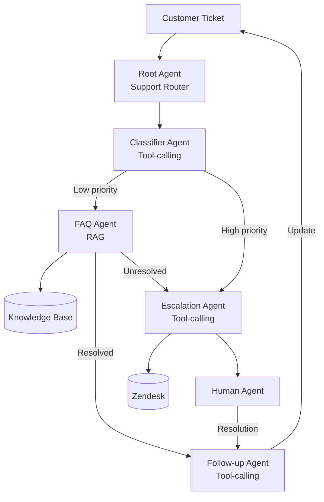

---

## 7. Agent Orchestration Patterns

```mermaid
graph TB
    subgraph "Pattern 1: Sequential"
        R1[Root Agent]
        A1[Agent A]
        A2[Agent B]
        A3[Agent C]
        
        R1 --> A1
        A1 -->|Output feeds| A2
        A2 -->|Output feeds| A3
        A3 --> RESULT1[Final Result]
    end
    
    subgraph "Pattern 2: Parallel"
        R2[Root Agent]
        B1[Agent A]
        B2[Agent B]
        B3[Agent C]
        AGG[Aggregator]
        
        R2 --> B1
        R2 --> B2
        R2 --> B3
        
        B1 --> AGG
        B2 --> AGG
        B3 --> AGG
        AGG --> RESULT2[Final Result]
    end
    
    subgraph "Pattern 3: Peer-to-Peer"
        R3[Root Agent]
        C1[Agent A]
        C2[Agent B]
        C3[Agent C]
        C4[Agent D]
        
        R3 --> C1
        R3 --> C2
        R3 --> C3
        R3 --> C4
        
        C1 <-->|Collaborate| C2
        C2 <-->|Collaborate| C4
        C3 <-->|Collaborate| C4
        C1 <-->|Collaborate| C3
        
        C1 --> RESULT3[Final Result]
        C2 --> RESULT3
        C3 --> RESULT3
        C4 --> RESULT3
    end
```

---

## 8. MCP Integration Architecture

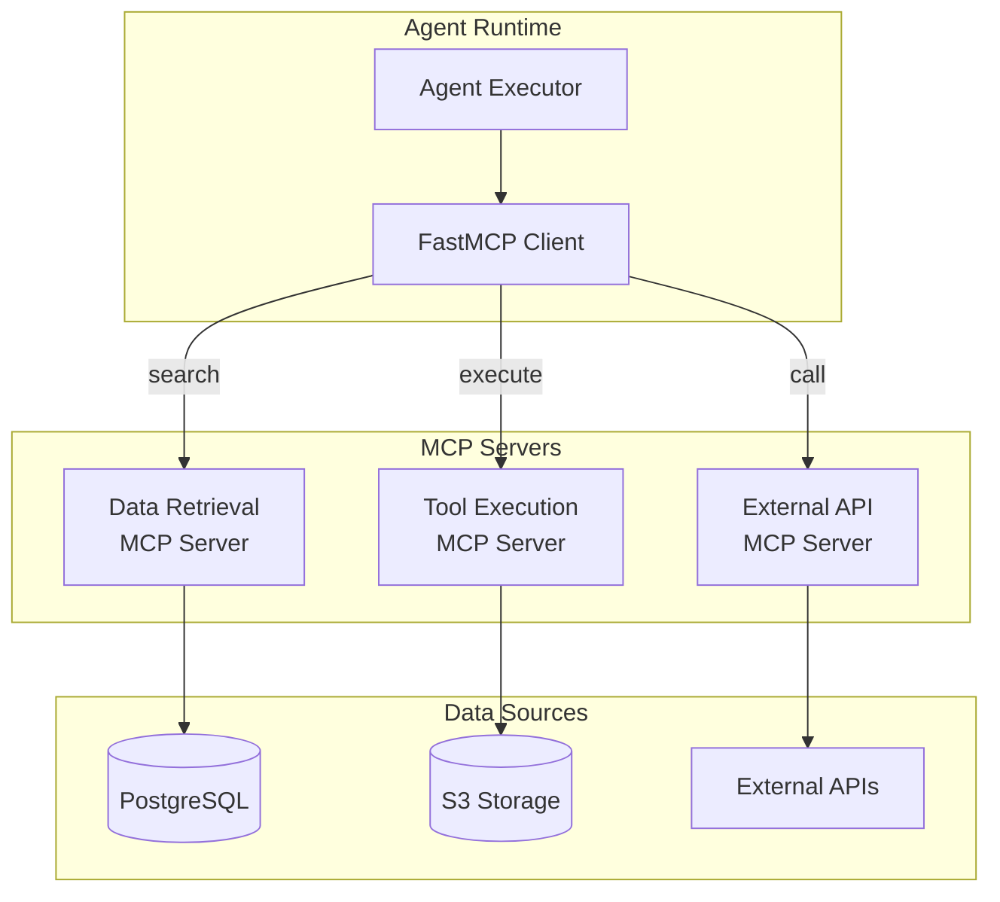

---

## 9. Security Architecture

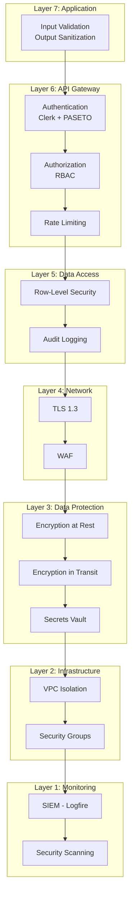

---

## 10. Tenant Provisioning Flow

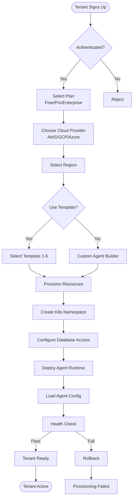

---

## 11. Observability Stack

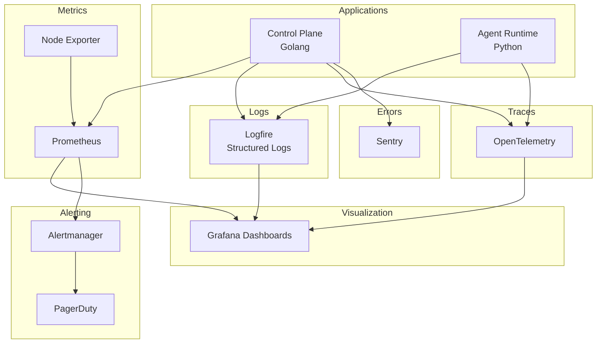

---

## 12. Horizontal Scaling

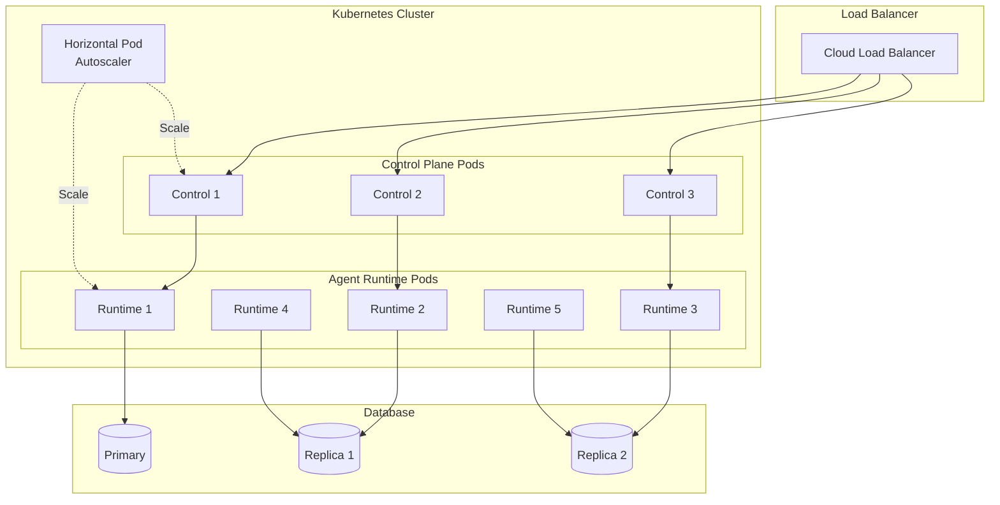

---

**Status:** ✅ Complete - 12 System Diagrams

**Usage:** Render using Mermaid (GitHub, GitLab, VS Code, etc.)
