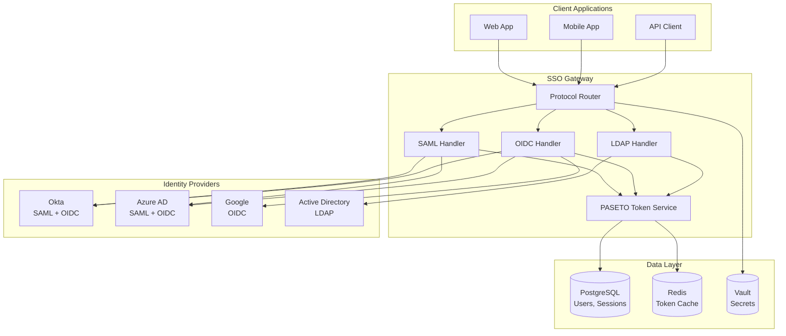
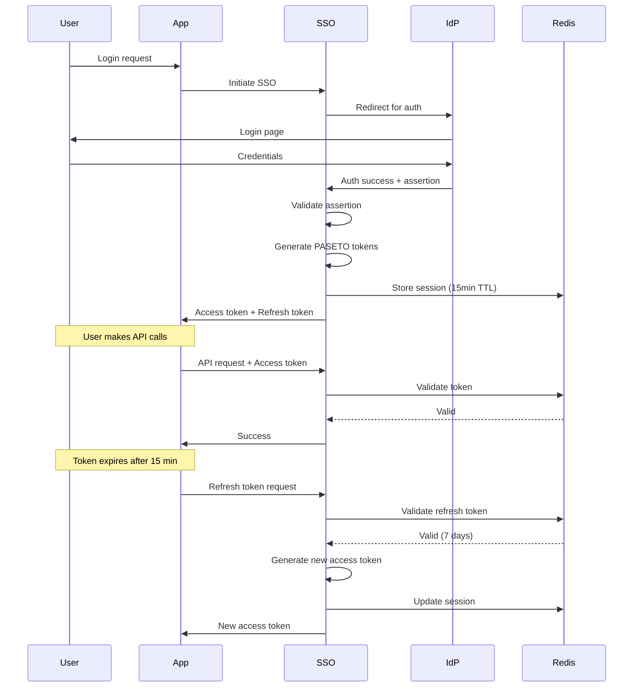
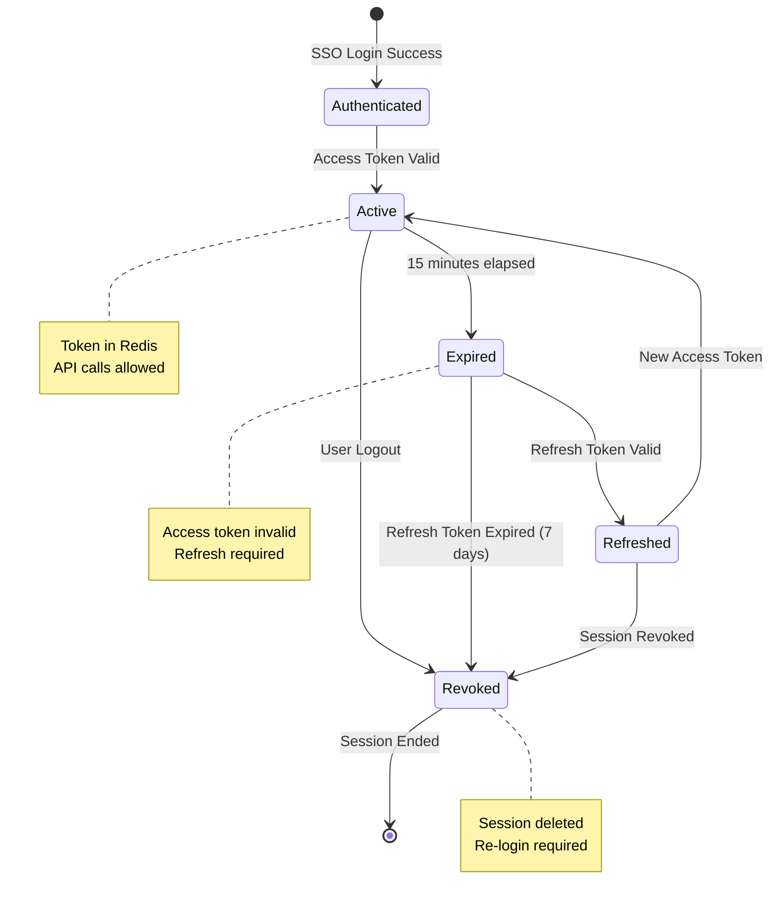

# Single Sign-On (SSO) Authentication System - Design & Architecture

**Document Date:** June 18, 2026  
**Tech Stack Status:** Latest & Greatest  
**Project Type:** Enterprise Authentication & Authorization  
**Development Approach:** Test-Driven Development (TDD)  
**Production Status:** Enterprise-Ready, Multi-Protocol Support  
**Reusability:** Universal SSO design for all applications

---

## 📋 Executive Summary

A comprehensive Single Sign-On (SSO) authentication system that enables users to authenticate once and access multiple applications seamlessly. Supports industry-standard protocols (SAML 2.0, OAuth 2.0, OpenID Connect), integrates with enterprise identity providers (Okta, Azure AD, Google Workspace, Auth0), and provides PASETO token-based session management for secure, stateless authentication.

**Core Problems Solved:**
1. ❌ **"Users manage multiple passwords"** → ✅ Single authentication across all apps
2. ❌ **"Manual user provisioning is slow"** → ✅ Automated SCIM provisioning
3. ❌ **"Password resets overwhelm IT"** → ✅ Centralized identity management
4. ❌ **"Compliance requires MFA"** → ✅ Enterprise IdP enforces MFA
5. ❌ **"Session management is complex"** → ✅ PASETO tokens with refresh flow

---

## 🎯 Supported SSO Protocols

### **1. SAML 2.0 (Security Assertion Markup Language)**
**Best For:** Enterprise organizations with existing SAML infrastructure

**Flow:**
```
User → App (SP) → IdP (Login) → IdP (Authenticate) → SAML Assertion → App (Validate) → Session Created
```

**Providers:**
- Okta
- Azure AD (Microsoft Entra)
- OneLogin
- PingIdentity
- Custom SAML IdPs

---

### **2. OAuth 2.0 + OpenID Connect (OIDC)**
**Best For:** Modern cloud applications, mobile apps, API access

**Flow:**
```
User → App → IdP (Authorize) → User Consent → Authorization Code → App (Exchange) → ID Token + Access Token → Session Created
```

**Providers:**
- Google Workspace
- Azure AD
- Okta
- Auth0
- GitHub (OAuth only)

---

### **3. LDAP/Active Directory**
**Best For:** On-premise enterprise environments

**Flow:**
```
User → App (Credentials) → LDAP Bind → AD Validation → Success → Session Created
```

**Providers:**
- Microsoft Active Directory
- OpenLDAP
- FreeIPA

---

## 🏗️ System Architecture

```
┌──────────────────────────────────────────────────────────────┐
│                    CLIENT APPLICATIONS                       │
│  Web App 1 | Web App 2 | Mobile App | API Client           │
└────────────────────────┬─────────────────────────────────────┘
                         │
                    HTTPS/REST
                         │
┌────────────────────────▼─────────────────────────────────────┐
│              SSO GATEWAY (Golang + Fiber)                    │
│  ┌────────────────────────────────────────────────────┐     │
│  │  Protocol Handler                                  │     │
│  │  • SAML 2.0 Parser & Validator                    │     │
│  │  • OAuth 2.0/OIDC Flow Manager                    │     │
│  │  • LDAP Bind Handler                              │     │
│  └────────────────────┬───────────────────────────────┘     │
│                       │                                      │
│  ┌────────────────────┬───────────────────────────────┐     │
│  │  Session Manager   │  PASETO Token Engine          │     │
│  │  • Token issuance  │  • v4.local (symmetric)       │     │
│  │  • Token refresh   │  • v4.public (asymmetric)     │     │
│  │  • Revocation      │  • 15min access, 7day refresh │     │
│  └────────────────────┴───────────────────────────────┘     │
└────────────────────────┬─────────────────────────────────────┘
                         │
┌────────────────────────▼─────────────────────────────────────┐
│           IDENTITY PROVIDER INTEGRATIONS                     │
│  ┌──────────┐  ┌──────────┐  ┌──────────┐  ┌──────────┐   │
│  │   Okta   │  │ Azure AD │  │  Google  │  │  Auth0   │   │
│  │ SAML/OIDC│  │ SAML/OIDC│  │   OIDC   │  │   OIDC   │   │
│  └──────────┘  └──────────┘  └──────────┘  └──────────┘   │
└──────────────────────────────────────────────────────────────┘
                         │
┌────────────────────────▼─────────────────────────────────────┐
│                   DATA LAYER                                 │
│  ┌──────────────┐  ┌────────────┐  ┌────────────┐          │
│  │ PostgreSQL   │  │   Redis    │  │   Vault    │          │
│  │ Users, Orgs  │  │  Sessions  │  │  Secrets   │          │
│  └──────────────┘  └────────────┘  └────────────┘          │
└──────────────────────────────────────────────────────────────┘
```

---

## 🔐 SAML 2.0 Implementation

### **Service Provider (SP) Configuration**

```go
// Golang SAML 2.0 Service Provider
package sso

import (
    "github.com/crewjam/saml"
    "github.com/crewjam/saml/samlsp"
)

type SAMLConfig struct {
    EntityID              string
    ACSURL                string // Assertion Consumer Service URL
    MetadataURL           string
    IDPMetadataURL        string
    Certificate           string
    PrivateKey            string
}

func NewSAMLServiceProvider(config SAMLConfig) (*samlsp.Middleware, error) {
    keyPair, err := tls.LoadX509KeyPair(config.Certificate, config.PrivateKey)
    if err != nil {
        return nil, err
    }
    
    // Fetch IdP metadata
    idpMetadataURL, err := url.Parse(config.IDPMetadataURL)
    if err != nil {
        return nil, err
    }
    
    idpMetadata, err := samlsp.FetchMetadata(
        context.Background(),
        http.DefaultClient,
        *idpMetadataURL,
    )

    if err != nil {
        return nil, err
    }
    
    rootURL, err := url.Parse(config.EntityID)
    if err != nil {
        return nil, err
    }
    
    samlSP, err := samlsp.New(samlsp.Options{
        URL:               *rootURL,
        Key:               keyPair.PrivateKey.(*rsa.PrivateKey),
        Certificate:       keyPair.Leaf,
        IDPMetadata:       idpMetadata,
        AllowIDPInitiated: true,
    })
    
    return samlSP, nil
}

// SAML Login Handler
func (s *SSOService) HandleSAMLLogin(c *fiber.Ctx) error {
    // Redirect to IdP for authentication
    return c.Redirect(s.samlSP.GetAuthURL(c.Path()))
}

// SAML Assertion Consumer Service (ACS)
func (s *SSOService) HandleSAMLACS(c *fiber.Ctx) error {
    // Parse SAML response
    assertion, err := s.samlSP.ParseResponse(c.Request(), []string{})
    if err != nil {
        return fiber.NewError(fiber.StatusUnauthorized, "Invalid SAML assertion")
    }
    
    // Extract user attributes
    userEmail := assertion.Subject.NameID.Value
    userAttrs := make(map[string]string)
    for _, attr := range assertion.AttributeStatements[0].Attributes {
        userAttrs[attr.Name] = attr.Values[0].Value
    }
    
    // Create or update user
    user, err := s.upsertUser(userEmail, userAttrs)
    if err != nil {
        return err
    }
    
    // Generate PASETO tokens
    accessToken, refreshToken, err := s.generateTokens(user)
    if err != nil {
        return err
    }
    
    return c.JSON(fiber.Map{
        "access_token":  accessToken,
        "refresh_token": refreshToken,
        "token_type":    "Bearer",
        "expires_in":    900, // 15 minutes
    })
}
```

---

## 🔓 OAuth 2.0 + OpenID Connect Implementation

### **Authorization Code Flow**

```go
// OAuth 2.0 + OIDC Implementation
package sso

import (
    "github.com/coreos/go-oidc/v3/oidc"
    "golang.org/x/oauth2"
)

type OIDCConfig struct {
    ProviderURL  string
    ClientID     string
    ClientSecret string
    RedirectURL  string
    Scopes       []string
}

func NewOIDCProvider(config OIDCConfig) (*OIDCProvider, error) {

    ctx := context.Background()
    
    // Discover OIDC provider
    provider, err := oidc.NewProvider(ctx, config.ProviderURL)
    if err != nil {
        return nil, err
    }
    
    // Configure OAuth2
    oauth2Config := oauth2.Config{
        ClientID:     config.ClientID,
        ClientSecret: config.ClientSecret,
        RedirectURL:  config.RedirectURL,
        Endpoint:     provider.Endpoint(),
        Scopes:       config.Scopes,
    }
    
    verifier := provider.Verifier(&oidc.Config{ClientID: config.ClientID})
    
    return &OIDCProvider{
        provider: provider,
        oauth:    oauth2Config,
        verifier: verifier,
    }, nil
}

// Initiate OAuth flow
func (o *OIDCProvider) HandleLogin(c *fiber.Ctx) error {
    state := generateRandomState() // CSRF protection
    nonce := generateRandomNonce() // Replay protection
    
    // Store state and nonce in session
    c.Cookie(&fiber.Cookie{
        Name:     "oauth_state",
        Value:    state,
        HTTPOnly: true,
        Secure:   true,
        SameSite: "Lax",
    })
    
    authURL := o.oauth.AuthCodeURL(state, oidc.Nonce(nonce))
    return c.Redirect(authURL)
}

// Handle OAuth callback
func (o *OIDCProvider) HandleCallback(c *fiber.Ctx) error {
    // Verify state (CSRF protection)
    state := c.Query("state")
    cookieState := c.Cookies("oauth_state")
    if state != cookieState {
        return fiber.NewError(fiber.StatusBadRequest, "Invalid state parameter")
    }
    
    // Exchange authorization code for tokens
    code := c.Query("code")
    oauth2Token, err := o.oauth.Exchange(context.Background(), code)
    if err != nil {
        return fiber.NewError(fiber.StatusUnauthorized, "Token exchange failed")
    }
    
    // Extract ID Token
    rawIDToken, ok := oauth2Token.Extra("id_token").(string)
    if !ok {
        return fiber.NewError(fiber.StatusBadRequest, "No id_token in response")
    }
    
    // Verify ID Token
    idToken, err := o.verifier.Verify(context.Background(), rawIDToken)
    if err != nil {
        return fiber.NewError(fiber.StatusUnauthorized, "Invalid ID token")
    }
    
    // Extract claims
    var claims struct {
        Email         string `json:"email"`
        EmailVerified bool   `json:"email_verified"`
        Name          string `json:"name"`
        Picture       string `json:"picture"`
    }
    if err := idToken.Claims(&claims); err != nil {

        return err
    }
    
    // Create or update user
    user, err := o.upsertUser(claims.Email, claims)
    if err != nil {
        return err
    }
    
    // Generate PASETO tokens
    accessToken, refreshToken, err := o.generateTokens(user)
    if err != nil {
        return err
    }
    
    return c.JSON(fiber.Map{
        "access_token":  accessToken,
        "refresh_token": refreshToken,
        "token_type":    "Bearer",
        "expires_in":    900,
    })
}
```

---

## 🎫 PASETO Token Implementation

### **Token Generation & Validation**

```go
// PASETO v4 Token Management
package sso

import (
    "aidanwoods.dev/go-paseto"
    "time"
)

type TokenClaims struct {
    UserID       string `json:"user_id"`
    Email        string `json:"email"`
    TenantID     string `json:"tenant_id"`
    Role         string `json:"role"`
    SessionID    string `json:"session_id"`
}

type TokenService struct {
    symmetricKey  paseto.V4SymmetricKey  // For v4.local tokens
    asymmetricKey paseto.V4AsymmetricSecretKey // For v4.public tokens
}

func NewTokenService() (*TokenService, error) {
    // Generate or load keys
    symmetricKey := paseto.NewV4SymmetricKey()
    asymmetricKey := paseto.NewV4AsymmetricSecretKey()
    
    return &TokenService{
        symmetricKey:  symmetricKey,
        asymmetricKey: asymmetricKey,
    }, nil
}

// Generate access token (v4.local - symmetric)
func (t *TokenService) GenerateAccessToken(claims TokenClaims) (string, error) {
    token := paseto.NewToken()
    
    // Set claims
    token.SetAudience("api")
    token.SetIssuer("sso-gateway")
    token.SetSubject(claims.UserID)
    token.SetIssuedAt(time.Now())
    token.SetExpiration(time.Now().Add(15 * time.Minute))
    token.SetNotBefore(time.Now())
    
    // Custom claims
    token.Set("email", claims.Email)
    token.Set("tenant_id", claims.TenantID)
    token.Set("role", claims.Role)
    token.Set("session_id", claims.SessionID)
    
    // Encrypt with symmetric key
    encrypted := token.V4Encrypt(t.symmetricKey, nil)
    return encrypted, nil
}

// Generate refresh token (longer expiry)
func (t *TokenService) GenerateRefreshToken(claims TokenClaims) (string, error) {
    token := paseto.NewToken()

    
    token.SetAudience("refresh")
    token.SetIssuer("sso-gateway")
    token.SetSubject(claims.UserID)
    token.SetIssuedAt(time.Now())
    token.SetExpiration(time.Now().Add(7 * 24 * time.Hour)) // 7 days
    
    token.Set("session_id", claims.SessionID)
    
    encrypted := token.V4Encrypt(t.symmetricKey, nil)
    return encrypted, nil
}

// Validate and parse access token
func (t *TokenService) ValidateAccessToken(tokenStr string) (*TokenClaims, error) {
    parser := paseto.NewParser()
    parser.AddRule(paseto.NotExpired())
    parser.AddRule(paseto.ValidAt(time.Now()))
    
    token, err := parser.ParseV4Local(t.symmetricKey, tokenStr, nil)
    if err != nil {
        return nil, err
    }
    
    claims := &TokenClaims{
        UserID:    token.GetSubject(),
        Email:     token.GetString("email"),
        TenantID:  token.GetString("tenant_id"),
        Role:      token.GetString("role"),
        SessionID: token.GetString("session_id"),
    }
    
    return claims, nil
}

// Token refresh flow
func (t *TokenService) RefreshAccessToken(refreshToken string) (string, error) {
    // Validate refresh token
    parser := paseto.NewParser()
    parser.AddRule(paseto.NotExpired())
    
    token, err := parser.ParseV4Local(t.symmetricKey, refreshToken, nil)
    if err != nil {
        return "", err
    }
    
    // Check if session is still valid
    sessionID := token.GetString("session_id")
    valid, err := t.isSessionValid(sessionID)
    if err != nil || !valid {
        return "", errors.New("session expired or revoked")
    }
    
    // Generate new access token
    claims := TokenClaims{
        UserID:    token.GetSubject(),
        SessionID: sessionID,
        // Fetch other claims from database
    }
    
    return t.GenerateAccessToken(claims)
}
```

---

## 📊 Database Schema

```sql
-- Organizations/Tenants
CREATE TABLE organizations (
    id UUID PRIMARY KEY DEFAULT gen_random_uuid(),
    name VARCHAR(255) NOT NULL,
    sso_enabled BOOLEAN DEFAULT false,
    sso_protocol VARCHAR(20), -- 'saml', 'oidc', 'ldap'
    sso_config JSONB, -- Provider-specific configuration
    created_at TIMESTAMP DEFAULT NOW()
);

-- Users
CREATE TABLE users (
    id UUID PRIMARY KEY DEFAULT gen_random_uuid(),
    organization_id UUID REFERENCES organizations(id),
    email VARCHAR(255) UNIQUE NOT NULL,
    name VARCHAR(255),
    avatar_url VARCHAR(500),
    sso_provider VARCHAR(50), -- 'okta', 'azure', 'google', 'local'
    sso_subject_id VARCHAR(255), -- IdP's unique user ID

    last_login_at TIMESTAMP,
    created_at TIMESTAMP DEFAULT NOW()
);

-- SSO Sessions
CREATE TABLE sso_sessions (
    id UUID PRIMARY KEY DEFAULT gen_random_uuid(),
    user_id UUID REFERENCES users(id),
    session_token VARCHAR(500) UNIQUE NOT NULL,
    refresh_token_hash VARCHAR(255), -- Hashed refresh token
    ip_address INET,
    user_agent TEXT,
    expires_at TIMESTAMP NOT NULL,
    revoked BOOLEAN DEFAULT false,
    created_at TIMESTAMP DEFAULT NOW()
);

-- SSO Providers Configuration
CREATE TABLE sso_providers (
    id UUID PRIMARY KEY DEFAULT gen_random_uuid(),
    organization_id UUID REFERENCES organizations(id),
    provider_type VARCHAR(20) NOT NULL, -- 'saml', 'oidc', 'ldap'
    provider_name VARCHAR(100), -- 'okta', 'azure', 'google'
    enabled BOOLEAN DEFAULT true,
    config JSONB NOT NULL, -- Protocol-specific config
    created_at TIMESTAMP DEFAULT NOW()
);

-- Audit logs
CREATE TABLE sso_audit_logs (
    id UUID PRIMARY KEY DEFAULT gen_random_uuid(),
    user_id UUID REFERENCES users(id),
    event_type VARCHAR(50) NOT NULL, -- 'login', 'logout', 'token_refresh', 'login_failed'
    provider VARCHAR(50),
    ip_address INET,
    user_agent TEXT,
    success BOOLEAN,
    error_message TEXT,
    created_at TIMESTAMP DEFAULT NOW()
);

-- Indexes
CREATE INDEX idx_sessions_user ON sso_sessions(user_id);
CREATE INDEX idx_sessions_expires ON sso_sessions(expires_at) WHERE NOT revoked;
CREATE INDEX idx_audit_user_created ON sso_audit_logs(user_id, created_at DESC);
```

---

## 🔄 Complete SSO Flows

### **1. SAML 2.0 Flow**

```
┌──────┐                ┌──────┐                ┌──────────┐
│ User │                │  SP  │                │   IdP    │
└──┬───┘                └──┬───┘                └────┬─────┘
   │                       │                         │
   │  1. Access App        │                         │
   ├──────────────────────>│                         │
   │                       │                         │
   │  2. Redirect to IdP   │                         │
   │  (SAML AuthnRequest)  │                         │
   ├───────────────────────┼────────────────────────>│
   │                       │                         │
   │  3. Present login     │                         │
   │<─────────────────────────────────────────────────┤
   │                       │                         │
   │  4. Submit credentials│                         │
   ├─────────────────────────────────────────────────>│
   │                       │                         │
   │  5. SAML Response     │                         │
   │  (signed assertion)   │                         │
   │<──────────────────────┼─────────────────────────┤
   │                       │                         │
   │  6. POST assertion    │                         │
   │  to ACS               │                         │
   ├──────────────────────>│                         │
   │                       │  7. Validate signature  │
   │                       │  & assertion            │
   │                       │                         │
   │  8. PASETO tokens     │                         │
   │<──────────────────────┤                         │
   │                       │                         │
```

### **2. OAuth 2.0 + OIDC Flow**

```
┌──────┐                ┌──────┐                ┌──────────┐
│ User │                │ Client│               │   IdP    │
└──┬───┘                └──┬───┘                └────┬─────┘
   │                       │                         │
   │  1. Click "Login"     │                         │
   ├──────────────────────>│                         │
   │                       │                         │

   │  2. Redirect to IdP   │                         │
   │  with client_id, scope│                         │
   ├───────────────────────┼────────────────────────>│
   │                       │                         │
   │  3. Present consent   │                         │
   │<─────────────────────────────────────────────────┤
   │                       │                         │
   │  4. User authorizes   │                         │
   ├─────────────────────────────────────────────────>│
   │                       │                         │
   │  5. Authorization code│                         │
   │  via redirect         │                         │
   │<──────────────────────┼─────────────────────────┤
   │                       │                         │
   │  6. POST code to app  │                         │
   ├──────────────────────>│                         │
   │                       │  7. Exchange code       │
   │                       │  for tokens             │
   │                       ├────────────────────────>│
   │                       │  8. ID token +          │
   │                       │  Access token           │
   │                       │<────────────────────────┤
   │                       │  9. Validate ID token   │
   │                       │                         │
   │  10. PASETO tokens    │                         │
   │<──────────────────────┤                         │
   │                       │                         │
```

---

## 📈 System Diagrams

### **Multi-Protocol SSO Architecture**



---

### **Token Lifecycle Flow**



---

### **Session Management**



---

## 🔧 Provider-Specific Configurations

### **Okta SAML Configuration**

```json
{
  "provider": "okta",
  "protocol": "saml",
  "entity_id": "https://app.example.com",
  "acs_url": "https://app.example.com/sso/saml/acs",
  "sso_url": "https://dev-12345.okta.com/app/app_id/sso/saml",
  "idp_metadata_url": "https://dev-12345.okta.com/app/app_id/sso/saml/metadata",
  "certificate": "-----BEGIN CERTIFICATE-----\n...",
  "attributes": {
    "email": "NameID",
    "first_name": "firstName",
    "last_name": "lastName",
    "role": "role"
  }
}
```

### **Azure AD OIDC Configuration**

```json
{
  "provider": "azure",
  "protocol": "oidc",
  "provider_url": "https://login.microsoftonline.com/{tenant_id}/v2.0",
  "client_id": "abc123-def456-ghi789",
  "client_secret": "secret_stored_in_vault",
  "redirect_uri": "https://app.example.com/sso/oidc/callback",
  "scopes": ["openid", "profile", "email"],
  "tenant_id": "common"
}
```

### **Google Workspace OIDC Configuration**

```json
{
  "provider": "google",
  "protocol": "oidc",
  "provider_url": "https://accounts.google.com",
  "client_id": "123456789.apps.googleusercontent.com",
  "client_secret": "secret_stored_in_vault",
  "redirect_uri": "https://app.example.com/sso/oidc/callback",
  "scopes": ["openid", "profile", "email"],
  "hd": "example.com"
}
```

---

## 🛡️ Security Best Practices

### **1. Token Security**
- Use PASETO v4 (NOT JWT)
- Short-lived access tokens (15 minutes)
- Secure refresh tokens (7 days, HTTP-only cookies)
- Store tokens in Redis with TTL
- Implement token revocation

### **2. Protocol Security**
- Validate SAML assertions with signature verification
- Verify OAuth state parameter (CSRF protection)
- Use PKCE for mobile/SPA applications
- Implement nonce for replay protection
- TLS 1.3 for all communications

### **3. Session Management**
- Track active sessions per user
- Allow users to revoke sessions
- Implement concurrent session limits
- Log all authentication events
- Monitor for anomalous behavior

---

## 📊 Baseline Performance & Scale

| Metric | Target | Notes |
|--------|--------|-------|
| SSO latency | < 500ms | SAML/OIDC round trip |
| Token validation | < 10ms | Redis cache lookup |
| Concurrent logins | 10,000/min | Auto-scaling enabled |
| Session storage | 1M sessions | Redis cluster |
| Uptime SLA | 99.99% | Multi-region deployment |

---

## 🧪 Testing Strategy

```python
# Property-based tests for PASETO tokens
from hypothesis import given, strategies as st

@given(st.text(min_size=1))
def test_paseto_encryption_decryption_inverse(user_id):
    """Property: Encrypt then decrypt returns original data"""
    token = generate_access_token(user_id)
    claims = validate_access_token(token)
    assert claims.user_id == user_id

@given(st.integers(min_value=0, max_value=3600))
def test_token_expiry_enforced(seconds_from_now):
    """Property: Expired tokens are rejected"""
    token = generate_token_with_expiry(seconds_from_now)
    time.sleep(seconds_from_now + 1)
    with pytest.raises(TokenExpiredError):
        validate_access_token(token)
```

---

## 📝 Integration Checklist

**For any application integrating SSO:**

- [ ] Choose SSO protocol (SAML, OIDC, or LDAP)
- [ ] Register app with Identity Provider
- [ ] Configure SSO Gateway with provider details
- [ ] Implement token validation in application
- [ ] Add logout endpoint (revoke session)
- [ ] Test login flow end-to-end
- [ ] Test token refresh flow
- [ ] Test session revocation
- [ ] Configure audit logging
- [ ] Deploy with TLS 1.3

---

**Document Status:** ✅ Complete - Reusable SSO Design

**Version:** 1.0  
**Date:** June 18, 2026

**Usage:** Reference this document for SSO implementation in any application requiring enterprise authentication.
