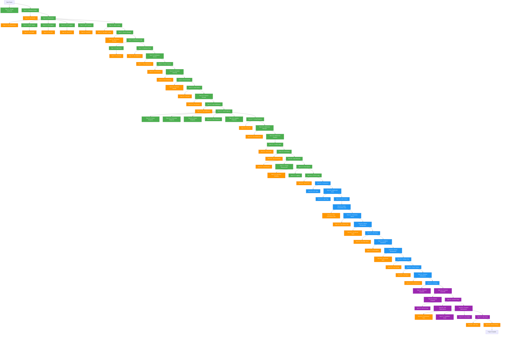

# WiFi Router Monitor - Task Dependency Graph

## Visualization



## Legend

- 🟢 **Green**: Backend tasks (Python/FastAPI)
- 🔵 **Blue**: Frontend tasks (Next.js/React)
- 🟠 **Orange**: Testing tasks
- 🟣 **Purple**: Deployment & documentation tasks

## Critical Path

The longest dependency chain (critical path):
1. Start → Testing Framework (1.1)
2. Database Models (2.1) → Repositories (2.3)
3. Protocol Adapters (3.x) → Device Manager (5.1)
4. Notification System (7.x) → Router Scanner (8.x)
5. Event Handler (9.1) → Auth (11.x)
6. REST API (12.x) → WebSocket (13.x)
7. Frontend Setup (20.x) → Auth UI (21.x)
8. Dashboard Views (22.x - 32.x)
9. Deployment (34.x - 37.x)
10. Final Testing (38.x) → Done

## Parallel Work Opportunities

Tasks that can be done in parallel:

### Backend Phase
- Protocol adapters (SNMP, SSH, HTTP, ARP) can all be developed simultaneously
- Repository implementations are independent
- Service layer components can be built in parallel after repositories are done

### Frontend Phase
- All dashboard views (22-32) can be developed in parallel after auth is complete
- Component development is highly parallelizable

### Testing Phase
- Unit tests can be written alongside implementation
- Integration tests can be developed in parallel with frontend

## Wave-Based Execution

The dependency graph is organized into 40 waves. Tasks in the same wave can be executed in parallel:

- **Waves 0-10**: Core backend infrastructure
- **Waves 11-21**: Backend services and API
- **Waves 22-34**: Frontend application
- **Waves 35-39**: Deployment and final testing

## Viewing the Graph

To view this Mermaid diagram:

1. **GitHub/GitLab**: Push this file - it will render automatically
2. **VS Code**: Install "Markdown Preview Mermaid Support" extension
3. **Online**: Copy the mermaid code to https://mermaid.live/
4. **CLI**: Use `mmdc` (mermaid-cli) to generate PNG/SVG

```bash
# Install mermaid-cli
npm install -g @mermaid-js/mermaid-cli

# Generate image
mmdc -i task-dependency-graph.md -o task-graph.png
```
